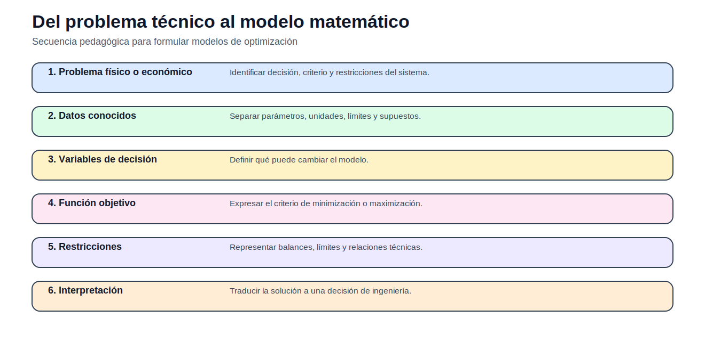
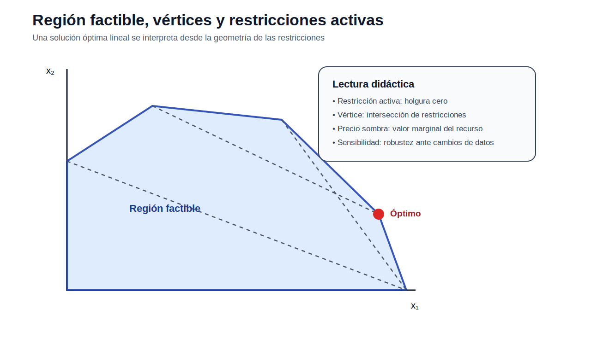
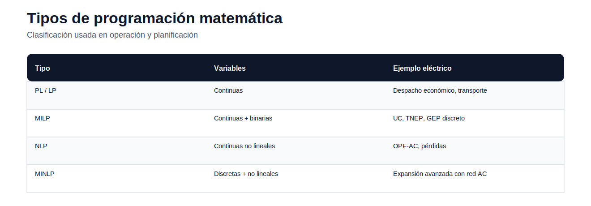
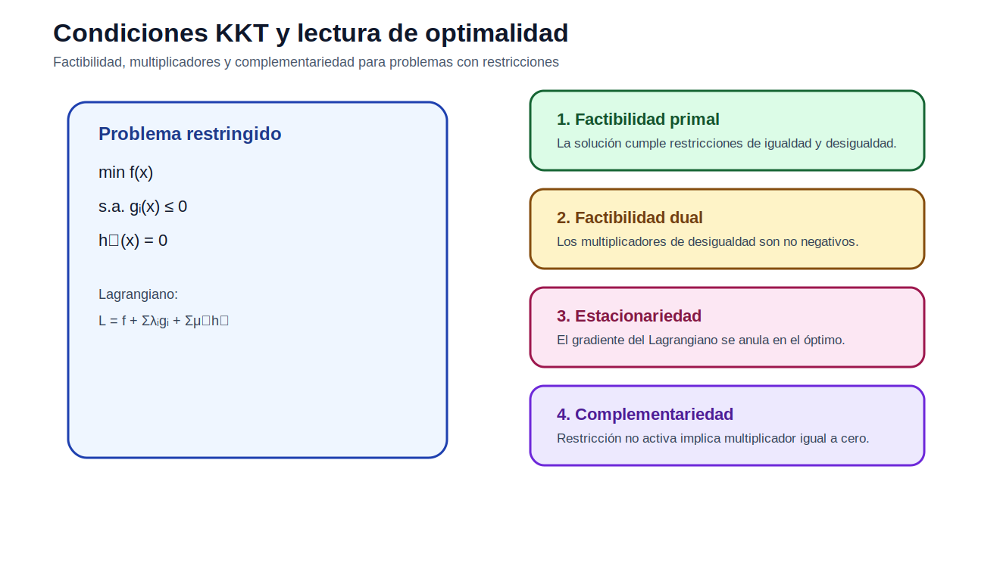
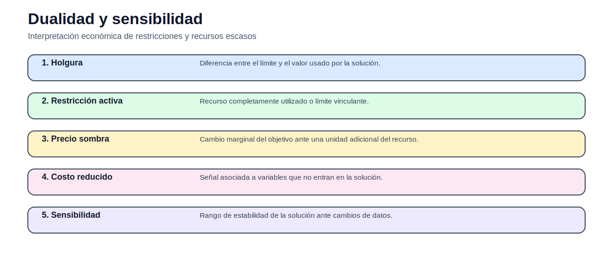
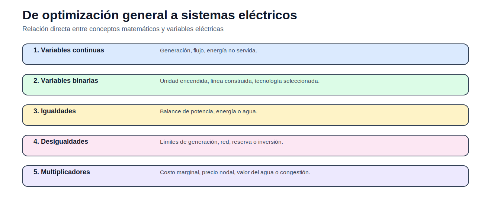

# 01 — Fundamentos de optimización

> [Menú principal](../README.md) · [Volver a Fundamentos de optimización](./README.md) · [Modelos del bloque](./modelos/README.md) · [Actividades](./actividades/README.md) · [Casos](../06_casos_de_estudio/README.md)

## 1. Propósito y contexto

Este bloque introduce la base matemática necesaria para todos los modelos posteriores. El estudiante debe aprender a identificar decisiones, parámetros, restricciones, factibilidad, optimalidad y sensibilidad antes de abordar problemas eléctricos de mayor escala.

## 2. Figuras y conceptos principales

Muestra cómo pasar de un problema técnico a un modelo matemático.

Permite explicar restricciones activas, vértices, holguras y solución óptima.

Diferencia PL, MILP, NLP y MINLP.

Resume factibilidad, estacionariedad, dualidad y complementariedad.

Conecta precios sombra y cambios marginales con interpretación técnica.

Relaciona variables matemáticas con generación, flujos, inversión y ENS.

## 3. Ecuaciones principales

### Problema general

$$
\min_x f(x)
$$

El objetivo representa el criterio de decisión.

### Restricciones

$$
g_i(x)\leq 0,\quad h_j(x)=0
$$

Las restricciones definen el conjunto factible.

### Lagrangiano

$$
\mathcal{L}(x,\lambda,\mu)=f(x)+\sum_i\lambda_i g_i(x)+\sum_j\mu_j h_j(x)
$$

Base para interpretar condiciones KKT.

### Complementariedad

$$
\lambda_i g_i(x^*)=0
$$

Una restricción no activa tiene multiplicador cero.

## 4. Modelos del bloque

| Modelo | Qué enseña | Acceso |
|---|---|---|
| Producción con recursos limitados | PL, región factible, restricciones activas | [Abrir](modelos/01_modelo_lineal_produccion_recursos.md) |
| Producción multiproducto indexada | conjuntos, índices y escalabilidad | [Abrir](modelos/02_modelo_indexado_produccion_multiproducto.md) |
| Transporte de energía | flujos, oferta, demanda y costos | [Abrir](modelos/03_modelo_transporte_energia.md) |
| Localización y cobertura | variables binarias e inversión | [Abrir](modelos/04_modelo_binario_localizacion_cobertura.md) |
| Forma matricial | estructura algebraica de un PL | [Abrir](modelos/05_forma_matricial_programa_lineal.md) |

## 5. Casos recomendados

| Caso | Uso en este bloque | Acceso |
|---|---|---|
| Operación 3 generadores | puente hacia despacho económico | [Abrir](../06_casos_de_estudio/operacion_3_generadores/README.md) |

## 6. Actividades

| Actividad | Tipo | Acceso |
|---|---|---|
| 01A — Producción lineal de componentes eléctricos | PL | [Abrir](actividades/actividad_01A_produccion_lineal.md) |
| 01B — Transporte de energía entre fuentes y cargas | PL transporte | [Abrir](actividades/actividad_01B_transporte_energia.md) |
| 01C — Localización binaria de equipos de monitoreo | MILP | [Abrir](actividades/actividad_01C_localizacion_binaria.md) |

## 7. Siguiente paso recomendado

1. Leer esta página completa.
2. Abrir el modelo de producción con recursos limitados.
3. Resolver la actividad 01A.
4. Continuar con transporte y localización binaria.

---

> [Menú principal](../README.md) · [Volver a Fundamentos de optimización](./README.md) · [Modelos del bloque](./modelos/README.md) · [Actividades](./actividades/README.md) · [Casos](../06_casos_de_estudio/README.md)
