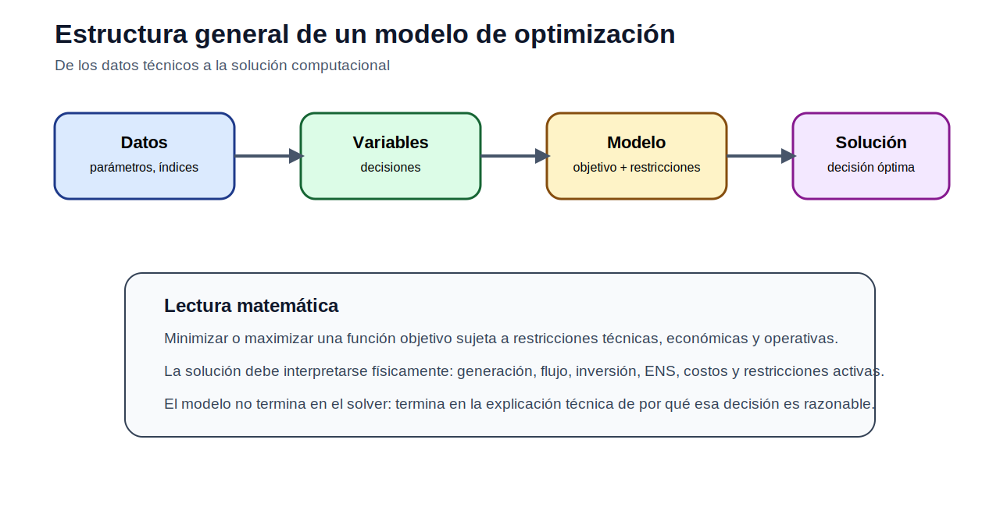
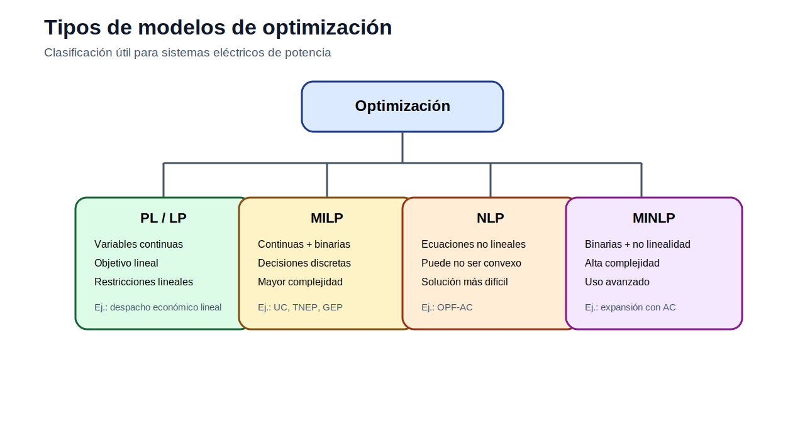
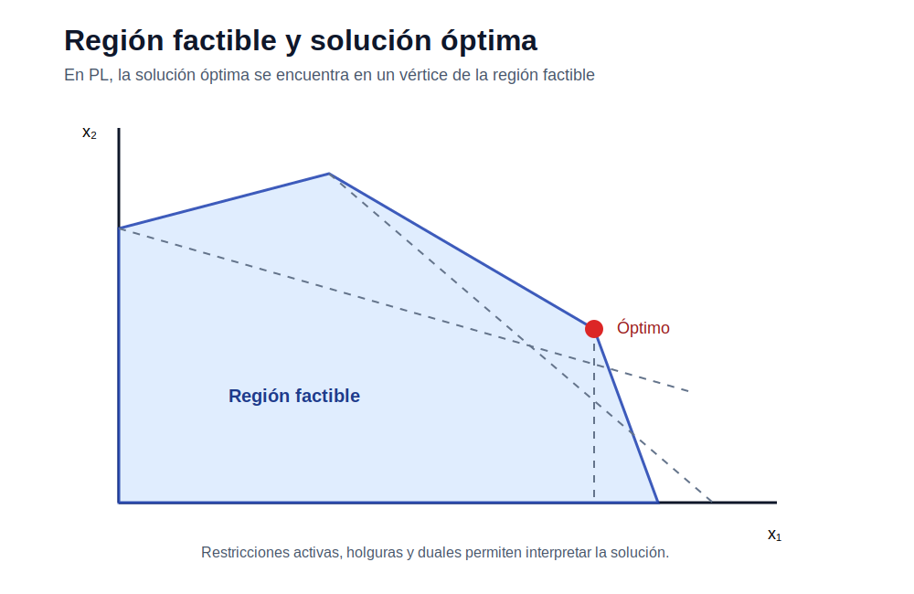

# 01 — Fundamentos de optimización

> [Menú principal](../README.md) · [Índice del sitio](../docs/index.md) · [Ruta de aprendizaje](../docs/learning_path.md) · [Modelos](../docs/modelos.md) · [Casos](../docs/casos_de_estudio.md) · [Evaluación](../docs/evaluacion.md)

## 1. Propósito del bloque

Este bloque introduce la teoría básica de optimización necesaria para comprender los modelos de operación y planificación de sistemas eléctricos de potencia. Antes de formular un despacho económico, un OPF, un TNEP o un GEP, el estudiante debe dominar la estructura general de un problema de optimización: decisión, objetivo, restricciones, factibilidad y análisis de resultados.

La optimización permite responder preguntas como:

- ¿cuál es la mejor decisión dentro de un conjunto de alternativas factibles?
- ¿qué restricciones técnicas limitan esa decisión?
- ¿cómo cambia la solución cuando cambia un parámetro?
- ¿qué significa que una restricción esté activa?
- ¿qué información del sistema se pierde cuando se simplifica un modelo?

## 2. Estructura general de un modelo

Un modelo de optimización se compone de cinco elementos principales:

| Elemento | Pregunta que responde | Ejemplo en sistemas eléctricos |
|---|---|---|
| Conjuntos e índices | ¿Qué elementos existen? | generadores, barras, líneas, años, bloques |
| Parámetros | ¿Qué datos son conocidos? | demanda, costos, límites, reactancias |
| Variables | ¿Qué decisiones se toman? | generación, flujo, inversión, ENS |
| Función objetivo | ¿Qué se desea optimizar? | minimizar costo, emisiones o energía no servida |
| Restricciones | ¿Qué condiciones deben cumplirse? | balance, capacidad, reserva, límites técnicos |

La forma general puede expresarse como:

$$
\min_{x} \; f(x)
$$

sujeto a:

$$
g_i(x) \leq 0, \quad i \in I
$$

$$
h_j(x) = 0, \quad j \in J
$$

$$
x \in \mathcal{X}
$$

donde $x$ representa las decisiones, $f(x)$ la función objetivo, $g_i(x)$ las restricciones de desigualdad, $h_j(x)$ las restricciones de igualdad y $\mathcal{X}$ el dominio de las variables.

## 3. Tipos principales de programación matemática

| Tipo | Variables | Función objetivo | Restricciones | Ejemplo eléctrico |
|---|---|---|---|---|
| Programación lineal (PL / LP) | Continuas | Lineal | Lineales | despacho económico lineal, transporte |
| Programación lineal entera mixta (MILP) | Continuas + enteras/binarias | Lineal | Lineales | unit commitment, TNEP, GEP con inversión discreta |
| Programación no lineal (NLP) | Continuas | Lineal o no lineal | Al menos una no lineal | OPF-AC |
| Programación no lineal entera mixta (MINLP) | Continuas + enteras/binarias | Puede ser no lineal | Puede ser no lineal | expansión con AC y decisiones discretas |

## 4. Región factible y optimalidad

La **región factible** contiene todas las soluciones que cumplen las restricciones. En programación lineal, cuando existe solución óptima finita, el óptimo se encuentra en un vértice de esa región. Esta idea es fundamental para interpretar resultados:

- una restricción activa tiene holgura cero;
- una restricción no activa no limita la solución;
- una variable en cero puede indicar que una alternativa no es competitiva;
- una solución infactible puede revelar falta de capacidad, demanda excesiva o datos inconsistentes.

## 5. Relación con los modelos eléctricos

| Concepto de optimización | Traducción en sistemas eléctricos |
|---|---|
| Variable continua | generación, flujo, energía no servida |
| Variable binaria | unidad encendida, línea construida, tecnología seleccionada |
| Restricción de igualdad | balance de potencia o energía |
| Restricción de desigualdad | límite de generación, transmisión, reserva o presupuesto |
| Parámetro incierto | demanda, disponibilidad hidro, costos, crecimiento |
| Función objetivo | costo operativo, inversión, ENS, emisiones |

## 6. De la teoría a los ejemplos

Después de esta base teórica, el bloque entra a ejemplos progresivos:

| Modelo | Qué enseña | Acceso |
|---|---|---|
| Producción con recursos limitados | PL, región factible y restricciones activas | [Abrir](modelos/01_modelo_lineal_produccion_recursos.md) |
| Producción multiproducto indexada | escalabilidad mediante conjuntos | [Abrir](modelos/02_modelo_indexado_produccion_multiproducto.md) |
| Transporte de energía | flujos, oferta y demanda | [Abrir](modelos/03_modelo_transporte_energia.md) |
| Localización y cobertura | variables binarias e inversión | [Abrir](modelos/04_modelo_binario_localizacion_cobertura.md) |
| Forma matricial | estructura algebraica general | [Abrir](modelos/05_forma_matricial_programa_lineal.md) |

## 7. Carpetas del bloque

| Carpeta | Uso |
|---|---|
| [modelos](modelos/README.md) | Explicaciones matemáticas y ejemplos |
| [notebooks](notebooks/) | Exploración y apoyo computacional |
| [actividades](actividades/README.md) | Evaluación aplicada del bloque |

## 8. Preguntas de control

1. ¿Cuál es la diferencia entre variable, parámetro e índice?
2. ¿Por qué una variable binaria transforma un LP en un MILP?
3. ¿Qué representa la región factible?
4. ¿Qué significa que una restricción esté activa?
5. ¿Por qué OPF-AC no es un problema lineal?
6. ¿Qué errores de unidades pueden causar resultados técnicamente incorrectos?
---

> [Menú principal](../README.md) · [Índice del sitio](../docs/index.md) · [Ruta de aprendizaje](../docs/learning_path.md) · [Modelos](../docs/modelos.md) · [Casos](../docs/casos_de_estudio.md) · [Evaluación](../docs/evaluacion.md)
