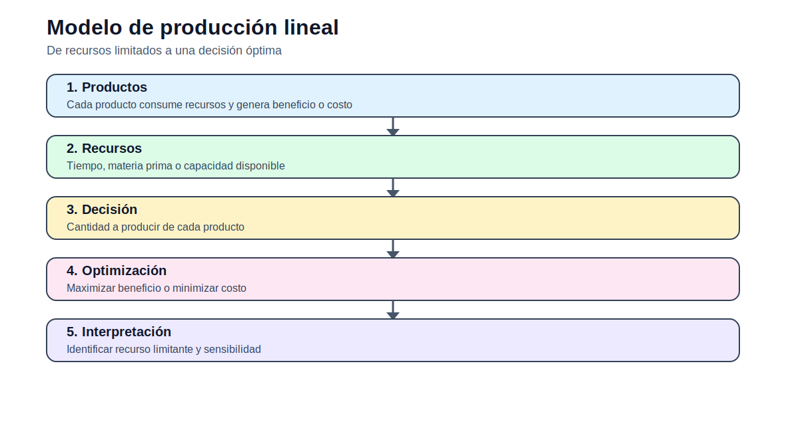

# Modelo indexado de producción multiproducto

[Inicio](../../README.md) | [Bloque](../README.md) | [Modelos](README.md) | [Actividades](../actividades/README.md)



## 1. Idea del modelo

Este modelo generaliza el caso de producción para que el número de alternativas no esté fijado. En lugar de escribir una variable por producto, se define un conjunto y se formulan ecuaciones indexadas. Esta transición es esencial para modelos grandes de sistemas eléctricos.

## 2. Lectura didáctica previa

| Elemento | Interpretación |
|---|---|
| Ventaja | Permite agregar tecnologías, unidades o escenarios sin reescribir el modelo. |
| Decisión | Producción por producto o tecnología. |
| Escalabilidad | El mismo modelo funciona para 2, 10 o 100 alternativas. |
| Analogía eléctrica | Generación por planta o tecnología. |

## 3. Formulación matemática

### 3.1 Conjuntos

- `P`: productos o tecnologías.
- `R`: recursos si hay varios recursos.

### 3.2 Índices

- `p ∈ P`: producto.
- `r ∈ R`: recurso.

### 3.3 Parámetros

- `c_p`: costo/beneficio unitario.
- `a_{r,p}`: consumo del recurso `r` por producto `p`.
- `B_r`: disponibilidad del recurso `r`.
- `u_p`: límite superior.

### 3.4 Variables de decisión

- `x_p ≥ 0`: producción del producto `p`.

### 3.5 Función objetivo

Minimizar costo o maximizar beneficio. Para minimización:  

```text
min Z = sum_{p in P} c_p x_p
```

### 3.6 Restricciones

### R1. Balance o requerimiento

La producción agregada debe cubrir un requerimiento mínimo.

```text
sum_{p in P} x_p >= D
```
### R2. Recursos múltiples

Cada recurso disponible limita la producción total.

```text
sum_{p in P} a_{r,p} x_p <= B_r  para todo r in R
```
### R3. Límites de producción

Cada producto tiene límites técnicos.

```text
0 <= x_p <= u_p
```

## 4. Construcción del archivo `.dat`

El `.dat` debe usar tablas indexadas. Si hay varios recursos, `a[r,p]` debe declararse como matriz.

## 5. Interpretación del archivo `.out`

El `.out` debe reportar producción por producto y uso de cada recurso. El estudiante debe identificar qué recurso condiciona la solución.

## 6. Errores frecuentes

- Declarar parámetros como escalares cuando son indexados.
- Omitir el índice en restricciones.
- No comprobar que todas las combinaciones `r,p` tengan datos.

## 7. Actividades relacionadas

- [Actividad 01](../actividades/actividad_01_fundamentos_optimizacion.md)
