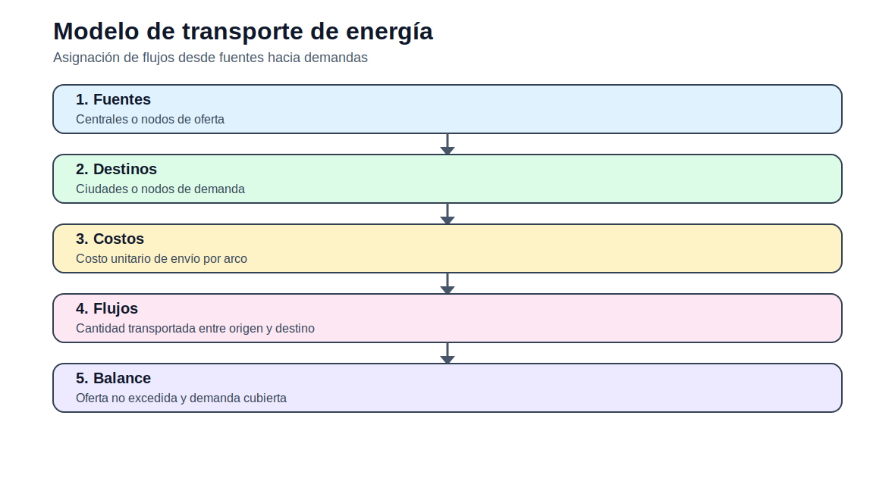

# Modelo de transporte de energía

> [Menú principal](../../README.md) · [Volver a Fundamentos](../README.md) · [Modelos del bloque](README.md) · [Actividades](../actividades/README.md) · [Casos](../../06_casos_de_estudio/README.md)

## 1. Contexto del problema

El modelo asigna flujos desde fuentes hacia cargas. Todavía no representa leyes eléctricas, pero permite estudiar balances, capacidad y costos.

## 2. Enunciado guía

Determinar flujos de energía entre fuentes y cargas minimizando costo de transporte.

## 3. Figura conceptual del modelo

## 4. Datos que debe reconocer el estudiante

| Elemento | Descripción |
|---|---|
| Conjuntos | $I$: fuentes, $J$: cargas. |
| Índices | $i\in I$, $j\in J$. |
| Parámetros | $S_i$, $D_j$, $c_{i,j}$. |
| Variables | $f_{i,j}$. |

## 5. Formulación matemática

### Función objetivo

$$
\min Z=\sum_{i\in I}\sum_{j\in J}c_{i,j}f_{i,j}
$$

### Oferta

$$
\sum_{j\in J}f_{i,j}\leq S_i\quad \forall i
$$

La fuente no excede su capacidad.

### Demanda

$$
\sum_{i\in I}f_{i,j}\geq D_j\quad \forall j
$$

Cada carga recibe energía suficiente.

## 6. Interpretación técnica

La solución no debe interpretarse solo como un valor objetivo. El estudiante debe explicar qué decisiones se activan, qué restricciones quedan vinculantes y qué implicación física o económica tiene el resultado.

## 7. Qué resultado debe graficarse

Mapa de flujos, rutas usadas y costo por ruta.

## 8. Errores frecuentes

- Confundir transporte con OPF.
- No verificar capacidad total.
- No explicar rutas no usadas.

## 9. Actividad relacionada

[Ir a la actividad](../actividades/actividad_01B_transporte_energia.md)

---

> [Menú principal](../../README.md) · [Volver a Fundamentos](../README.md) · [Modelos del bloque](README.md) · [Actividades](../actividades/README.md) · [Casos](../../06_casos_de_estudio/README.md)
