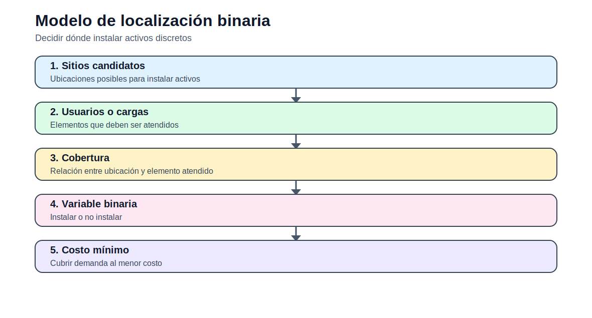

# Modelo binario de localización y cobertura

> [Menú principal](../../README.md) · [Índice del sitio](../../docs/index.md) · [Ruta de aprendizaje](../../docs/learning_path.md) · [Modelos](../../docs/modelos.md) · [Casos](../../docs/casos_de_estudio.md) · [Evaluación](../../docs/evaluacion.md)

## 1. Intuición del modelo

Este modelo introduce variables binarias. La decisión ya no es solo cuánto producir, sino si instalar o no un activo. Esta lógica aparece luego en unit commitment, expansión de transmisión y expansión de generación.

## 2. Elementos de la formulación

| Elemento | Descripción |
|---|---|
| Conjuntos | $A$: sitios candidatos; $M$: elementos a cubrir. |
| Índices | $a \in A$, $m \in M$. |
| Parámetros | $C_a$: costo de instalación; $q_{m,a}$: cobertura posible. |
| Variables | $y_a$: instalación; $z_{m,a}$: asignación de cobertura. |

## 3. Formulación matemática

### Objetivo

Minimizar costo de instalación.

$$
\min Z = \sum_{a \in A} C_a y_a
$$

### Cobertura

Cada elemento debe estar cubierto por al menos un sitio.

$$
\sum_{a \in A} z_{m,a} \geq 1 \quad \forall m \in M
$$

### Activación

Un sitio solo cubre si fue instalado.

$$
z_{m,a} \leq y_a \quad \forall m,a
$$

### Elegibilidad

La asignación solo existe si el sitio puede cubrir al elemento.

$$
z_{m,a} \leq q_{m,a} \quad \forall m,a
$$

### Dominio binario

Las decisiones son binarias.

$$
y_a,z_{m,a} \in \{0,1\}
$$

## 4. Interpretación técnica

El resultado debe interpretarse como una decisión de inversión. En sistemas eléctricos, esta estructura es análoga a construir líneas o instalar nueva capacidad.

## 5. Actividad relacionada

- [Ir a la actividad](../actividades/actividad_01_fundamentos_optimizacion.md)
---

> [Menú principal](../../README.md) · [Índice del sitio](../../docs/index.md) · [Ruta de aprendizaje](../../docs/learning_path.md) · [Modelos](../../docs/modelos.md) · [Casos](../../docs/casos_de_estudio.md) · [Evaluación](../../docs/evaluacion.md)
