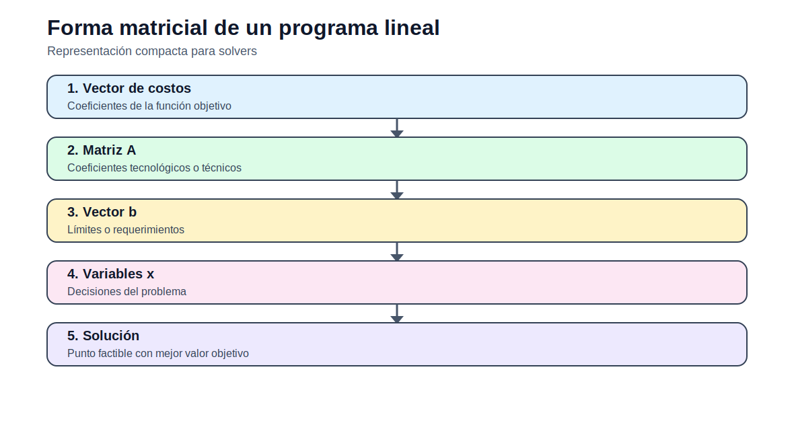

# Forma matricial de un programa lineal

[Inicio](../../README.md) | [Bloque](../README.md) | [Modelos](README.md) | [Actividades](../actividades/README.md)



## 1. Idea del modelo

La forma matricial resume un programa lineal en vectores y matrices. Es útil para comprender cómo los solvers reciben el problema y para analizar factibilidad, optimalidad y sensibilidad.

## 2. Lectura didáctica previa

| Elemento | Interpretación |
|---|---|
| Vector de variables | Agrupa todas las decisiones. |
| Vector de costos | Define el peso de cada variable en el objetivo. |
| Matriz técnica | Relaciona variables y restricciones. |
| Vector derecho | Representa límites o requerimientos. |

## 3. Formulación matemática

### 3.1 Conjuntos

- `I`: restricciones.
- `J`: variables.

### 3.2 Índices

- `i ∈ I`: restricción.
- `j ∈ J`: variable.

### 3.3 Parámetros

- `c_j`: costo de variable `j`.
- `A_{i,j}`: coeficiente tecnológico.
- `b_i`: lado derecho de restricción.

### 3.4 Variables de decisión

- `x_j ≥ 0`: variable de decisión.

### 3.5 Función objetivo

Forma estándar de minimización:  

```text
min Z = sum_{j in J} c_j x_j
```

### 3.6 Restricciones

### R1. Restricciones matriciales

Cada fila de la matriz define una restricción.

```text
sum_{j in J} A_{i,j} x_j >= b_i
```
### R2. No negatividad

Dominio básico de variables continuas.

```text
x_j >= 0
```

## 4. Construcción del archivo `.dat`

El `.dat` debe declarar matriz `A`, vector `c` y vector `b`. Es importante controlar el sentido de cada restricción.

## 5. Interpretación del archivo `.out`

El `.out` debe interpretarse como vector solución y valor objetivo. Si el solver reporta infactibilidad, se debe revisar matriz y signos.

## 6. Errores frecuentes

- Mezclar restricciones `<=`, `>=` y `=` sin documentarlo.
- No ordenar variables e índices.
- Perder interpretación física por usar notación compacta.

## 7. Actividades relacionadas

- [Actividad 01](../actividades/actividad_01_fundamentos_optimizacion.md)
