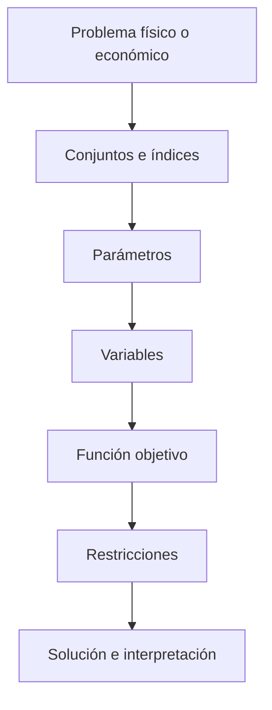

# Fundamentos: LP, MILP y NLP

> Nota: esta página describe la formulación matemática con fines didácticos. La implementación computacional puede variar según el solver, el lenguaje de modelado y las simplificaciones adoptadas en clase.

## Idea del modelo

Un problema de optimización busca seleccionar valores de variables de decisión que minimicen o maximicen una función objetivo, cumpliendo restricciones. En sistemas eléctricos, esta estructura aparece en despacho, compromiso de unidades, OPF, expansión de transmisión y expansión de generación.

## Conjuntos e índices

- $i \in \mathcal{I}$: índice genérico de actividades, unidades, barras, líneas o tecnologías.
- $j \in \mathcal{J}$: índice de restricciones.

## Parámetros

- $c_i$: coeficiente de costo o beneficio de la variable $x_i$.
- $a_{ji}$: coeficiente tecnológico o físico que relaciona $x_i$ con la restricción $j$.
- $b_j$: lado derecho de la restricción $j$.

## Variables de decisión

- $x_i \geq 0$: variable continua.
- $y_i \in \{0,1\}$: variable binaria, si el problema es MILP.

## Función objetivo

Forma lineal general:

$$
\min \sum_{i \in \mathcal{I}} c_i x_i
$$

## Restricciones principales

$$
\sum_{i \in \mathcal{I}} a_{ji} x_i \leq b_j \qquad \forall j \in \mathcal{J}
$$

Un **LP** usa función objetivo y restricciones lineales con variables continuas. Un **MILP** añade variables enteras o binarias. Un **NLP** incluye no linealidad en la función objetivo o en las restricciones.

## Interpretación de resultados

Antes de implementar un modelo eléctrico, el estudiante debe reconocer si la formulación es LP, MILP o NLP, porque esto afecta convexidad, tamaño, solver, tiempo computacional e interpretación de resultados.

## Esquema conceptual

## Actividad sugerida

Clasifique ED, UC, OPF-DC, OPF-AC, TNEP y GEP según sean LP, MILP o NLP, justificando la presencia de variables binarias o restricciones no lineales.
