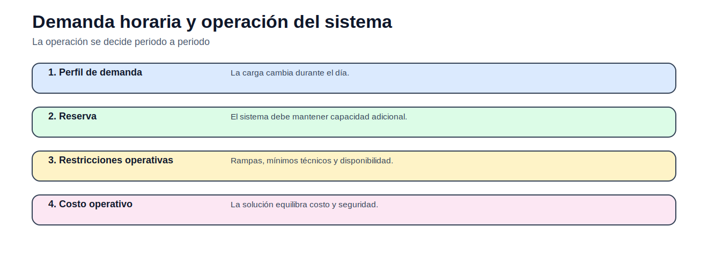
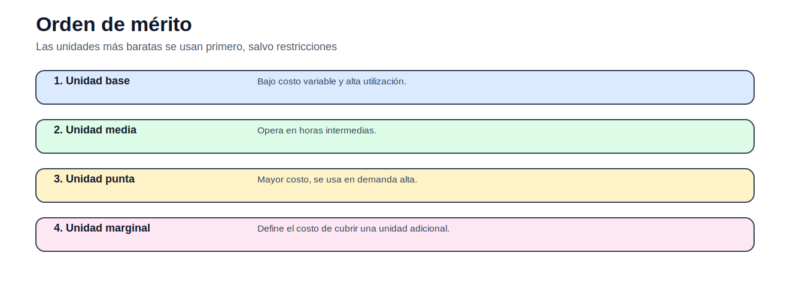
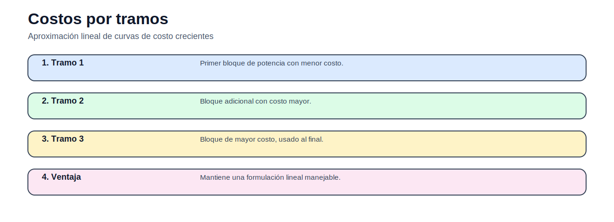
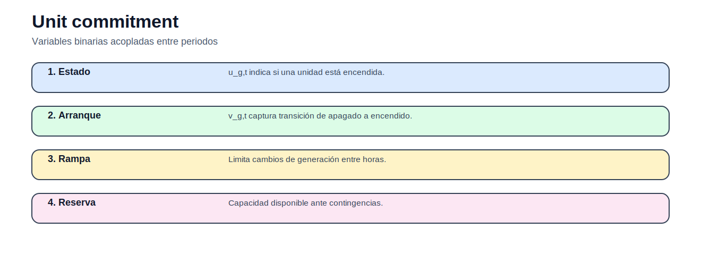
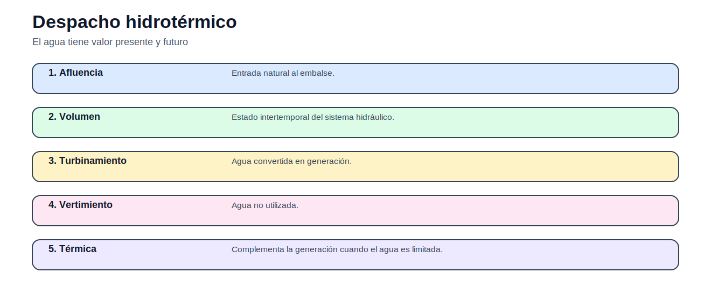

# 02 — Operación de corto plazo

> [Menú principal](../README.md) · [Volver a Operación de corto plazo](./README.md) · [Modelos del bloque](./modelos/README.md) · [Actividades](./actividades/README.md) · [Casos](../06_casos_de_estudio/README.md)

## 1. Propósito y contexto

Este bloque estudia decisiones horarias o diarias: cuánto genera cada unidad, qué unidad se enciende, cómo se cumple la reserva y cómo se usa el agua en sistemas hidrotérmicos.

## 2. Figuras y conceptos principales

Ubica la operación en un horizonte temporal.

Explica despacho económico y unidad marginal.

Introduce aproximación lineal de curvas de costo.

Muestra decisiones binarias acopladas en el tiempo.

Explica balance de embalse y valor del agua.

## 3. Ecuaciones principales

### Balance de potencia

$$
\sum_{g\in G}P_{g,t}+ENS_t=D_t
$$

La demanda debe cubrirse en cada periodo.

### Límites de generación

$$
\underline{P}_g u_{g,t}\leq P_{g,t}\leq \overline{P}_g u_{g,t}
$$

Vincula estado y generación en UC.

### Arranque

$$
v_{g,t}\geq u_{g,t}-u_{g,t-1}
$$

Detecta transición de apagado a encendido.

### Balance hídrico

$$
V_{h,t}=V_{h,t-1}+A_{h,t}-Q_{h,t}-S_{h,t}
$$

Representa la dinámica del embalse.

## 4. Modelos del bloque

| Modelo | Qué enseña | Acceso |
|---|---|---|
| Despacho económico uninodal | costo marginal y balance | [Abrir](modelos/01_despacho_economico_uninodal.md) |
| Despacho económico por tramos | curva de costos linealizada | [Abrir](modelos/02_despacho_economico_por_tramos.md) |
| Despacho hidrotérmico simple | uso de agua y térmica | [Abrir](modelos/03_despacho_hidrotermico_simple.md) |
| Cascada hidroeléctrica | balances de embalses conectados | [Abrir](modelos/04_operacion_cascada_hidroelectrica.md) |
| Cascada con rampas | restricciones intertemporales | [Abrir](modelos/05_cascada_hidroelectrica_con_rampas.md) |
| Compromiso de unidades | MILP operativo | [Abrir](modelos/06_compromiso_unidades_termicas.md) |

## 5. Casos recomendados

| Caso | Uso en este bloque | Acceso |
|---|---|---|
| Operación 3 generadores | ED y costos por tramos | [Abrir](../06_casos_de_estudio/operacion_3_generadores/README.md) |
| Hidrotérmico didáctico | despacho hidrotérmico y cascadas | [Abrir](../06_casos_de_estudio/hidrotermico_didactico/README.md) |
| Operación 101 generadores | ED escalable | [Abrir](../06_casos_de_estudio/operacion_101_generadores/README.md) |

## 6. Actividades

| Actividad | Tipo | Acceso |
|---|---|---|
| Actividad 02 — Operación de corto plazo | ED + UC + hidrotérmico | [Abrir](actividades/actividad_02_operacion_corto_plazo.md) |

## 7. Siguiente paso recomendado

1. Revisar orden de mérito.
2. Abrir despacho económico.
3. Resolver actividad 02.
4. Comparar con hidrotérmico y UC.

---

> [Menú principal](../README.md) · [Volver a Operación de corto plazo](./README.md) · [Modelos del bloque](./modelos/README.md) · [Actividades](./actividades/README.md) · [Casos](../06_casos_de_estudio/README.md)
