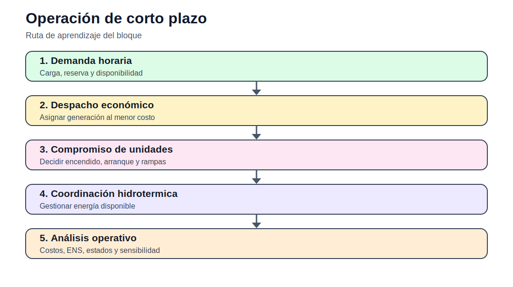

# 02 — Operación de corto plazo

[Inicio](../README.md) | [Sitio](../docs/index.md) | [Bloque anterior](../01_fundamentos_optimizacion/README.md) | [Bloque siguiente](../03_opf_flujo_optimo_potencia/README.md)

## Propósito del bloque

Estudia decisiones operativas de minutos, horas y días: despacho económico, despacho con pérdidas, compromiso de unidades y coordinación hidrotérmica. El énfasis está en diferenciar decisiones continuas, binarias y restricciones temporales.

## Mapa de contenidos

| Sección | Acceso |
|---|---|
| Modelos matemáticos | [modelos/README.md](modelos/README.md) |
| ED | [ED_despacho_economico/README.md](ED_despacho_economico/README.md) |
| ED con pérdidas | [ED_con_perdidas/README.md](ED_con_perdidas/README.md) |
| UC | [UC_unit_commitment/README.md](UC_unit_commitment/README.md) |
| Hidrotérmico | [despacho_hidrotermico/README.md](despacho_hidrotermico/README.md) |
| Notebooks | [notebooks/](notebooks/) |
| Actividades | [actividades/README.md](actividades/README.md) |

## Secuencia sugerida

1. Revisar los modelos matemáticos documentados.
2. Explorar los datos disponibles en casos o actividades.
3. Ejecutar los notebooks de exploración, cuando corresponda.
4. Desarrollar la actividad integradora del bloque.
5. Preparar informe técnico y archivo Excel de interpretación.

## Resultado esperado

Al finalizar este bloque, el estudiante debe poder explicar el problema, formular el modelo, construir datos, ejecutar la implementación computacional y defender técnicamente los resultados.
