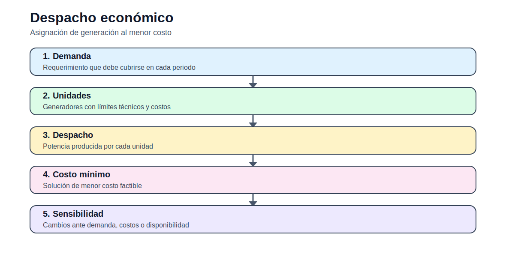

# Despacho económico uninodal

[Inicio](../../README.md) | [Bloque](../README.md) | [Modelos](README.md) | [Actividades](../actividades/README.md)



## 1. Idea del modelo

El despacho económico uninodal decide la generación de cada unidad para cubrir la demanda total del sistema sin representar restricciones de red. Es el primer modelo operativo porque permite entender costo marginal, límites de generación y balance de potencia.

## 2. Lectura didáctica previa

| Elemento | Interpretación |
|---|---|
| Horizonte | Corto plazo: horas o días. |
| Decisión | Generación, estado o uso de recursos por periodo. |
| Salida clave | Costo operativo, despacho, ENS y restricciones activas. |

## 3. Formulación matemática

### 3.1 Conjuntos

- `G`: conjunto de generadores.
- `T`: periodos de operación.

### 3.2 Índices

- `g`: generador
- `t`: periodo horario
- `h`: unidad hidroeléctrica si aplica

### 3.3 Parámetros

- `c_g`: costo variable.
- `Pmin_g`, `Pmax_g`: límites de generación.
- `D_t`: demanda.
- `VOLL`: penalización ENS.

### 3.4 Variables de decisión

- `Pg_{g,t}`: generación.
- `ENS_t`: energía no servida.

### 3.5 Función objetivo

Minimizar costo variable más penalización por ENS.

### 3.6 Restricciones

### R1. Balance

La generación total más ENS cubre demanda.

```text
sum_g Pg[g,t] + ENS[t] = D[t]
```
### R2. Límites de generación

Cada unidad opera dentro de sus límites.

```text
Pmin[g] <= Pg[g,t] <= Pmax[g]
```
### R3. No negatividad ENS

La energía no servida no puede ser negativa.

```text
ENS[t] >= 0
```

## 4. Construcción del archivo `.dat`

El `.dat` debe separar demanda horaria, datos técnicos de unidades, costos y parámetros temporales. Use unidades explícitas: MW, MWh, USD/MWh.

## 5. Interpretación del archivo `.out`

El `.out` debe reportar generación por hora, costo total, energía no servida, estados binarios y uso de recursos hídricos cuando aplique.

## 6. Errores frecuentes

- No vincular generación y estado binario en UC.
- No revisar rampas entre horas.
- Mezclar MW y MWh.
- No interpretar la energía hidro como recurso limitado.

## 7. Actividades relacionadas

- [Actividad 02](../actividades/actividad_02_operacion_corto_plazo.md)
