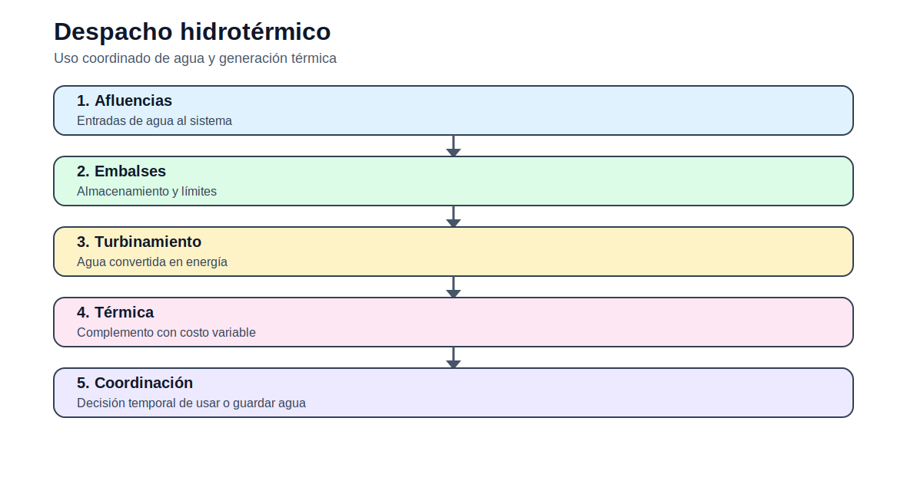

# Despacho hidrotérmico simple

[Inicio](../../README.md) | [Bloque](../README.md) | [Modelos](README.md) | [Actividades](../actividades/README.md)



## 1. Idea del modelo

Coordina generación térmica e hidroeléctrica cuando el agua disponible es limitada. El modelo ilustra el valor temporal del recurso hidroeléctrico.

## 2. Lectura didáctica previa

| Elemento | Interpretación |
|---|---|
| Horizonte | Corto plazo: horas o días. |
| Decisión | Generación, estado o uso de recursos por periodo. |
| Salida clave | Costo operativo, despacho, ENS y restricciones activas. |

## 3. Formulación matemática

### 3.1 Conjuntos

- `G`: térmicas.
- `H`: hidroeléctricas.
- `T`: periodos.

### 3.2 Índices

- `g`: generador
- `t`: periodo horario
- `h`: unidad hidroeléctrica si aplica

### 3.3 Parámetros

- `c_g`: costo térmico.
- `D_t`: demanda.
- `Emax_h`: energía hidro disponible.
- `Pmax_h`: potencia hidro máxima.

### 3.4 Variables de decisión

- `Pg_{g,t}`: generación térmica.
- `Ph_{h,t}`: generación hidro.
- `ENS_t`: energía no servida.

### 3.5 Función objetivo

Minimizar costo térmico más ENS.

### 3.6 Restricciones

### R1. Balance

Térmica, hidro y ENS cubren demanda.

```text
sum_g Pg[g,t] + sum_h Ph[h,t] + ENS[t] = D[t]
```
### R2. Límite hidro horario

La hidro no supera su potencia disponible.

```text
0 <= Ph[h,t] <= Pmax[h]
```
### R3. Energía hidro

La suma de generación hidro no supera energía disponible.

```text
sum_t Ph[h,t] <= Emax[h]
```

## 4. Construcción del archivo `.dat`

El `.dat` debe separar demanda horaria, datos técnicos de unidades, costos y parámetros temporales. Use unidades explícitas: MW, MWh, USD/MWh.

## 5. Interpretación del archivo `.out`

El `.out` debe reportar generación por hora, costo total, energía no servida, estados binarios y uso de recursos hídricos cuando aplique.

## 6. Errores frecuentes

- No vincular generación y estado binario en UC.
- No revisar rampas entre horas.
- Mezclar MW y MWh.
- No interpretar la energía hidro como recurso limitado.

## 7. Actividades relacionadas

- [Actividad 02](../actividades/actividad_02_operacion_corto_plazo.md)
