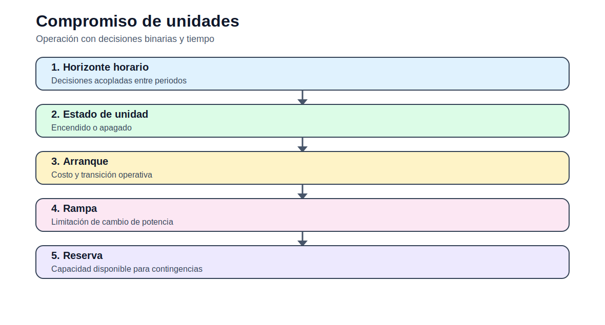

# Compromiso de unidades térmicas

[Inicio](../../README.md) | [Bloque](../README.md) | [Modelos](README.md) | [Actividades](../actividades/README.md)



## 1. Idea del modelo

El unit commitment decide qué unidades se encienden y cuánto generan en cada periodo. Agrega variables binarias, costos de arranque, rampas y reserva.

## 2. Lectura didáctica previa

| Elemento | Interpretación |
|---|---|
| Horizonte | Corto plazo: horas o días. |
| Decisión | Generación, estado o uso de recursos por periodo. |
| Salida clave | Costo operativo, despacho, ENS y restricciones activas. |

## 3. Formulación matemática

### 3.1 Conjuntos

- `G`: unidades térmicas.
- `T`: horas.

### 3.2 Índices

- `g`: generador
- `t`: periodo horario
- `h`: unidad hidroeléctrica si aplica

### 3.3 Parámetros

- `Pmin_g`, `Pmax_g`.
- `c_g`: costo variable.
- `SU_g`: costo de arranque.
- `RU_g`, `RD_g`: rampas.
- `D_t`: demanda.

### 3.4 Variables de decisión

- `Pg_{g,t}`: generación.
- `u_{g,t}`: estado encendido.
- `startup_{g,t}`: arranque.
- `ENS_t`: energía no servida.

### 3.5 Función objetivo

Minimizar costo variable, costos de arranque y penalización ENS.

### 3.6 Restricciones

### R1. Balance

Generación y ENS cubren demanda.

```text
sum_g Pg[g,t] + ENS[t] = D[t]
```
### R2. Límites con estado

La generación depende de si la unidad está encendida.

```text
Pmin[g] u[g,t] <= Pg[g,t] <= Pmax[g] u[g,t]
```
### R3. Arranque

La variable de arranque captura transición de apagado a encendido.

```text
startup[g,t] >= u[g,t] - u[g,t-1]
```
### R4. Rampas

La generación no cambia abruptamente entre periodos.

```text
Pg[g,t] - Pg[g,t-1] <= RU[g]
```

## 4. Construcción del archivo `.dat`

El `.dat` debe separar demanda horaria, datos técnicos de unidades, costos y parámetros temporales. Use unidades explícitas: MW, MWh, USD/MWh.

## 5. Interpretación del archivo `.out`

El `.out` debe reportar generación por hora, costo total, energía no servida, estados binarios y uso de recursos hídricos cuando aplique.

## 6. Errores frecuentes

- No vincular generación y estado binario en UC.
- No revisar rampas entre horas.
- Mezclar MW y MWh.
- No interpretar la energía hidro como recurso limitado.

## 7. Actividades relacionadas

- [Actividad 02](../actividades/actividad_02_operacion_corto_plazo.md)
