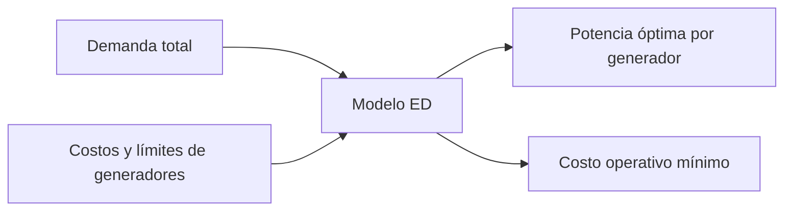

# Despacho económico sin pérdidas (ED)

> Nota: esta página describe la formulación matemática con fines didácticos. La implementación computacional puede variar según el solver, el lenguaje de modelado y las simplificaciones adoptadas en clase.

## Idea del modelo

El despacho económico determina la potencia activa de cada generador para atender una demanda al menor costo, respetando límites técnicos de generación.

## Conjuntos e índices

- $g \in \mathcal{G}$: generadores térmicos o unidades despachables.

## Parámetros

- $D$: demanda total del sistema.
- $P_g^{\min}, P_g^{\max}$: límites mínimo y máximo del generador $g$.
- $C_g(P_g)$: función de costo de generación. Puede ser lineal o cuadrática.
- $c_g$: costo variable lineal, si se usa aproximación lineal.

## Variables de decisión

- $P_g$: potencia generada por la unidad $g$.

## Función objetivo

Caso lineal:

$$
\min \sum_{g \in \mathcal{G}} c_g P_g
$$

Caso cuadrático:

$$
\min \sum_{g \in \mathcal{G}} \left(a_g P_g^2 + b_g P_g + c_g\right)
$$

## Restricciones principales

Balance de potencia:

$$
\sum_{g \in \mathcal{G}} P_g = D
$$

Límites técnicos:

$$
P_g^{\min} \leq P_g \leq P_g^{\max} \qquad \forall g \in \mathcal{G}
$$

## Interpretación de resultados

El resultado indica cuánto debe producir cada unidad para cubrir la demanda al menor costo. Si no se modela red, el ED no detecta congestión ni pérdidas.

## Esquema conceptual

## Errores frecuentes

- Interpretar el ED como si incluyera red eléctrica.
- Confundir costo marginal con costo total.
- Ignorar límites mínimos de generación.

## Actividad sugerida

Resolver un caso de 3 generadores y comparar el despacho cuando cambia la demanda en 10 %.
