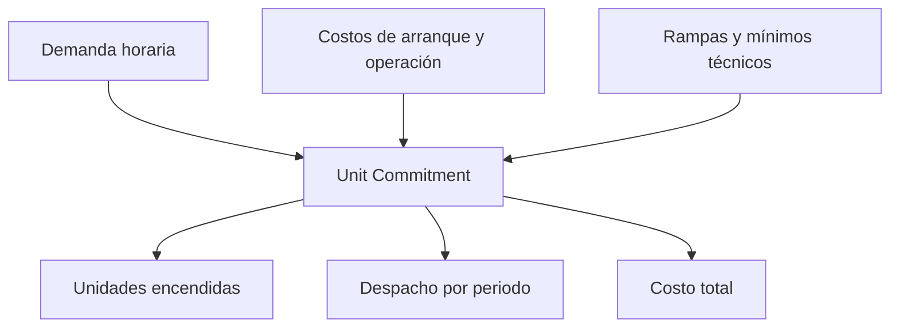

# Unit Commitment (UC)

> Nota: esta página describe la formulación matemática con fines didácticos. La implementación computacional puede variar según el solver, el lenguaje de modelado y las simplificaciones adoptadas en clase.

## Idea del modelo

El compromiso de unidades decide qué generadores están encendidos y cuánto producen en cada periodo, minimizando costos de operación, arranque y operación en vacío.

## Conjuntos e índices

- $g \in \mathcal{G}$: unidades generadoras.
- $t \in \mathcal{T}$: periodos de tiempo.

## Parámetros

- $D_t$: demanda en el periodo $t$.
- $P_g^{\min}, P_g^{\max}$: límites de generación.
- $c_g$: costo variable.
- $c_g^{NL}$: costo en vacío o no-load.
- $c_g^{SU}$: costo de arranque.
- $RU_g, RD_g$: límites de rampa.
- $UT_g, DT_g$: tiempos mínimos de encendido y apagado.
- $R_t$: reserva requerida.

## Variables de decisión

- $P_{g,t}$: potencia generada.
- $u_{g,t} \in \{0,1\}$: 1 si la unidad está encendida.
- $v_{g,t} \in \{0,1\}$: 1 si la unidad arranca.
- $w_{g,t} \in \{0,1\}$: 1 si la unidad se apaga.

## Función objetivo

$$
\min \sum_{t \in \mathcal{T}}\sum_{g \in \mathcal{G}} \left(c_g P_{g,t} + c_g^{NL}u_{g,t} + c_g^{SU}v_{g,t}\right)
$$

## Restricciones principales

Balance:

$$
\sum_g P_{g,t}=D_t \qquad \forall t
$$

Límites dependientes del estado:

$$
P_g^{\min}u_{g,t} \leq P_{g,t} \leq P_g^{\max}u_{g,t}
$$

Transición de estado:

$$
u_{g,t}-u_{g,t-1}=v_{g,t}-w_{g,t}
$$

Reserva:

$$
\sum_g P_g^{\max}u_{g,t} \geq D_t + R_t
$$

Rampas y tiempos mínimos se agregan según el nivel de detalle del modelo.

## Interpretación de resultados

El UC no solo decide despacho; también decide encendido/apagado. Es un MILP por las variables binarias. Sus resultados deben leerse por unidad y periodo.

## Esquema conceptual

## Errores frecuentes

- Confundir ED con UC.
- Olvidar que una unidad apagada no puede generar.
- Ignorar rampas o tiempos mínimos.
