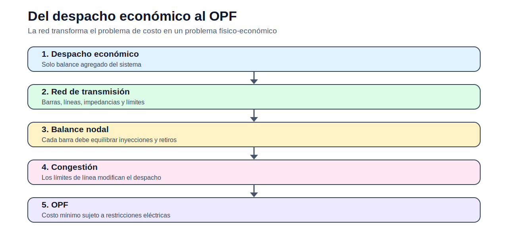

# 03 — Flujo óptimo de potencia

> [Menú principal](../README.md) · [Índice del sitio](../docs/index.md) · [Ruta de aprendizaje](../docs/learning_path.md) · [Modelos](../docs/modelos.md) · [Casos](../docs/casos_de_estudio.md) · [Evaluación](../docs/evaluacion.md)

## 1. Propósito del bloque

El OPF conecta el despacho económico con la física de la red. A diferencia del despacho uninodal, aquí la ubicación de la generación y la demanda importa. Una solución barata puede no ser factible si las líneas se congestionan o si las tensiones salen de rango.

## 2. Idea central

En OPF-DC, cada barra cumple un balance nodal:

$$
\sum_{g \in G_n} P_g - P^D_n + ENS_n =
\sum_{\ell \in \delta(n)} A_{n,\ell} F_\ell
$$

y cada flujo se aproxima como:

$$
F_\ell = \frac{\theta_i - \theta_j}{x_\ell}
$$

En OPF-AC, el modelo incorpora tensiones, ángulos, potencia reactiva y pérdidas mediante ecuaciones no lineales.

## 3. Modelos del bloque

| Modelo | Uso |
|---|---|
| [Flujo óptimo de potencia DC](modelos/01_flujo_optimo_potencia_dc.md) | análisis lineal de congestión |
| [Flujo óptimo de potencia AC](modelos/02_flujo_optimo_potencia_ac.md) | análisis con tensión, reactivos y pérdidas |

## 4. Carpetas del bloque

| Carpeta | Uso |
|---|---|
| [modelos](modelos/README.md) | Formulaciones OPF |
| [OPF_DC](OPF_DC/README.md) | Material específico OPF-DC |
| [OPF_AC](OPF_AC/README.md) | Material específico OPF-AC |
| [notebooks](notebooks/) | Visualización de datos de red |
| [actividades](actividades/README.md) | Evaluación aplicada |
---

> [Menú principal](../README.md) · [Índice del sitio](../docs/index.md) · [Ruta de aprendizaje](../docs/learning_path.md) · [Modelos](../docs/modelos.md) · [Casos](../docs/casos_de_estudio.md) · [Evaluación](../docs/evaluacion.md)
