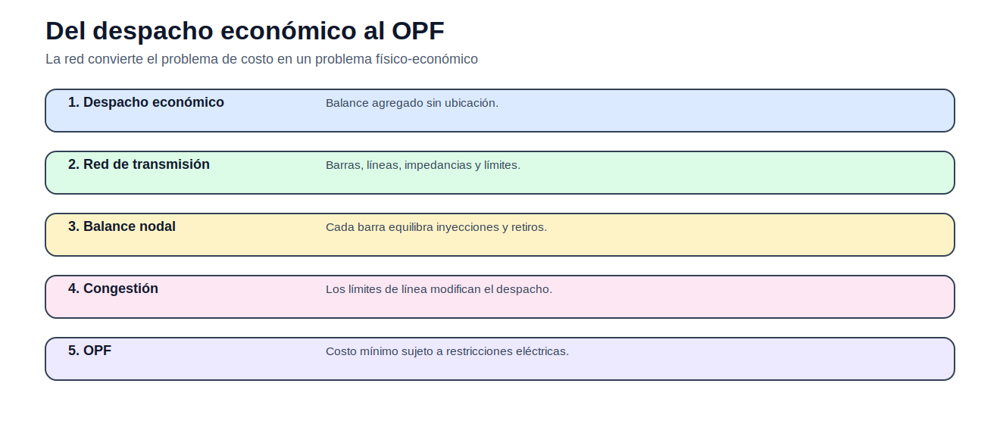
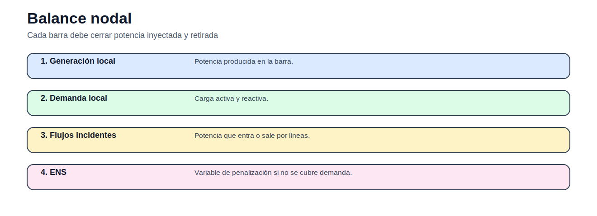

# 03 — Flujo óptimo de potencia

> [Menú principal](../README.md) · [Volver a Flujo óptimo de potencia](./README.md) · [Modelos del bloque](./modelos/README.md) · [Actividades](./actividades/README.md) · [Casos](../06_casos_de_estudio/README.md)

## 1. Propósito y contexto

El OPF incorpora la red al despacho económico. La ubicación de generación y demanda importa porque las líneas tienen límites, reactancias, tensiones y pérdidas.

## 2. Figuras y conceptos principales

Explica por qué la red modifica el despacho.

Introduce balance por barra.

Relaciona flujo y ángulos.

Incluye tensión, reactivos y pérdidas.

Relaciona restricciones de línea y señales marginales.

## 3. Ecuaciones principales

### Balance nodal DC

$$
\sum_{g\in G_n}P_g-P_n^D+ENS_n=\sum_{\ell\in L}A_{n,\ell}F_\ell
$$

Balance de potencia por barra.

### Flujo DC

$$
F_\ell=\frac{\theta_i-\theta_j}{x_\ell}
$$

Aproximación lineal del flujo activo.

### Balance AC activo

$$
P_i=V_i\sum_jV_j(G_{ij}\cos\theta_{ij}+B_{ij}\sin\theta_{ij})
$$

Ecuación no lineal de potencia activa.

### Balance AC reactivo

$$
Q_i=V_i\sum_jV_j(G_{ij}\sin\theta_{ij}-B_{ij}\cos\theta_{ij})
$$

Ecuación no lineal de potencia reactiva.

## 4. Modelos del bloque

| Modelo | Qué enseña | Acceso |
|---|---|---|
| OPF-DC | congestión lineal y ángulos | [Abrir](modelos/01_flujo_optimo_potencia_dc.md) |
| OPF-AC | tensión, reactivos y pérdidas | [Abrir](modelos/02_flujo_optimo_potencia_ac.md) |

## 5. Casos recomendados

| Caso | Uso en este bloque | Acceso |
|---|---|---|
| OPF-DC didáctico | primer análisis de balance nodal | [Abrir](../06_casos_de_estudio/opf_dc_didactico/README.md) |
| IEEE 14 barras | OPF-AC introductorio | [Abrir](../06_casos_de_estudio/ieee_14_barras/README.md) |
| IEEE 30 barras | OPF-AC de mayor escala | [Abrir](../06_casos_de_estudio/ieee_30_barras/README.md) |

## 6. Actividades

| Actividad | Tipo | Acceso |
|---|---|---|
| Actividad 03 — OPF DC y AC | comparación de formulaciones | [Abrir](actividades/actividad_03_opf_dc_ac.md) |

## 7. Siguiente paso recomendado

1. Leer comparación DC/AC.
2. Abrir OPF-DC.
3. Usar caso OPF-DC didáctico.
4. Comparar con OPF-AC.

---

> [Menú principal](../README.md) · [Volver a Flujo óptimo de potencia](./README.md) · [Modelos del bloque](./modelos/README.md) · [Actividades](./actividades/README.md) · [Casos](../06_casos_de_estudio/README.md)
