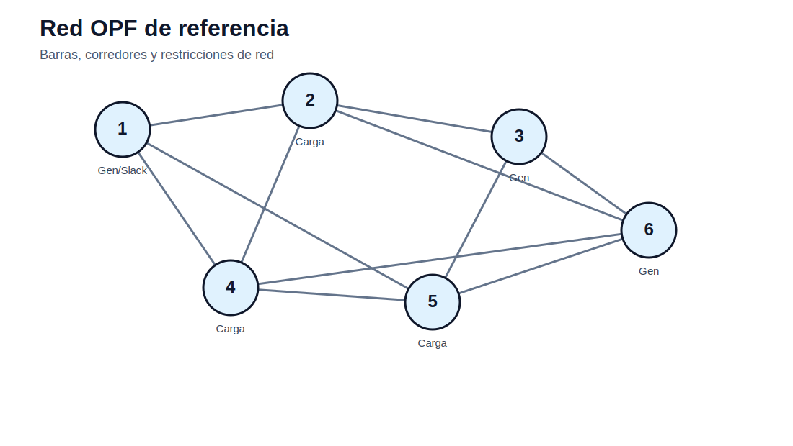

# 03 — Flujo óptimo de potencia

[Inicio](../README.md) | [Sitio](../docs/index.md) | [Bloque anterior](../02_operacion_corto_plazo/README.md) | [Bloque siguiente](../04_tnep_expansion_transmision/README.md)

## Propósito del bloque

Relaciona el despacho económico con las restricciones físicas de la red. El bloque diferencia OPF-DC y OPF-AC, destacando balance nodal, flujos, límites de líneas, tensión, potencia reactiva y congestión.

## Mapa de contenidos

| Sección | Acceso |
|---|---|
| Modelos matemáticos | [modelos/README.md](modelos/README.md) |
| OPF-DC | [OPF_DC/README.md](OPF_DC/README.md) |
| OPF-AC | [OPF_AC/README.md](OPF_AC/README.md) |
| Notebooks | [notebooks/](notebooks/) |
| Actividades | [actividades/README.md](actividades/README.md) |

## Secuencia sugerida

1. Revisar los modelos matemáticos documentados.
2. Explorar los datos disponibles en casos o actividades.
3. Ejecutar los notebooks de exploración, cuando corresponda.
4. Desarrollar la actividad integradora del bloque.
5. Preparar informe técnico y archivo Excel de interpretación.

## Resultado esperado

Al finalizar este bloque, el estudiante debe poder explicar el problema, formular el modelo, construir datos, ejecutar la implementación computacional y defender técnicamente los resultados.
