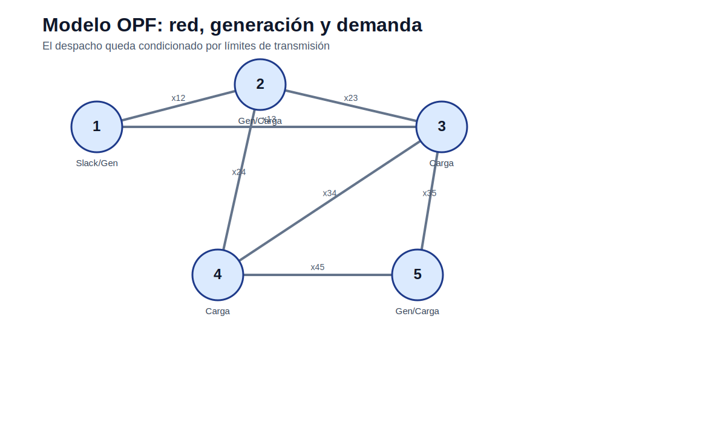

# Flujo óptimo de potencia DC

[Inicio](../../README.md) | [Bloque](../README.md) | [Modelos](README.md) | [Actividades](../actividades/README.md)



## 1. Idea del modelo

El OPF-DC es una aproximación lineal del flujo de potencia activa. Se asume magnitud de tensión cercana a 1 p.u., ángulos pequeños y resistencia despreciable. Es útil para estudiar congestión, despacho económico con red y precios nodales aproximados.

## 2. Lectura didáctica previa

| Elemento | Interpretación |
|---|---|
| Decisión | Generación activa y ángulos de barra. |
| Restricción física | Flujo proporcional a diferencia angular. |
| Ventaja | Lineal y rápido. |
| Limitación | No representa potencia reactiva, pérdidas ni magnitudes de tensión. |

## 3. Formulación matemática

### 3.1 Conjuntos

- `N`: barras.
- `L`: líneas.
- `G`: generadores.

### 3.2 Índices

- `n ∈ N`: barra.
- `l ∈ L`: línea.
- `g ∈ G`: generador.

### 3.3 Parámetros

- `Pd_n`: demanda.
- `Pmin_g`, `Pmax_g`.
- `c_g`: costo.
- `x_l`: reactancia.
- `Fmax_l`: límite.

### 3.4 Variables de decisión

- `Pg_g`: generación.
- `theta_n`: ángulo.
- `F_l`: flujo.
- `ENS_n`: energía no servida.

### 3.5 Función objetivo

Minimizar costo de generación y penalización de ENS.

### 3.6 Restricciones

### R1. Balance nodal

La inyección neta en cada barra se equilibra con los flujos incidentes.

```text
sum_{g en n} Pg_g - Pd_n + ENS_n = sum_{l incidentes n} A_{n,l} F_l
```
### R2. Flujo DC

El flujo depende de la diferencia angular.

```text
F_l = (theta_i - theta_j)/x_l
```
### R3. Límite térmico

Cada línea respeta su capacidad.

```text
-Fmax_l <= F_l <= Fmax_l
```
### R4. Referencia angular

Una barra fija el ángulo de referencia.

```text
theta_ref = 0
```

## 4. Construcción del archivo `.dat`

El `.dat` debe indicar barras, generadores, líneas, origen, destino, reactancia y límites.

## 5. Interpretación del archivo `.out`

El `.out` debe reportar generación, ángulos, flujos, líneas saturadas, ENS y costo total.

## 6. Errores frecuentes

- No fijar barra de referencia.
- Invertir signos de incidencia.
- Usar reactancia cero.
- Interpretar OPF-DC como flujo AC completo.

## 7. Actividades relacionadas

- [Actividad 03](../actividades/actividad_03_opf_dc_ac.md)
