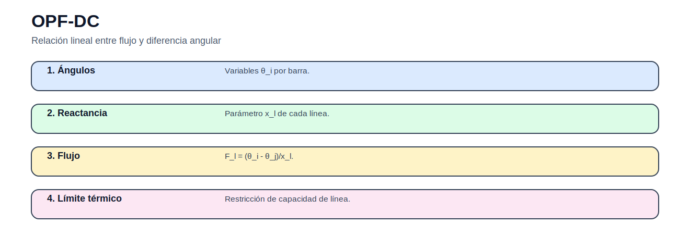

# Flujo óptimo de potencia DC

> [Menú principal](../../README.md) · [Volver a OPF](../README.md) · [Modelos del bloque](README.md) · [Actividades](../actividades/README.md) · [Casos](../../06_casos_de_estudio/README.md)

## 1. Contexto del problema

El OPF-DC incorpora red mediante balance nodal, ángulos y límites de línea.

## 2. Enunciado guía

Determinar despacho mínimo costo respetando transmisión.

## 3. Figura conceptual del modelo

## 4. Datos que debe reconocer el estudiante

| Elemento | Descripción |
|---|---|
| Conjuntos | $N$: barras, $L$: líneas, $G$: generadores. |
| Parámetros | $P^D_n$, $x_l$, $F^{max}_l$, $c_g$. |
| Variables | $P_g$, $F_l$, $\theta_n$, $ENS_n$. |

## 5. Formulación matemática

### Función objetivo

$$
\min Z=\sum_g c_gP_g+\sum_nVOLL\,ENS_n
$$

### Balance nodal

$$
\sum_{g\in G_n}P_g-P^D_n+ENS_n=\sum_{\ell}A_{n,\ell}F_\ell
$$

Balance por barra.

### Flujo DC

$$
F_\ell=\frac{\theta_i-\theta_j}{x_\ell}
$$

Flujo lineal.

### Límite

$$
-\overline{F}_\ell\leq F_\ell\leq \overline{F}_\ell
$$

Capacidad de línea.

## 6. Interpretación técnica

La solución no debe interpretarse solo como un valor objetivo. El estudiante debe explicar qué decisiones se activan, qué restricciones quedan vinculantes y qué implicación física o económica tiene el resultado.

## 7. Qué resultado debe graficarse

Mapa de flujos, ángulos y líneas congestionadas.

## 8. Errores frecuentes

- No fijar barra slack.
- Invertir signos de incidencia.
- No revisar congestión.

## 9. Actividad relacionada

[Ir a la actividad](../actividades/actividad_03_opf_dc_ac.md)

---

> [Menú principal](../../README.md) · [Volver a OPF](../README.md) · [Modelos del bloque](README.md) · [Actividades](../actividades/README.md) · [Casos](../../06_casos_de_estudio/README.md)
