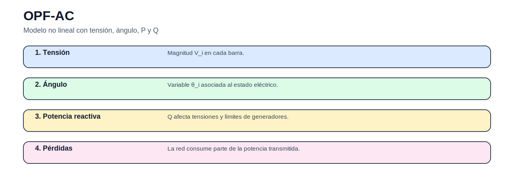

# Flujo óptimo de potencia AC

> [Menú principal](../../README.md) · [Volver a OPF](../README.md) · [Modelos del bloque](README.md) · [Actividades](../actividades/README.md) · [Casos](../../06_casos_de_estudio/README.md)

## 1. Contexto del problema

El OPF-AC representa tensiones, reactivos, ángulos y pérdidas mediante ecuaciones no lineales.

## 2. Enunciado guía

Determinar operación óptima con restricciones eléctricas completas.

## 3. Figura conceptual del modelo

## 4. Datos que debe reconocer el estudiante

| Elemento | Descripción |
|---|---|
| Conjuntos | $N$: barras, $G$: generadores. |
| Parámetros | admitancias, demandas P/Q, límites V/P/Q. |
| Variables | $P_g$, $Q_g$, $V_i$, $\theta_i$. |

## 5. Formulación matemática

### Función objetivo

$$
\min Z=\sum_g c_gP_g
$$

### Balance activo

$$
P_i^G-P_i^D=V_i\sum_jV_j(G_{ij}\cos\theta_{ij}+B_{ij}\sin\theta_{ij})
$$

Potencia activa.

### Balance reactivo

$$
Q_i^G-Q_i^D=V_i\sum_jV_j(G_{ij}\sin\theta_{ij}-B_{ij}\cos\theta_{ij})
$$

Potencia reactiva.

### Tensión

$$
\underline{V}_i\leq V_i\leq \overline{V}_i
$$

Rango admisible.

## 6. Interpretación técnica

La solución no debe interpretarse solo como un valor objetivo. El estudiante debe explicar qué decisiones se activan, qué restricciones quedan vinculantes y qué implicación física o económica tiene el resultado.

## 7. Qué resultado debe graficarse

Perfil de tensión, reactivos, pérdidas y límites activos.

## 8. Errores frecuentes

- Usar datos incompletos.
- No comparar con DC.
- Ignorar límites de Q.

## 9. Actividad relacionada

[Ir a la actividad](../actividades/actividad_03_opf_dc_ac.md)

---

> [Menú principal](../../README.md) · [Volver a OPF](../README.md) · [Modelos del bloque](README.md) · [Actividades](../actividades/README.md) · [Casos](../../06_casos_de_estudio/README.md)
