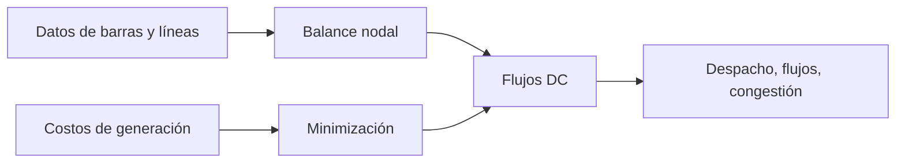

# Flujo óptimo de potencia DC (DC-OPF)

> Nota: esta página describe la formulación matemática con fines didácticos. La implementación computacional puede variar según el solver, el lenguaje de modelado y las simplificaciones adoptadas en clase.

## Idea del modelo

El DC-OPF minimiza costo de generación considerando balance nodal y límites de flujo activo bajo una aproximación lineal de la red.

## Conjuntos e índices

- $n \in \mathcal{N}$: barras.
- $\ell=(i,j) \in \mathcal{L}$: líneas o corredores.
- $g \in \mathcal{G}_n$: generadores ubicados en la barra $n$.

## Parámetros

- $D_n$: demanda activa en barra $n$.
- $B_\ell = 1/x_\ell$: susceptancia serie aproximada.
- $F_\ell^{\max}$: límite térmico de flujo.
- $P_g^{\min}, P_g^{\max}$: límites de generación.
- $c_g$: costo variable.

## Variables de decisión

- $P_g$: generación activa.
- $\theta_n$: ángulo de tensión en barra $n$.
- $f_\ell$: flujo activo por línea $\ell$.

## Función objetivo

$$
\min \sum_{g \in \mathcal{G}} c_gP_g
$$

## Restricciones principales

Flujo DC:

$$
f_{ij}=B_{ij}(\theta_i-\theta_j)
$$

Balance nodal:

$$
\sum_{g \in \mathcal{G}_n}P_g - D_n = \sum_{\ell \in \delta^+(n)}f_\ell - \sum_{\ell \in \delta^-(n)}f_\ell \qquad \forall n
$$

Límites de línea:

$$
-F_\ell^{\max}\leq f_\ell\leq F_\ell^{\max}
$$

Límites de generación y ángulo de referencia:

$$
P_g^{\min}\leq P_g\leq P_g^{\max}, \qquad \theta_{ref}=0
$$

## Interpretación de resultados

El resultado permite identificar congestión, generación nodal, flujos y costos marginales nodales si se analizan duales. No modela tensión ni potencia reactiva.

## Esquema conceptual

## Errores frecuentes

- Usar DC-OPF para evaluar tensión o reactivos.
- Olvidar fijar barra de referencia.
- Confundir límite de flujo con límite de generación.
