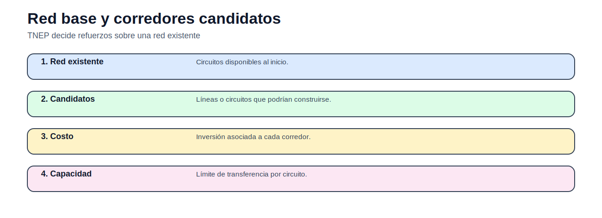
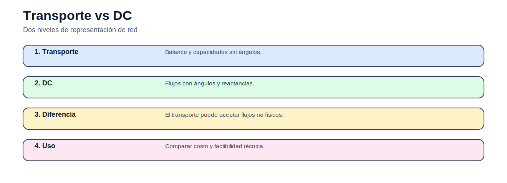
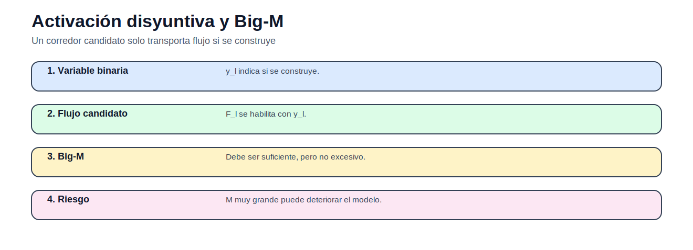

# 04 — Expansión de transmisión

> [Menú principal](../README.md) · [Volver a Expansión de transmisión](./README.md) · [Modelos del bloque](./modelos/README.md) · [Actividades](./actividades/README.md) · [Casos](../06_casos_de_estudio/README.md)

## 1. Propósito y contexto

El TNEP decide qué líneas o circuitos construir para que la generación pueda abastecer la demanda bajo límites técnicos y económicos. Compara formulaciones con distinto nivel de fidelidad física.

## 2. Figuras y conceptos principales

Distingue red existente y expansión posible.

Compara formulaciones de red.

Explica activación de líneas candidatas.

Introduce temporalidad de inversión.

## 3. Ecuaciones principales

### Costo de inversión

$$
C^{inv}=\sum_{\ell\in L}c_\ell n_\ell
$$

Costo de construir circuitos.

### Capacidad de corredor

$$
-\overline{F}_\ell(n_\ell^0+n_\ell)\leq F_\ell\leq \overline{F}_\ell(n_\ell^0+n_\ell)
$$

Límite de flujo con circuitos existentes y nuevos.

### Activación binaria

$$
-My_\ell\leq F_\ell\leq My_\ell
$$

Línea candidata solo transporta si se construye.

### Acumulación multietapa

$$
N_{\ell,t}=N_{\ell,t-1}+n_{\ell,t}
$$

La inversión se acumula en el tiempo.

## 4. Modelos del bloque

| Modelo | Qué enseña | Acceso |
|---|---|---|
| Transporte para expansión | aproximación sin ángulos | [Abrir](modelos/01_modelo_transporte_expansion_transmision.md) |
| Refuerzo constructivo | heurística de congestión | [Abrir](modelos/02_modelo_constructivo_refuerzo_red.md) |
| Modelo DC | flujos con ángulos | [Abrir](modelos/03_modelo_dc_expansion_transmision.md) |
| Modelo híbrido | detalle físico parcial | [Abrir](modelos/04_modelo_hibrido_expansion_transmision.md) |
| Lineal disyuntivo | activación de candidatos | [Abrir](modelos/05_modelo_lineal_disyuntivo_expansion_transmision.md) |
| Multietapa | temporalidad de inversión | [Abrir](modelos/06_modelo_multietapa_expansion_transmision.md) |

## 5. Casos recomendados

| Caso | Uso en este bloque | Acceso |
|---|---|---|
| Garver 6 barras | caso principal TNEP | [Abrir](../06_casos_de_estudio/garver_6_barras/README.md) |
| IEEE 24 RTS | caso avanzado TNEP | [Abrir](../06_casos_de_estudio/ieee_24_rts/README.md) |

## 6. Actividades

| Actividad | Tipo | Acceso |
|---|---|---|
| Actividad 04 — TNEP Garver | comparación de formulaciones | [Abrir](actividades/actividad_04_tnep_garver.md) |

## 7. Siguiente paso recomendado

1. Revisar red base y candidatos.
2. Abrir modelo de transporte.
3. Comparar con DC.
4. Resolver actividad TNEP.

---

> [Menú principal](../README.md) · [Volver a Expansión de transmisión](./README.md) · [Modelos del bloque](./modelos/README.md) · [Actividades](./actividades/README.md) · [Casos](../06_casos_de_estudio/README.md)
