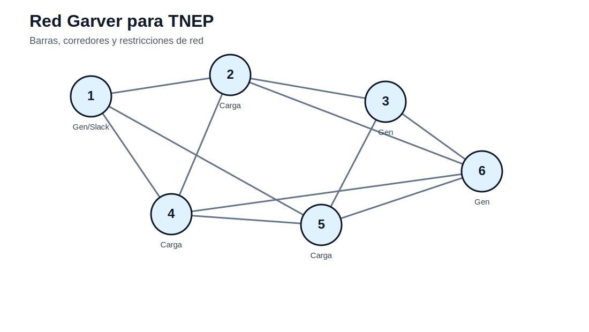

# 04 — Planificación de expansión de transmisión

[Inicio](../README.md) | [Sitio](../docs/index.md) | [Bloque anterior](../03_opf_flujo_optimo_potencia/README.md) | [Bloque siguiente](../05_gep_expansion_generacion/README.md)

## Propósito del bloque

Presenta formulaciones para decidir nuevas líneas de transmisión. Se comparan modelos de transporte, DC, híbrido, lineal disyuntivo y multietapa, usando casos tipo Garver e IEEE 24.

## Mapa de contenidos

| Sección | Acceso |
|---|---|
| Modelos matemáticos | [modelos/README.md](modelos/README.md) |
| Transporte | [transporte/README.md](transporte/README.md) |
| DC | [DC/README.md](DC/README.md) |
| Híbrido | [hibrido/README.md](hibrido/README.md) |
| Lineal disyuntivo | [lineal_disyuntivo/README.md](lineal_disyuntivo/README.md) |
| Notebooks | [notebooks/](notebooks/) |
| Actividades | [actividades/README.md](actividades/README.md) |

## Secuencia sugerida

1. Revisar los modelos matemáticos documentados.
2. Explorar los datos disponibles en casos o actividades.
3. Ejecutar los notebooks de exploración, cuando corresponda.
4. Desarrollar la actividad integradora del bloque.
5. Preparar informe técnico y archivo Excel de interpretación.

## Resultado esperado

Al finalizar este bloque, el estudiante debe poder explicar el problema, formular el modelo, construir datos, ejecutar la implementación computacional y defender técnicamente los resultados.
