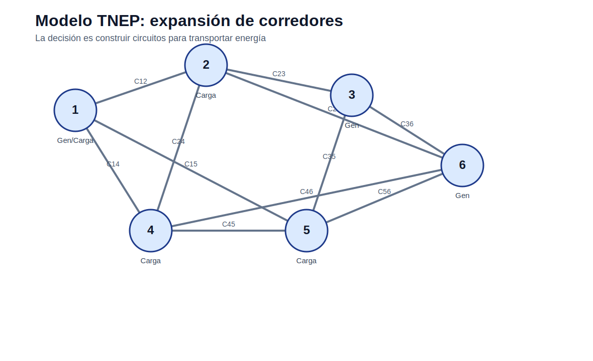

# Modelo lineal disyuntivo de expansión de transmisión

[Inicio](../../README.md) | [Bloque](../README.md) | [Modelos](README.md) | [Actividades](../actividades/README.md)



## 1. Idea del modelo

Usa restricciones condicionales activadas por variables de inversión para representar que una línea candidata solo puede transportar flujo si se construye.

## 2. Lectura didáctica previa

| Elemento | Interpretación |
|---|---|
| Decisión principal | Construcción de nuevos circuitos o corredores. |
| Variable clave | Número de circuitos nuevos o binaria de inversión. |
| Indicador | Costo de inversión, ENS y congestión. |
| Validación | Comparar flujo, inversión y factibilidad. |

## 3. Formulación matemática

### 3.1 Conjuntos

- `N`: barras.
- `C`: corredores.
- `T`: periodos si aplica.

### 3.2 Índices

- `n ∈ N`: barra.
- `c ∈ C`: corredor.
- `t ∈ T`: periodo.

### 3.3 Parámetros

- `D_n`: demanda.
- `Gmax_n`: generación máxima.
- `Cost_c`: costo de circuito.
- `Fmax_c`: capacidad.
- `x_c`: reactancia.
- `Nexist_c`: circuitos existentes.
- `Nmax_c`: máximo de circuitos nuevos.

### 3.4 Variables de decisión

- `nnew_c`: circuitos construidos.
- `F_c`: flujo.
- `theta_n`: ángulo.
- `Pg_n`: generación.
- `ENS_n`: energía no servida.

### 3.5 Función objetivo

Minimizar inversión en transmisión y penalización por energía no servida.

### 3.6 Restricciones

### R1. Balance nodal

La generación, demanda, ENS y flujos se equilibran por barra.

```text
Pg_n - D_n + ENS_n = sum_c A_{n,c} F_c
```
### R2. Capacidad de corredor

El flujo queda limitado por circuitos existentes y nuevos.

```text
-Fmax_c (Nexist_c+nnew_c) <= F_c <= Fmax_c (Nexist_c+nnew_c)
```
### R3. Límite de construcción

No se puede construir más del máximo permitido.

```text
0 <= nnew_c <= Nmax_c
```
### R4. Flujo DC si aplica

El flujo se relaciona con ángulos y reactancia.

```text
F_c = (Nexist_c+nnew_c)(theta_i-theta_j)/x_c
```

## 4. Construcción del archivo `.dat`

El `.dat` debe separar barras, demanda, generación, corredores existentes/candidatos, costos, capacidades y reactancias.

## 5. Interpretación del archivo `.out`

El `.out` debe mostrar circuitos construidos, flujos por corredor, ENS, costo de inversión y costo total.

## 6. Errores frecuentes

- Aceptar una solución de transporte sin validar física.
- No limitar máximo de circuitos.
- Usar big-M excesivo sin analizar estabilidad.
- No distinguir corredor existente y candidato.

## 7. Actividades relacionadas

- [Actividad 04](../actividades/actividad_04_tnep_garver.md)
