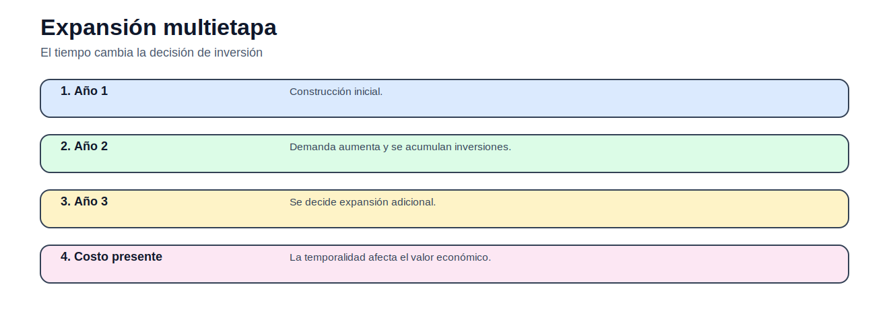

# Modelo multietapa de expansión de transmisión

> [Menú principal](../../README.md) · [Volver a TNEP](../README.md) · [Modelos del bloque](README.md) · [Actividades](../actividades/README.md) · [Casos](../../06_casos_de_estudio/README.md)

## 1. Contexto del problema

Decide qué construir y cuándo construir en un horizonte temporal.

## 2. Enunciado guía

Modelar inversión acumulada por etapa.

## 3. Figura conceptual del modelo

## 4. Datos que debe reconocer el estudiante

| Elemento | Descripción |
|---|---|
| Conjuntos | $N$: barras, $L$: corredores, $T$: periodos. |
| Parámetros | demanda, generación, costos, capacidades, reactancias. |
| Variables | $n_l$, $y_l$, $F_l$, $\theta_n$, $ENS_n$. |

## 5. Formulación matemática

### Función objetivo

$$
\min Z=\sum_{\ell}c_\ell n_\ell+\sum_nVOLL\,ENS_n
$$

### Balance

$$
P_n-D_n+ENS_n=\sum_\ell A_{n,\ell}F_\ell
$$

Balance nodal.

### Capacidad

$$
-\overline{F}_\ell(n_\ell^0+n_\ell)\leq F_\ell\leq \overline{F}_\ell(n_\ell^0+n_\ell)
$$

Capacidad total.

### Límite de inversión

$$
0\leq n_\ell\leq \overline{n}_\ell
$$

Máximo de circuitos nuevos.

## 6. Interpretación técnica

La solución no debe interpretarse solo como un valor objetivo. El estudiante debe explicar qué decisiones se activan, qué restricciones quedan vinculantes y qué implicación física o económica tiene el resultado.

## 7. Qué resultado debe graficarse

Corredores construidos, flujos, ENS y costo de inversión.

## 8. Errores frecuentes

- No diferenciar existente y candidato.
- No comparar formulaciones.
- No revisar ENS.

## 9. Actividad relacionada

[Ir a la actividad](../actividades/actividad_04_tnep_garver.md)

---

> [Menú principal](../../README.md) · [Volver a TNEP](../README.md) · [Modelos del bloque](README.md) · [Actividades](../actividades/README.md) · [Casos](../../06_casos_de_estudio/README.md)
