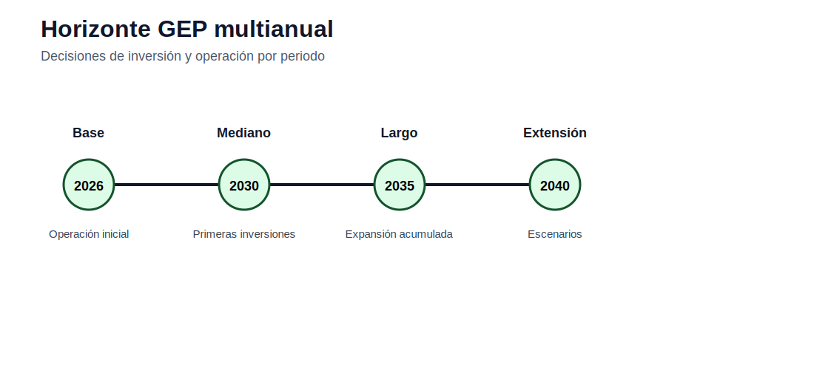

# 05 — Planificación de expansión de generación

[Inicio](../README.md) | [Sitio](../docs/index.md) | [Bloque anterior](../04_tnep_expansion_transmision/README.md) | [Bloque siguiente](../06_casos_de_estudio/README.md)

## Propósito del bloque

Estudia decisiones de inversión en capacidad de generación. El bloque avanza desde un GEP base hasta formulaciones con bloques de demanda y horizonte multianual, incorporando reserva, energía no servida y escenarios.

## Mapa de contenidos

| Sección | Acceso |
|---|---|
| Modelos matemáticos | [modelos/README.md](modelos/README.md) |
| GEP base | [base/README.md](base/README.md) |
| GEP estático con bloques | [estatico_bloques/README.md](estatico_bloques/README.md) |
| GEP multianual | [multianual/README.md](multianual/README.md) |
| Notebooks | [notebooks/](notebooks/) |
| Actividades | [actividades/README.md](actividades/README.md) |

## Secuencia sugerida

1. Revisar los modelos matemáticos documentados.
2. Explorar los datos disponibles en casos o actividades.
3. Ejecutar los notebooks de exploración, cuando corresponda.
4. Desarrollar la actividad integradora del bloque.
5. Preparar informe técnico y archivo Excel de interpretación.

## Resultado esperado

Al finalizar este bloque, el estudiante debe poder explicar el problema, formular el modelo, construir datos, ejecutar la implementación computacional y defender técnicamente los resultados.
