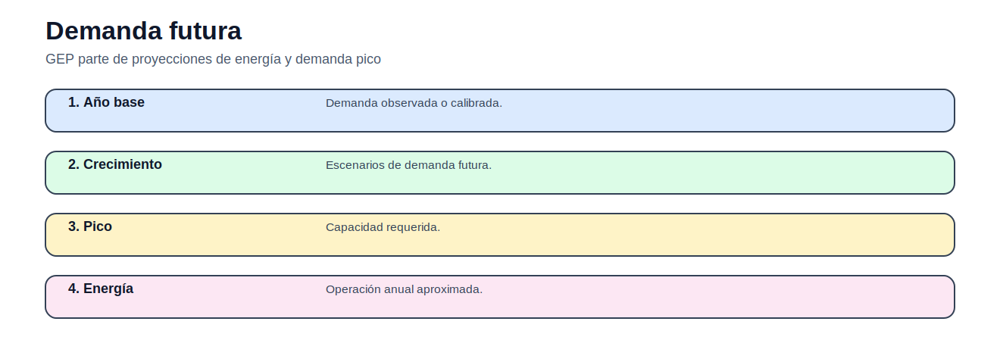
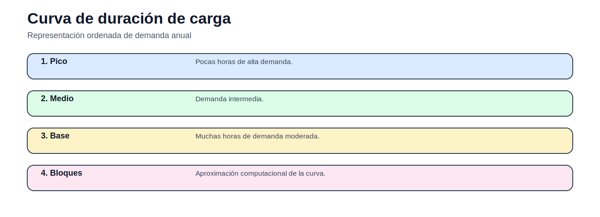
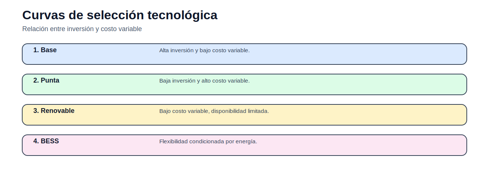
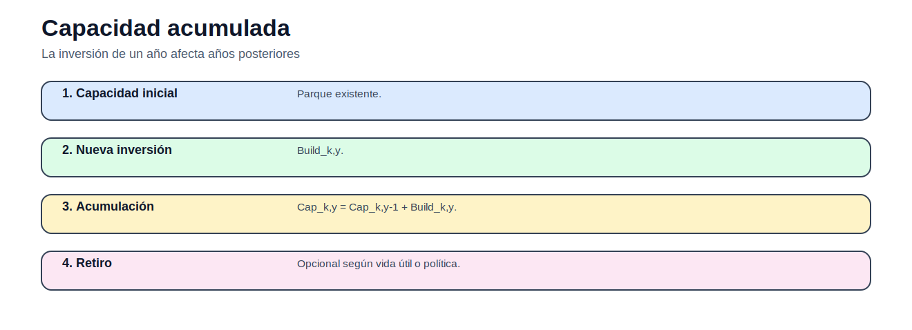
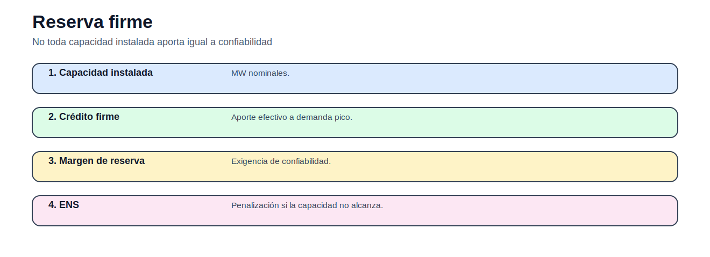

# 05 — Expansión de generación

> [Menú principal](../README.md) · [Volver a Expansión de generación](./README.md) · [Modelos del bloque](./modelos/README.md) · [Actividades](./actividades/README.md) · [Casos](../06_casos_de_estudio/README.md)

## 1. Propósito y contexto

El GEP decide qué capacidad instalar, cuánto instalar y cuándo instalarla para cubrir demanda futura, reserva y operación representativa, minimizando inversión, operación y energía no servida.

## 2. Figuras y conceptos principales

Explica demanda pico y energía futura.

Introduce bloques de carga.

Compara tecnologías por inversión y costo variable.

Muestra inversión acumulada por año.

Distingue capacidad nominal y aporte firme.

## 3. Ecuaciones principales

### Capacidad acumulada

$$
Cap_{k,y}=Cap_{k,y-1}+Build_{k,y}
$$

La inversión se acumula en el horizonte.

### Balance por bloque

$$
\sum_k Gen_{k,y,b}+\sum_e Gen_{e,y,b}+ENS_{y,b}=D_{y,b}
$$

La generación cubre demanda por bloque.

### Disponibilidad

$$
Gen_{k,y,b}\leq AF_k Cap_{k,y}h_b
$$

La generación depende de disponibilidad y duración.

### Reserva firme

$$
\sum_k FC_kCap_{k,y}+\sum_eFC_eCap_e^0\geq(1+RM)D_y^{peak}
$$

Capacidad firme cubre demanda pico y margen.

## 4. Modelos del bloque

| Modelo | Qué enseña | Acceso |
|---|---|---|
| GEP estático | capacidad en un periodo | [Abrir](modelos/01_modelo_gep_estatico_capacidad.md) |
| GEP con bloques | inversión y operación representativa | [Abrir](modelos/02_modelo_gep_bloques_carga.md) |
| GEP multianual | capacidad acumulada y escenarios | [Abrir](modelos/03_modelo_gep_multianual.md) |

## 5. Casos recomendados

| Caso | Uso en este bloque | Acceso |
|---|---|---|
| Garver 6 barras | GEP base, bloques y multianual | [Abrir](../06_casos_de_estudio/garver_6_barras/README.md) |

## 6. Actividades

| Actividad | Tipo | Acceso |
|---|---|---|
| Actividad 05 — GEP multianual | capacidad y bloques | [Abrir](actividades/actividad_05_gep_multianual.md) |

## 7. Siguiente paso recomendado

1. Revisar demanda futura y bloques.
2. Abrir GEP estático.
3. Pasar a bloques.
4. Resolver actividad GEP multianual.

---

> [Menú principal](../README.md) · [Volver a Expansión de generación](./README.md) · [Modelos del bloque](./modelos/README.md) · [Actividades](./actividades/README.md) · [Casos](../06_casos_de_estudio/README.md)
