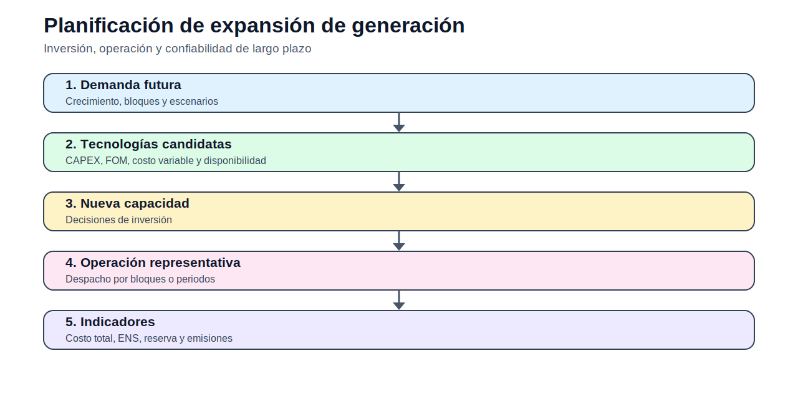

# 05 — Planificación de expansión de generación

> [Menú principal](../README.md) · [Índice del sitio](../docs/index.md) · [Ruta de aprendizaje](../docs/learning_path.md) · [Modelos](../docs/modelos.md) · [Casos](../docs/casos_de_estudio.md) · [Evaluación](../docs/evaluacion.md)

## 1. Propósito del bloque

El GEP decide qué capacidad de generación instalar, cuándo instalarla y cómo operarla de manera representativa para cubrir demanda futura, reserva y criterios económicos o ambientales.

## 2. Estructura conceptual

La capacidad acumulada de una tecnología candidata $k$ en el año $y$ puede escribirse como:

$$
Cap_{k,y} = Cap_{k,y-1} + Build_{k,y}
$$

El balance por bloque de carga es:

$$
\sum_{k \in K} Gen_{k,y,b} + \sum_{e \in E} Gen_{e,y,b} + ENS_{y,b}
= D_{y,b}
$$

La reserva firme exige:

$$
\sum_{k \in K} FC_k Cap_{k,y} + \sum_{e \in E} FC_e Cap^0_e
\geq (1+RM)D^{peak}_{y}
$$

## 3. Modelos del bloque

| Modelo | Acceso |
|---|---|
| GEP estático | [Abrir](modelos/01_modelo_gep_estatico_capacidad.md) |
| GEP con bloques | [Abrir](modelos/02_modelo_gep_bloques_carga.md) |
| GEP multianual | [Abrir](modelos/03_modelo_gep_multianual.md) |
---

> [Menú principal](../README.md) · [Índice del sitio](../docs/index.md) · [Ruta de aprendizaje](../docs/learning_path.md) · [Modelos](../docs/modelos.md) · [Casos](../docs/casos_de_estudio.md) · [Evaluación](../docs/evaluacion.md)
