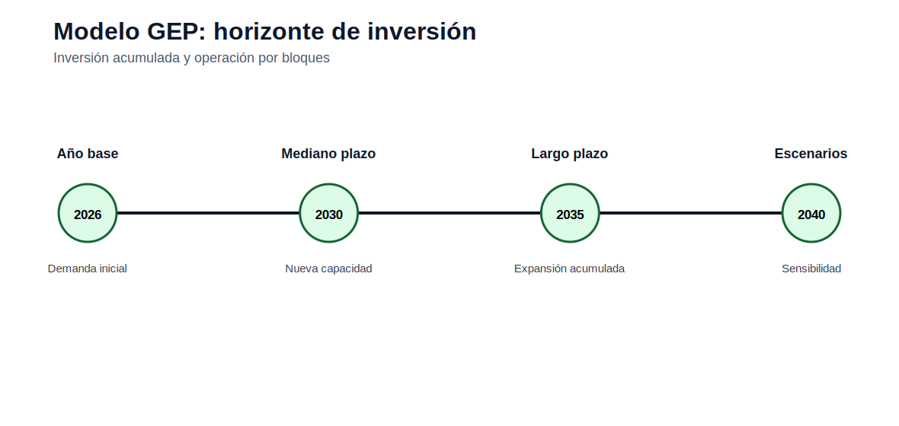

# Modelo GEP estático de capacidad

[Inicio](../../README.md) | [Bloque](../README.md) | [Modelos](README.md) | [Actividades](../actividades/README.md)



## 1. Idea del modelo

El GEP estático decide cuánta capacidad instalar para cubrir demanda y reserva en un periodo representativo.

## 2. Lectura didáctica previa

| Elemento | Interpretación |
|---|---|
| Decisión principal | Nueva capacidad por tecnología y periodo. |
| Operación | Generación por bloque o año. |
| Confiabilidad | Reserva firme y energía no servida. |
| Trade-off | Inversión vs operación vs ENS. |

## 3. Formulación matemática

### 3.1 Conjuntos

- `Y`: años.
- `B`: bloques de demanda.
- `K`: tecnologías candidatas.
- `E`: plantas existentes.

### 3.2 Índices

- `y ∈ Y`: año.
- `b ∈ B`: bloque.
- `k ∈ K`: tecnología.
- `e ∈ E`: planta existente.

### 3.3 Parámetros

- `Demand_{y,b}`.
- `Duration_b`.
- `CAPEX_k`.
- `FOM_k`.
- `VarCost_k`.
- `Avail_k`.
- `FirmCredit_k`.
- `VOLL`.
- `ReserveMargin`.

### 3.4 Variables de decisión

- `Build_{k,y}`: nueva capacidad.
- `Cap_{k,y}`: capacidad acumulada.
- `Gen_{k,y,b}`: generación.
- `ENS_{y,b}`: energía no servida.

### 3.5 Función objetivo

Minimizar inversión, costos fijos, costos operativos y penalización por energía no servida.

### 3.6 Restricciones

### R1. Balance por bloque

Generación y ENS cubren demanda en cada bloque.

```text
sum_k Gen_{k,y,b} + ENS_{y,b} = Demand_{y,b}
```
### R2. Capacidad disponible

La generación está limitada por capacidad y disponibilidad.

```text
Gen_{k,y,b} <= Cap_{k,y} Avail_k Duration_b
```
### R3. Evolución de capacidad

La capacidad acumulada incluye inversiones previas.

```text
Cap_{k,y} = Cap_{k,y-1} + Build_{k,y}
```
### R4. Reserva firme

La capacidad firme cubre demanda pico más margen.

```text
sum_k FirmCredit_k Cap_{k,y} >= (1+RM) PeakDemand_y
```
### R5. Presupuesto o máximo de construcción

Limita inversiones por tecnología/año si aplica.

```text
Build_{k,y} <= BuildMax_{k,y}
```

## 4. Construcción del archivo `.dat`

El `.dat` debe declarar años, bloques, tecnologías, demanda, duración, costos, disponibilidad, crédito firme y VOLL. Se recomienda estandarizar todo en USD o kUSD y documentarlo.

## 5. Interpretación del archivo `.out`

El `.out` debe separar nueva capacidad, capacidad acumulada, generación, ENS, costos y emisiones si existen.

## 6. Errores frecuentes

- Confundir potencia MW con energía MWh.
- No multiplicar por duración de bloque.
- Confundir capacidad nueva con acumulada.
- Asignar crédito firme completo a renovables variables sin justificarlo.

## 7. Actividades relacionadas

- [Actividad 05](../actividades/actividad_05_gep_multianual.md)
