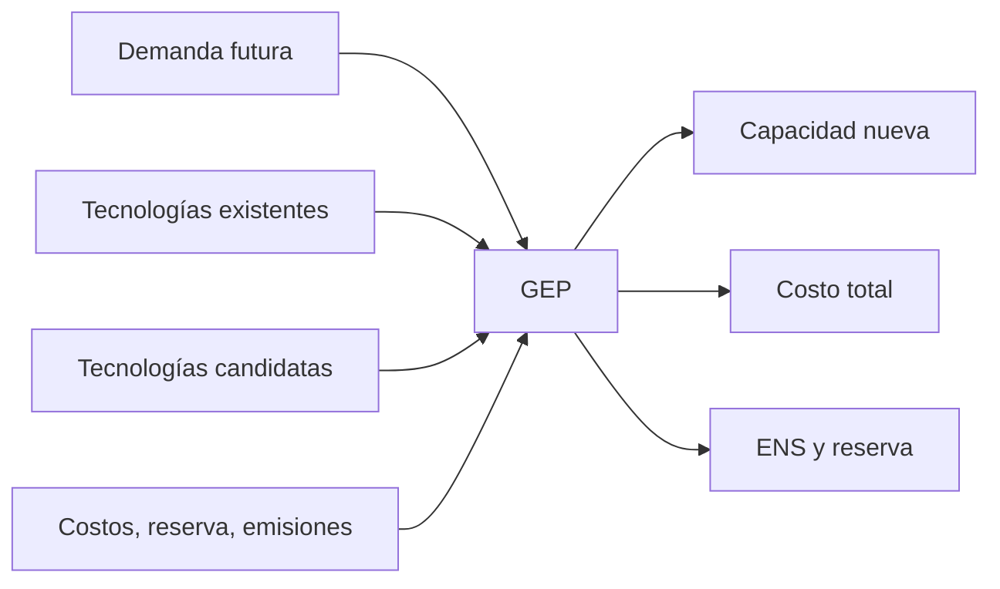

# GEP base: expansión de generación

> Nota: esta página describe la formulación matemática con fines didácticos. La implementación computacional puede variar según el solver, el lenguaje de modelado y las simplificaciones adoptadas en clase.

## Idea del modelo

El GEP decide cuánta capacidad nueva instalar por tecnología para atender la demanda futura con criterios de costo, reserva, emisiones y energía no servida.

## Conjuntos e índices

- $g\in\mathcal{G}$: tecnologías existentes y candidatas.
- $c\in\mathcal{CAND}\subset\mathcal{G}$: tecnologías candidatas.
- $t\in\mathcal{T}$: periodos o años de planificación.

## Parámetros

- $D_t$: demanda pico o demanda representativa en el periodo $t$.
- $P_g^0$: capacidad existente inicial.
- $IC_{g,t}^{max}$: máxima capacidad instalable de tecnología $g$ en $t$.
- $IC_g$: costo de inversión.
- $C_g$: costo operativo variable.
- $firm_g$: crédito de capacidad firme.
- $ef_g$: factor de emisiones.
- $RM$: margen de reserva.
- $C^{ENS}$: costo de energía no servida.

## Variables de decisión

- $P_{g,t}$: generación o despacho de tecnología $g$ en $t$.
- $I_{g,t}$: capacidad nueva instalada.
- $Cap_{g,t}$: capacidad acumulada disponible.
- $ENS_t$: energía o potencia no servida.

## Función objetivo

$$
\min \sum_{t\in\mathcal{T}}\sum_{g\in\mathcal{G}} C_gP_{g,t} + \sum_{t\in\mathcal{T}}\sum_{c\in\mathcal{CAND}}IC_c I_{c,t} + \sum_t C^{ENS}ENS_t
$$

## Restricciones principales

Capacidad acumulada:

$$
Cap_{g,t}=P_g^0+\sum_{\tau\leq t} I_{g,\tau}
$$

Balance:

$$
\sum_g P_{g,t}+ENS_t=D_t
$$

Límite de despacho:

$$
0\leq P_{g,t}\leq Cap_{g,t}
$$

Límite de inversión:

$$
0\leq I_{c,t}\leq IC_{c,t}^{max}
$$

Reserva firme:

$$
\sum_g firm_g Cap_{g,t}\geq (1+RM)D_t
$$

Emisiones:

$$
\sum_g ef_g P_{g,t}\leq Emi_t^{max}
$$

Energía no servida:

$$
0\leq ENS_t\leq ENS_t^{max}
$$

## Interpretación de resultados

El estudiante debe diferenciar inversión nueva, capacidad acumulada, generación despachada y ENS. Un plan con ENS cero no necesariamente garantiza seguridad de red si no se modelan flujos.

## Esquema conceptual

## Errores frecuentes

- Confundir capacidad construida con despacho.
- Suponer que la tecnología de menor costo variable siempre se construye.
- Interpretar ENS=0 como seguridad eléctrica completa.

## Actividad sugerida

Usar el caso Garver base para identificar qué tecnología candidata se vuelve atractiva bajo mayor demanda o menor disponibilidad hidroeléctrica.
