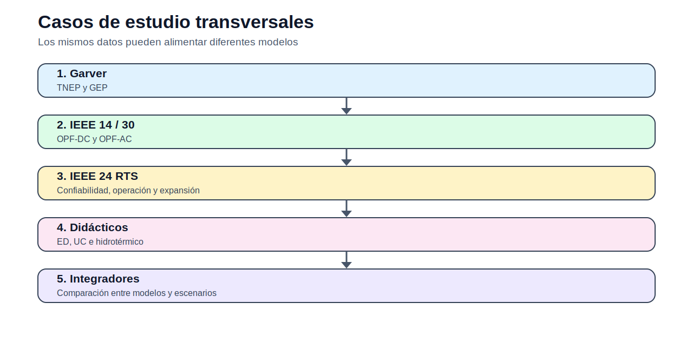

# 06 — Casos de estudio

> [Menú principal](../README.md) · [Índice del sitio](../docs/index.md) · [Ruta de aprendizaje](../docs/learning_path.md) · [Modelos](../docs/modelos.md) · [Casos](../docs/casos_de_estudio.md) · [Evaluación](../docs/evaluacion.md)

## 1. Propósito del bloque

Los casos de estudio permiten reutilizar datos entre modelos. Un mismo sistema puede servir para estudiar despacho, OPF, expansión de transmisión o expansión de generación, siempre que los datos sean adaptados correctamente.

## 2. Casos disponibles

| Caso | Uso principal | Acceso |
|---|---|---|
| Garver 6 barras | TNEP y GEP | [Abrir](garver_6_barras/README.md) |
| IEEE 14 barras | OPF | [Abrir](ieee_14_barras/README.md) |
| IEEE 24 RTS | TNEP / confiabilidad | [Abrir](ieee_24_rts/README.md) |
| IEEE 30 barras | OPF | [Abrir](ieee_30_barras/README.md) |
| Operación 3 generadores | ED y ED por tramos | [Abrir](operacion_3_generadores/README.md) |
| Hidrotérmico didáctico | Hidrotérmico y cascadas | [Abrir](hidrotermico_didactico/README.md) |

## 3. Criterio de uso

Antes de usar un caso, el estudiante debe identificar:

1. qué datos están disponibles;
2. qué modelo puede usarlos directamente;
3. qué datos requieren adaptación;
4. qué unidades se emplean;
5. qué supuestos se introducen.
---

> [Menú principal](../README.md) · [Índice del sitio](../docs/index.md) · [Ruta de aprendizaje](../docs/learning_path.md) · [Modelos](../docs/modelos.md) · [Casos](../docs/casos_de_estudio.md) · [Evaluación](../docs/evaluacion.md)
