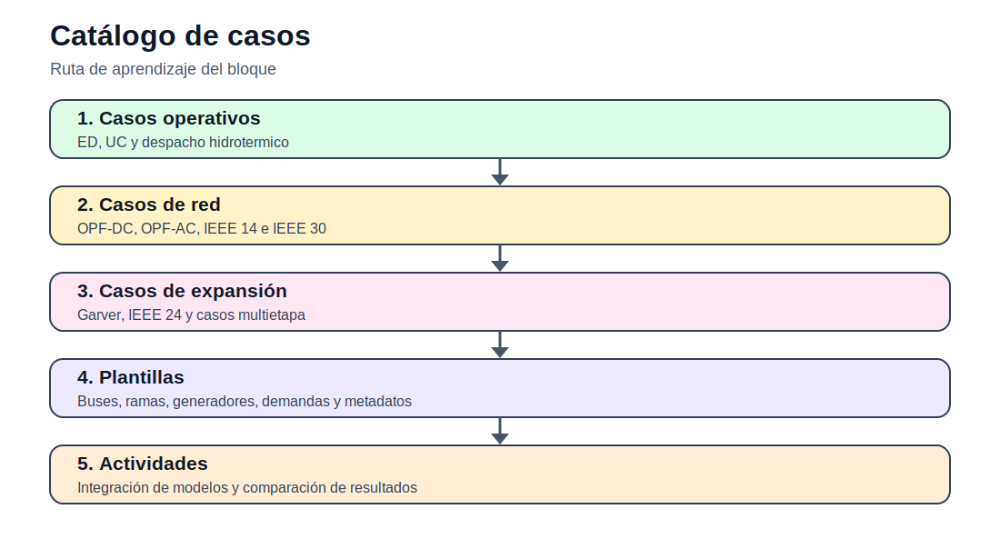

# 06 — Casos de estudio

[Inicio](../README.md) | [Sitio](../docs/index.md) | [Bloque anterior](../05_gep_expansion_generacion/README.md)

## Propósito del bloque

Agrupa los datos reutilizables empleados en los modelos y actividades. Cada caso debe documentar su propósito, fuente, estado de adaptación, datos disponibles y modelos recomendados.

## Mapa de contenidos

| Sección | Acceso |
|---|---|
| Garver 6 barras | [garver_6_barras/README.md](garver_6_barras/README.md) |
| IEEE 14 barras | [ieee_14_barras/README.md](ieee_14_barras/README.md) |
| IEEE 24 RTS | [ieee_24_rts/README.md](ieee_24_rts/README.md) |
| IEEE 30 barras | [ieee_30_barras/README.md](ieee_30_barras/README.md) |
| Plantillas | [plantillas/README.md](plantillas/README.md) |
| Actividades | [actividades/README.md](actividades/README.md) |

## Secuencia sugerida

1. Revisar los modelos matemáticos documentados.
2. Explorar los datos disponibles en casos o actividades.
3. Ejecutar los notebooks de exploración, cuando corresponda.
4. Desarrollar la actividad integradora del bloque.
5. Preparar informe técnico y archivo Excel de interpretación.

## Resultado esperado

Al finalizar este bloque, el estudiante debe poder explicar el problema, formular el modelo, construir datos, ejecutar la implementación computacional y defender técnicamente los resultados.
