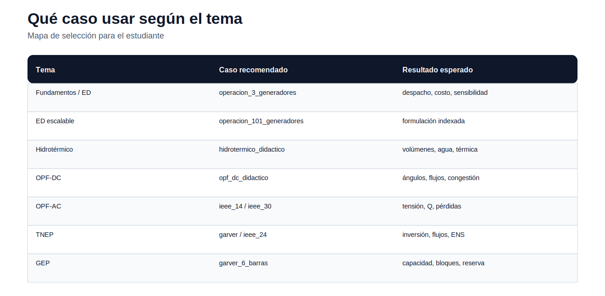

# 06 — Casos de estudio

> [Menú principal](../README.md) · [Ruta de aprendizaje](../docs/ruta_aprendizaje.md) · [Mapa de modelos](../docs/mapa_modelos.md) · [Mapa de casos](../docs/mapa_casos.md) · [Evaluación](../docs/evaluacion.md)

## Qué caso usar según el tema

| Tema | Caso recomendado | Qué se aprende |
|---|---|---|
| Fundamentos / ED | [operacion_3_generadores](operacion_3_generadores/README.md) | despacho básico, costos, sensibilidad |
| ED escalable | [operacion_101_generadores](operacion_101_generadores/README.md) | formulación indexada |
| Hidrotérmico | [hidrotermico_didactico](hidrotermico_didactico/README.md) | embalses, agua, térmica |
| OPF-DC | [opf_dc_didactico](opf_dc_didactico/README.md) | balance nodal, ángulos, congestión |
| OPF-AC | [ieee_14_barras](ieee_14_barras/README.md) / [ieee_30_barras](ieee_30_barras/README.md) | tensión, reactivos, pérdidas |
| TNEP | [garver_6_barras](garver_6_barras/README.md) / [ieee_24_rts](ieee_24_rts/README.md) | inversión, flujos, ENS |
| GEP | [garver_6_barras](garver_6_barras/README.md) | capacidad, bloques, reserva |

---

> [Menú principal](../README.md) · [Ruta de aprendizaje](../docs/ruta_aprendizaje.md) · [Mapa de modelos](../docs/mapa_modelos.md) · [Mapa de casos](../docs/mapa_casos.md) · [Evaluación](../docs/evaluacion.md)
