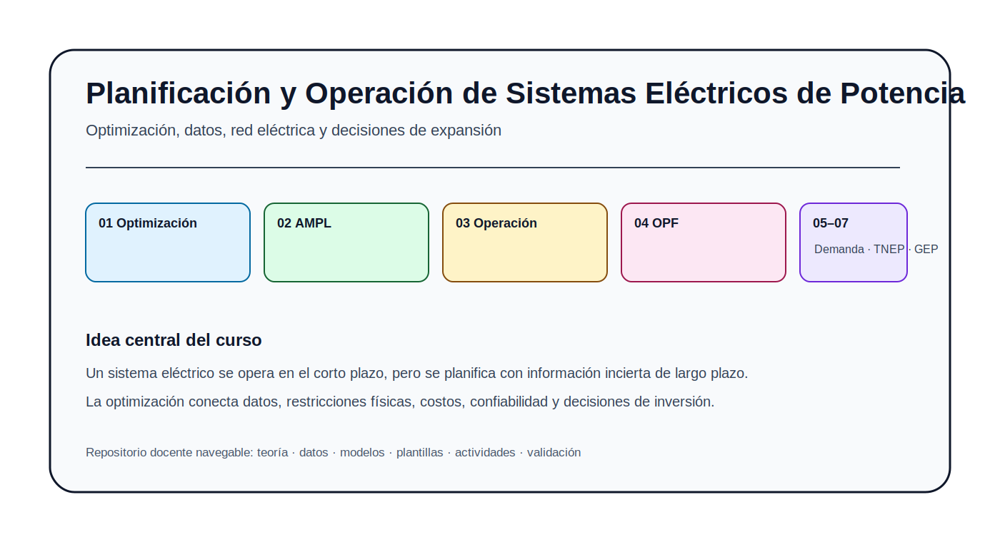
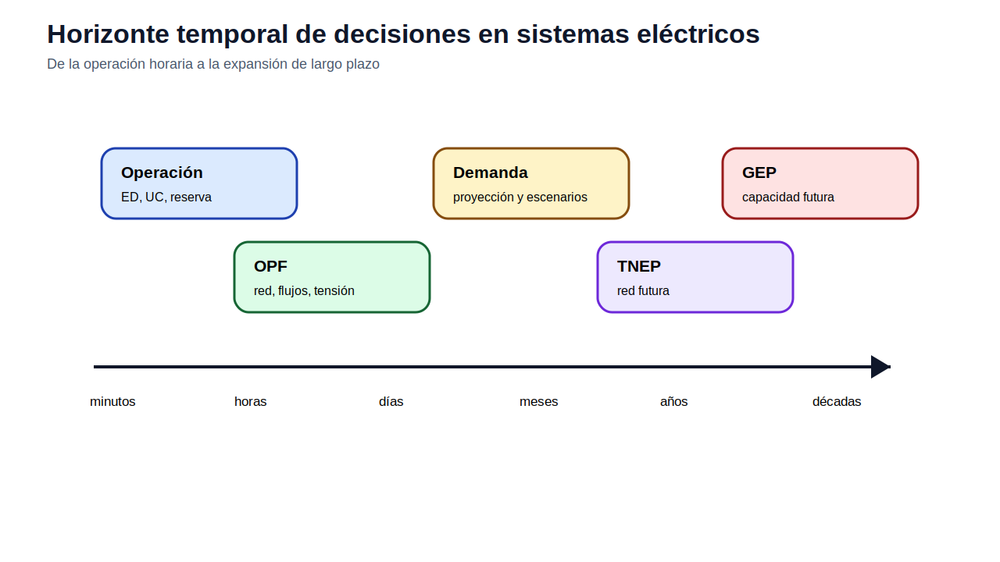
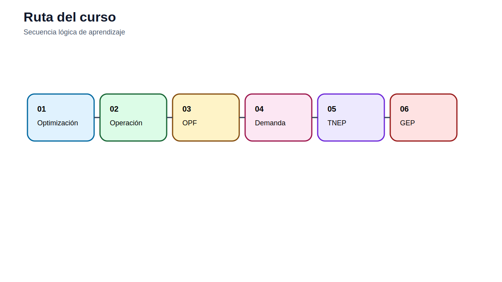
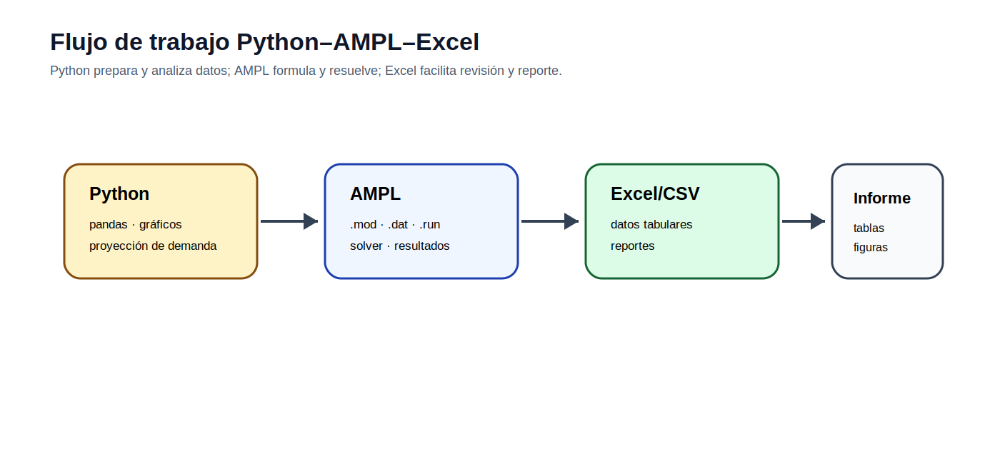

# Planificación y Operación de Sistemas Eléctricos de Potencia

[Guía docente](docs/guia_docente.md) · [Ruta de aprendizaje](docs/ruta_aprendizaje.md) · [Evaluación](docs/evaluacion.md) · [Auditoría](docs/AUDITORIA_V15.md)

## Presentación

Este repositorio acompaña el estudio de la operación y planificación de sistemas eléctricos de potencia mediante optimización matemática, análisis de datos, modelos computacionales y actividades reproducibles. La organización está pensada para que el estudiante avance desde la formulación de un problema de decisión hasta modelos de operación, flujo óptimo de potencia, proyección de demanda y expansión de infraestructura.

La intención no es entregar únicamente archivos de datos o ecuaciones aisladas. Cada módulo plantea una pregunta técnica, desarrolla los conceptos necesarios, presenta una formulación matemática, ofrece datos completos para construir archivos de trabajo y propone actividades con criterios de validación.

## Horizonte temporal de decisiones

En operación, la demanda se trata normalmente como dato conocido o pronosticado de corto plazo. En planificación, la demanda se convierte en una trayectoria futura bajo incertidumbre. Por esa razón, el módulo de proyección de demanda se ubica después de OPF y antes de TNEP/GEP.

## Ruta académica

| Módulo | Tema | Propósito | Enlace |
|---:|---|---|---|
| 01 | Fundamentos de optimización | formular decisiones, objetivos, restricciones y optimalidad | [Abrir](modulos/01_fundamentos_optimizacion/README.md) |
| 02 | Fundamentos de AMPL | pasar de la formulación matemática a archivos `.mod`, `.dat`, `.run` y Excel | [Abrir](modulos/02_fundamentos_ampl/README.md) |
| 03 | Operación de corto plazo | despacho económico, UC e hidrotérmico | [Abrir](modulos/03_operacion_corto_plazo/README.md) |
| 04 | Flujo óptimo de potencia | red, flujos, tensión y congestión | [Abrir](modulos/04_opf_flujo_optimo_potencia/README.md) |
| 05 | Proyección de demanda | escenarios futuros con Python | [Abrir](modulos/05_proyeccion_demanda/README.md) |
| 06 | Expansión de transmisión | líneas candidatas y refuerzos | [Abrir](modulos/06_tnep_expansion_transmision/README.md) |
| 07 | Expansión de generación | capacidad futura y tecnologías | [Abrir](modulos/07_gep_expansion_generacion/README.md) |

## Herramientas

- **Excel**: apoyo inicial para comprender tablas, balances y sensibilidad simple.
- **AMPL**: formulación algebraica, separación modelo/datos, ejecución con solver y reporte de resultados.
- **Python**: análisis de datos, proyección de demanda, notebooks y visualización.

## Casos integradores

| Caso | Uso | Enlace |
|---|---|---|
| Garver 6 barras | TNEP y GEP | [Abrir](casos_integradores/garver_6_barras/README.md) |
| IEEE 24 RTS | planificación avanzada | [Abrir](casos_integradores/ieee_24_rts/README.md) |

## Cómo usar el repositorio

1. Leer el README del módulo.
2. Estudiar la pregunta guía y la formulación base.
3. Revisar los datos completos.
4. Construir el `.dat` o el archivo CSV solicitado.
5. Ejecutar el flujo de trabajo propuesto.
6. Validar resultados con los criterios del modelo.
7. Elaborar un breve informe técnico.

## Auditoría

La versión v15 conserva la capa de datos completos de la v14 y agrega revisión narrativa, módulo AMPL, figuras orgánicas y criterios de validación. La verificación se encuentra en [docs/AUDITORIA_V15.md](docs/AUDITORIA_V15.md).
