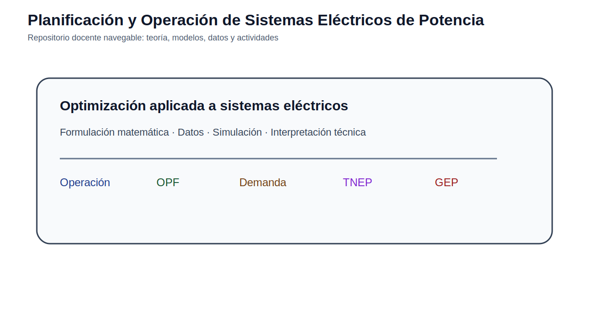
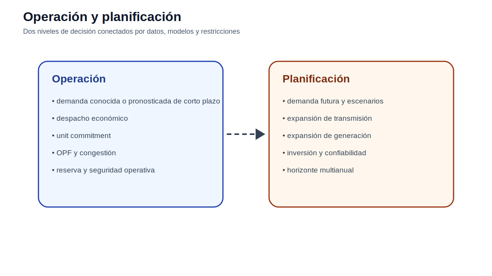

# Planificación y Operación de Sistemas Eléctricos de Potencia

[Guía docente](docs/guia_docente.md) · [Ruta de aprendizaje](docs/ruta_aprendizaje.md) · [Evaluación](docs/evaluacion.md)

## Presentación

Este repositorio reúne material docente para estudiar la operación y planificación de sistemas eléctricos de potencia mediante modelos de optimización, análisis de datos y casos didácticos. La estructura está pensada como un curso navegable: cada módulo inicia con teoría, luego presenta ejemplos o modelos, datos de trabajo y actividades.

## Operación y planificación de sistemas eléctricos

La operación se ocupa de decidir cómo usar los recursos disponibles en el corto plazo: generación, reserva, encendido de unidades, flujos de potencia, tensiones y congestión. La planificación estudia decisiones de largo plazo: crecimiento de demanda, expansión de transmisión, expansión de generación, suficiencia y confiabilidad.

## Horizonte temporal de las decisiones

La asignatura conecta decisiones que ocurren en distintos horizontes. En la operación, la demanda suele tratarse como un dato conocido o pronosticado de corto plazo. En planificación, la demanda futura se convierte en un insumo central y debe construirse mediante proyecciones y escenarios.

## Ruta del curso

| Módulo | Tema | Enlace |
|---:|---|---|
| 01 | Fundamentos de optimización | [Abrir](modulos/01_fundamentos_optimizacion/README.md) |
| 02 | Operación de corto plazo | [Abrir](modulos/02_operacion_corto_plazo/README.md) |
| 03 | Flujo óptimo de potencia | [Abrir](modulos/03_opf_flujo_optimo_potencia/README.md) |
| 04 | Proyección de demanda eléctrica | [Abrir](modulos/04_proyeccion_demanda/README.md) |
| 05 | Expansión de transmisión | [Abrir](modulos/05_tnep_expansion_transmision/README.md) |
| 06 | Expansión de generación | [Abrir](modulos/06_gep_expansion_generacion/README.md) |

## Python y AMPL

Python se utiliza para análisis de datos, proyección de demanda, construcción de escenarios y visualización. AMPL se utiliza para formular y resolver modelos de optimización de operación y planificación.

## Casos integradores

Los datos básicos de cada módulo se ubican dentro de la carpeta del módulo. Solo se mantienen como casos integradores aquellos que sirven a más de un tema:

| Caso | Uso |
|---|---|
| [Garver 6 barras](casos_integradores/garver_6_barras/README.md) | TNEP y GEP |
| [IEEE 24 RTS](casos_integradores/ieee_24_rts/README.md) | TNEP avanzado y planificación con mayor escala |

## Cómo usar este repositorio

1. Leer el README principal para ubicar el curso.
2. Entrar al módulo correspondiente.
3. Revisar la teoría antes del modelo.
4. Abrir los ejemplos o modelos del módulo.
5. Usar los datos del módulo.
6. Resolver la actividad.
7. Presentar resultados con tablas, figuras y análisis técnico.

## Licencia y citación

Consulte [LICENSE.md](LICENSE.md), [CITATION.cff](CITATION.cff) y [CONTRIBUTING.md](CONTRIBUTING.md).

## Nota de versión v14

Esta versión incorpora datos completos por modelo, explicación de funciones objetivo, explicación de restricciones y plantillas `.dat` sugeridas para que el estudiante pueda construir sus propios archivos de datos en AMPL a partir de la información suministrada.

## Auditoría v14

La verificación de datos, objetivos y restricciones se documenta en [docs/AUDITORIA_V14.md](docs/AUDITORIA_V14.md).
