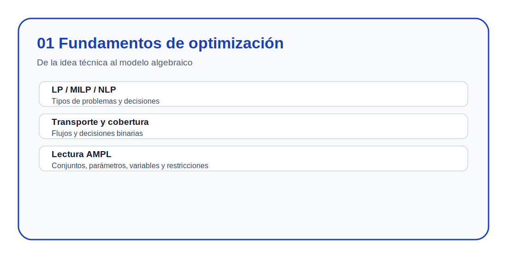
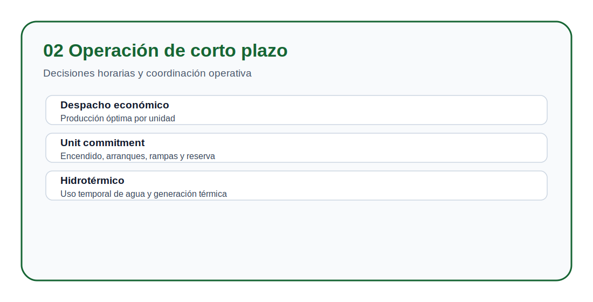
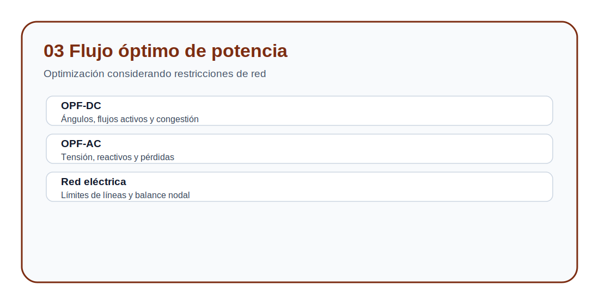
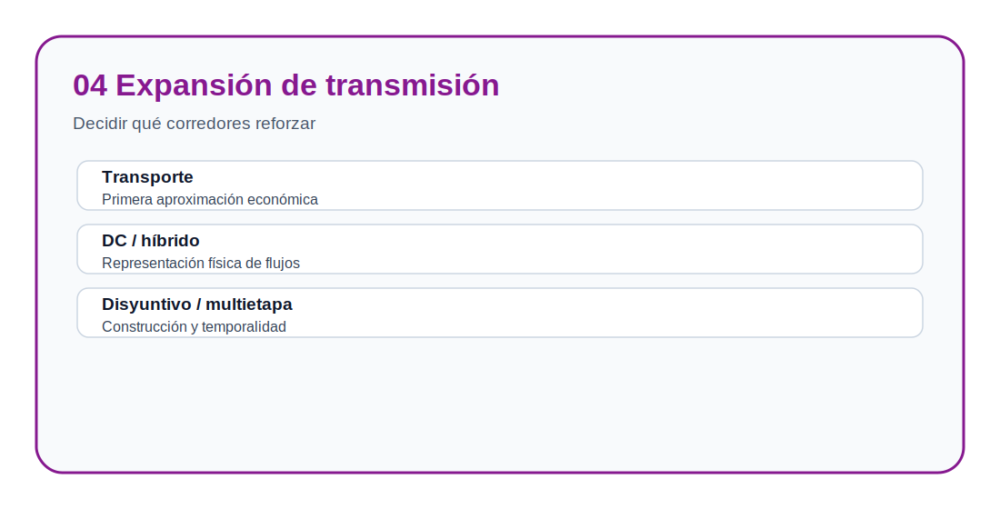
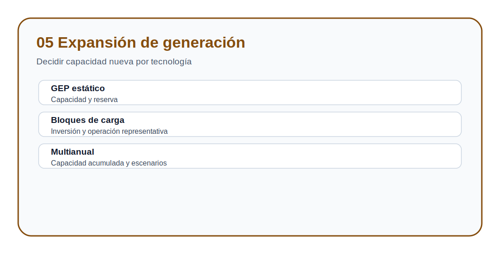
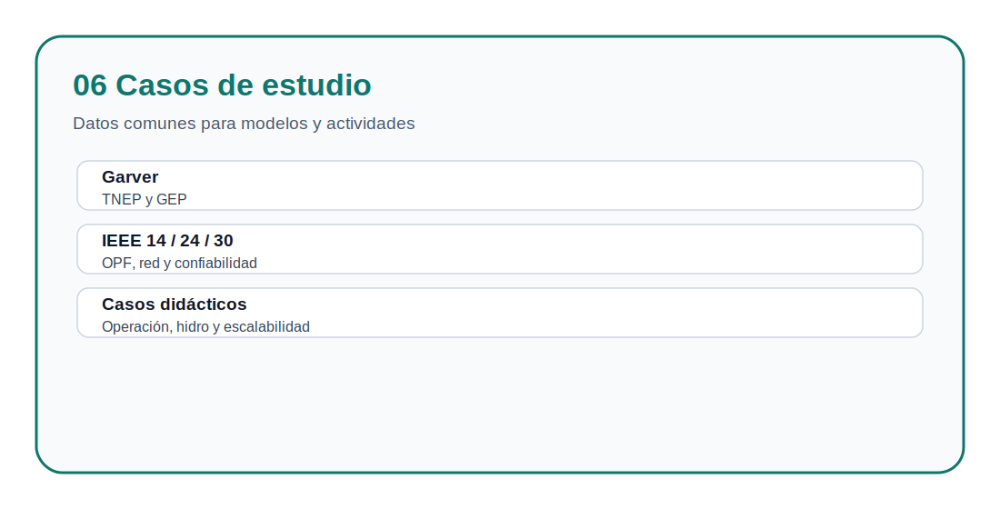

# Planificación y Operación de Sistemas Eléctricos de Potencia

> [Índice del sitio](docs/index.md) · [Ruta de aprendizaje](docs/learning_path.md) · [Modelos](docs/modelos.md) · [Casos](docs/casos_de_estudio.md) · [Evaluación](docs/evaluacion.md)

Repositorio académico de apoyo a la asignatura **Planificación y Operación de Sistemas Eléctricos de Potencia**. Organiza formulaciones matemáticas, datos de prueba, casos de estudio, notebooks de exploración y actividades de evaluación para estudiar problemas de operación y planificación de sistemas eléctricos.

El material está estructurado para que el estudiante pueda transitar desde la formulación matemática hasta la interpretación técnica de resultados computacionales.

## Bienvenida al curso

Este repositorio funciona como una guía de laboratorio y como un mapa de aprendizaje. Cada bloque contiene tres niveles de trabajo:

1. **Modelos**: explicación conceptual y formulación matemática.
2. **Casos de estudio**: datos reutilizables para implementar y comparar modelos.
3. **Actividades**: desarrollo aplicado donde el estudiante construye sus archivos `.dat`, `.mod`, `.run`, `.out`, procesa resultados en Excel y redacta conclusiones técnicas.

## Propósito

- Presentar modelos de optimización aplicados a sistemas eléctricos de potencia.
- Organizar casos de prueba reutilizables para operación, OPF, TNEP y GEP.
- Facilitar el análisis de datos mediante notebooks y archivos tabulares.
- Apoyar actividades de clase, laboratorios, evaluación formativa y discusión técnica.
- Promover una lectura crítica de las soluciones obtenidas mediante herramientas computacionales.

## Mapa académico del repositorio

## Estructura temática

| Bloque | Carpeta | Contenido principal | Finalidad didáctica |
|---|---|---|---|
| 1 | [`01_fundamentos_optimizacion`](01_fundamentos_optimizacion/README.md) | LP, MILP, NLP, transporte y localización | Comprender la formulación matemática antes de estudiar aplicaciones eléctricas |
| 2 | [`02_operacion_corto_plazo`](02_operacion_corto_plazo/README.md) | ED, ED por tramos, UC, despacho hidrotérmico | Modelar decisiones operativas de corto plazo |
| 3 | [`03_opf_flujo_optimo_potencia`](03_opf_flujo_optimo_potencia/README.md) | OPF-DC, OPF-AC | Relacionar optimización con restricciones de red |
| 4 | [`04_tnep_expansion_transmision`](04_tnep_expansion_transmision/README.md) | Transporte, DC, híbrido, lineal disyuntivo, multietapa | Decidir expansión de red y comparar formulaciones |
| 5 | [`05_gep_expansion_generacion`](05_gep_expansion_generacion/README.md) | GEP estático, bloques de carga, multianual | Decidir expansión de generación por tecnología y periodo |
| 6 | [`06_casos_de_estudio`](06_casos_de_estudio/README.md) | Garver, IEEE 14, IEEE 24 RTS, IEEE 30, sistemas didácticos | Reutilizar datos comunes en distintos modelos |

## Navegación visual por bloques

| Fundamentos | Operación |
|---|---|
|  |  |

| OPF | TNEP |
|---|---|
|  |  |

| GEP | Casos de estudio |
|---|---|
|  |  |

## Horizontes temporales

La asignatura estudia decisiones que ocurren en distintos horizontes temporales: desde la operación de minutos u horas hasta la planificación de expansión de varios años. Esta separación ayuda a identificar qué variables son operativas, qué variables son de inversión y qué restricciones deben considerarse en cada escala.

## Flujo de trabajo sugerido

1. Revisar la formulación matemática del bloque correspondiente.
2. Identificar conjuntos, índices, parámetros, variables, función objetivo y restricciones.
3. Explorar el caso de estudio mediante archivos de datos y notebooks.
4. Construir los archivos de trabajo indicados por la actividad.
5. Ejecutar el modelo computacional indicado por el docente.
6. Comparar resultados, validar supuestos y responder las actividades.
7. Elaborar conclusiones técnicas sobre costo, operación, factibilidad, confiabilidad y expansión.

## Accesos rápidos

| Recurso | Enlace |
|---|---|
| Sitio navegable del repositorio | [`docs/index.md`](docs/index.md) |
| Ruta de aprendizaje | [`docs/learning_path.md`](docs/learning_path.md) |
| Manual del laboratorio | [`docs/manual_laboratorio.md`](docs/manual_laboratorio.md) |
| Catálogo de modelos | [`docs/modelos.md`](docs/modelos.md) |
| Casos de estudio | [`docs/casos_de_estudio.md`](docs/casos_de_estudio.md) |
| Evaluación por bloques | [`docs/evaluacion.md`](docs/evaluacion.md) |

## Sitio web del repositorio

La carpeta [`docs`](docs/) contiene una versión navegable de la guía del repositorio para publicarla mediante GitHub Pages.

## Licencia y citación

Este repositorio incluye archivos de licencia, citación y contribución para facilitar su uso académico, trazabilidad y mantenimiento:

- [`LICENSE.md`](LICENSE.md)
- [`CITATION.cff`](CITATION.cff)
- [`CONTRIBUTING.md`](CONTRIBUTING.md)
---

> [Índice del sitio](docs/index.md) · [Ruta de aprendizaje](docs/learning_path.md) · [Modelos](docs/modelos.md) · [Casos](docs/casos_de_estudio.md) · [Evaluación](docs/evaluacion.md)
