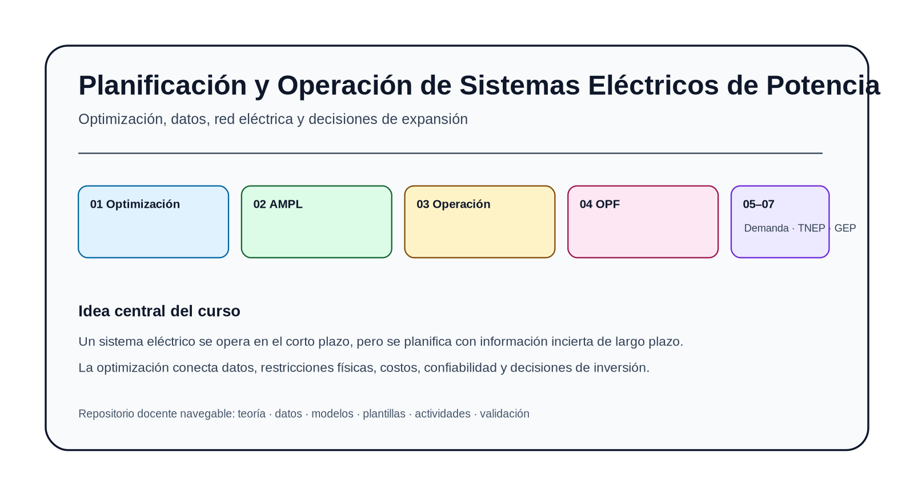
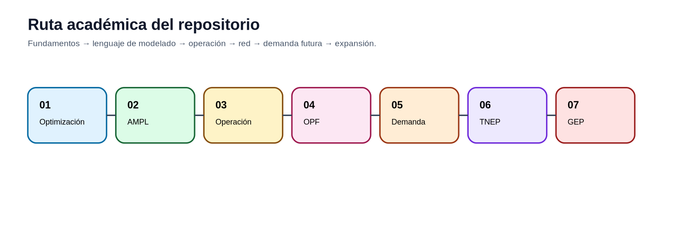
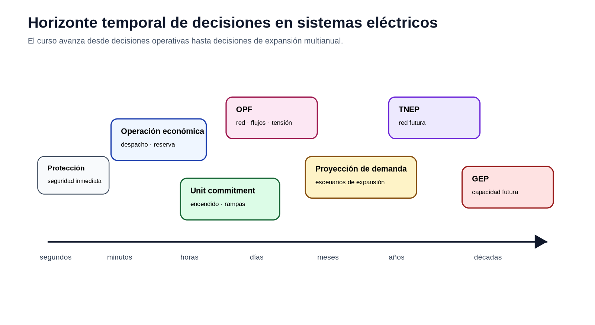
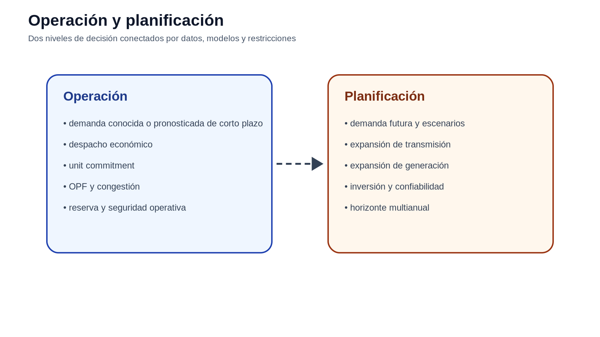
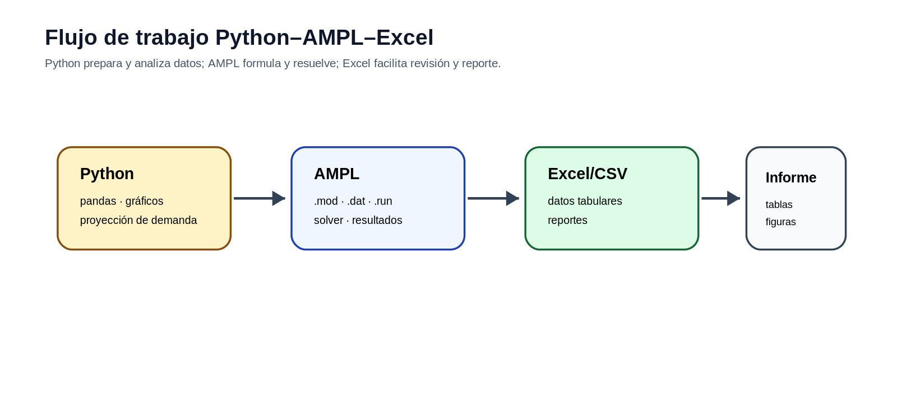

# Planificación y Operación de Sistemas Eléctricos de Potencia

Este material acompaña el desarrollo de la asignatura desde la formulación matemática hasta la implementación computacional de problemas de operación y planificación de sistemas eléctricos de potencia. Cada tema se presenta como una práctica de ingeniería: se parte de un enunciado, se identifican datos y restricciones, se escribe el modelo algebraico y se preparan los archivos de trabajo que el estudiante debe construir.

El repositorio no entrega modelos AMPL resueltos. Las tablas incluidas en los enunciados y en la carpeta `datos/` son el punto de partida para que cada estudiante elabore sus propios archivos `.mod`, `.dat` y `.run`, ejecute los casos y defienda técnicamente sus resultados.

## Mapa del curso

## Horizonte temporal de los problemas eléctricos

## Operación y planificación

## Flujo de trabajo computacional

## Navegación

| Módulo | Tema | Enlace |
|---|---|---|
| 01 | Fundamentos de optimización | [Abrir](modulos/01_optimizacion/README.md) |
| 02 | AMPL para modelos eléctricos | [Abrir](modulos/02_ampl/README.md) |
| 03 | Despacho económico y operación de corto plazo | [Abrir](modulos/03_despacho_economico/README.md) |
| 04 | Flujo óptimo de potencia | [Abrir](modulos/04_opf/README.md) |
| 05 | Proyección de demanda | [Abrir](modulos/05_demanda/README.md) |
| 06 | Expansión de transmisión | [Abrir](modulos/06_tnep/README.md) |
| 07 | Expansión de generación | [Abrir](modulos/07_gep/README.md) |

## Forma de trabajo

En cada módulo se debe entregar un informe breve con la formulación utilizada, los archivos construidos por el estudiante y la interpretación técnica de la solución. El informe no debe limitarse a capturas del solver: debe comprobar balances, límites, unidades y coherencia de los resultados.
