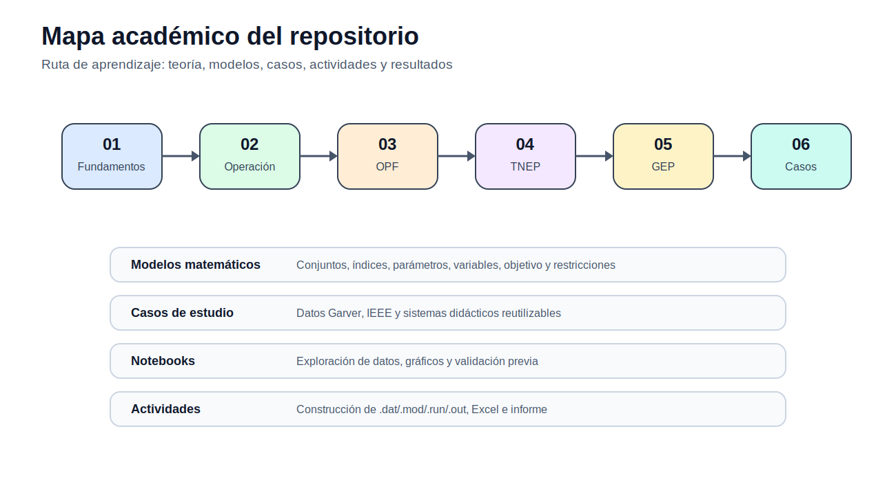

# Índice del sitio

[Menú principal](../README.md) · [Ruta de aprendizaje](../docs/ruta_aprendizaje.md) · [Mapa de modelos](../docs/mapa_modelos.md) · [Mapa de casos](../docs/mapa_casos.md) · [Evaluación](../docs/evaluacion.md)

## Acceso por bloques

| Tema | Enlace |
|---|---|
| Fundamentos de optimización | [Abrir](../01_fundamentos_optimizacion/README.md) |
| Operación de corto plazo | [Abrir](../02_operacion_corto_plazo/README.md) |
| Flujo óptimo de potencia | [Abrir](../03_opf_flujo_optimo_potencia/README.md) |
| Expansión de transmisión | [Abrir](../04_tnep_expansion_transmision/README.md) |
| Expansión de generación | [Abrir](../05_gep_expansion_generacion/README.md) |
| Casos de estudio | [Abrir](../06_casos_de_estudio/README.md) |
