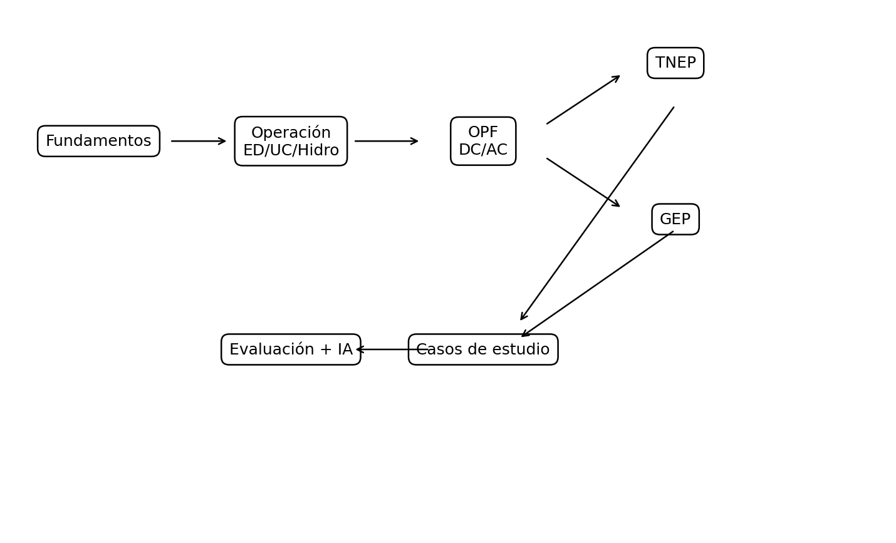
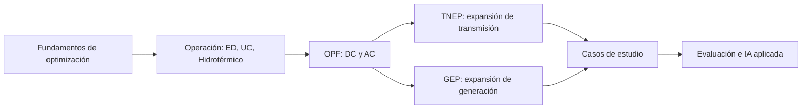

# Planificación y Operación de Sistemas Eléctricos de Potencia

Este sitio acompaña el repositorio público de la asignatura. Su objetivo es ofrecer una entrada didáctica a modelos de optimización para sistemas eléctricos de potencia mediante casos, guías, notebooks y actividades.

## Acceso rápido

- [Guía rápida del repositorio](guia_rapida.md)
- [Actividad interactiva CDD](actividad_cdd.md)
- [Recursos interactivos](recursos_interactivos.md)
- [Evaluación propuesta](evaluacion.md)

## Mapa del repositorio

## Bloques de aprendizaje

## Filosofía del repositorio

El repositorio no reemplaza la clase. Funciona como laboratorio abierto para:

- organizar datos de entrada;
- documentar modelos matemáticos;
- preparar actividades de interpretación;
- usar IA como apoyo docente y objeto de revisión crítica;
- promover reproducibilidad sin publicar necesariamente todos los modelos completos.
