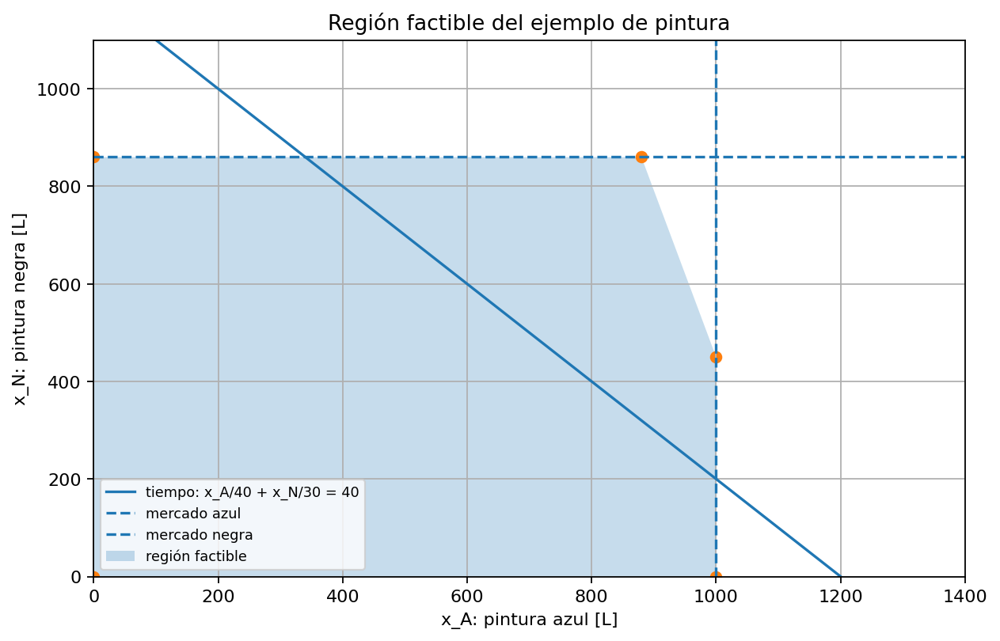

# 01 — Fundamentos de optimización

[Menú principal](../../README.md) · [Actividades](actividades/README.md) · [Datos](datos/)

## Pregunta guía

¿Cómo se transforma una decisión técnica en un modelo matemático que pueda resolverse de manera sistemática?

## Contexto técnico

Una empresa, un operador eléctrico o un planificador rara vez decide con libertad total. Normalmente decide bajo límites: presupuesto, capacidad, demanda, disponibilidad, seguridad, red eléctrica o recursos naturales. La optimización permite representar esa situación mediante variables de decisión, una función objetivo y restricciones.

El módulo inicia con problemas simples que incluso pueden explorarse en Excel. Luego introduce la idea de región factible, optimalidad, restricciones activas, problemas no lineales y condiciones KKT. El objetivo no es memorizar conceptos aislados, sino entender cuándo aparecen y para qué sirven.

## Secuencia conceptual

```text
decisión técnica
→ variables de decisión
→ función objetivo
→ restricciones
→ datos
→ región factible
→ solución óptima
→ interpretación y sensibilidad
```

## Primer hilo conductor: el ejemplo de pintura

La fábrica de pintura permite ver todos los elementos básicos: variables, objetivo, restricciones, datos, región factible e interpretación económica.



## De programación lineal a problemas no lineales

En programación lineal, el óptimo suele ubicarse en un vértice de la región factible. Sin embargo, muchos problemas de ingeniería no son lineales: pérdidas eléctricas, OPF-AC, costos cuadráticos o relaciones hidráulicas. En esos casos aparecen derivadas, gradiente, Hessiana y condiciones de optimalidad.

## Clasificación de problemas

| Tipo | Qué significa | Ejemplo del curso |
|---|---|---|
| LP | lineal y continuo | pintura, acero, transporte |
| MILP | lineal con variables binarias/enteras | antenas, unit commitment, TNEP |
| QP | objetivo cuadrático | despacho con costos cuadráticos |
| NLP | funciones no lineales | OPF-AC |
| MINLP | no lineal con enteras | expansión avanzada |
| SOCP/SDP | relajaciones convexas | OPF avanzado |

## Ejemplos del módulo

| Ejemplo | Propósito | Enlace |
|---|---|---|
| Fábrica de pintura | LP y región factible | [Abrir](ejemplos/01_fabrica_pintura.md) |
| Producción de acero | LP con datos industriales | [Abrir](ejemplos/02_produccion_acero.md) |
| Transporte de energía | balances y costos | [Abrir](ejemplos/03_transporte_energia.md) |
| Localización de antenas | variables binarias | [Abrir](ejemplos/04_localizacion_antenas.md) |
| Forma matricial | estructura algebraica | [Abrir](ejemplos/05_forma_matricial.md) |

## Validación del aprendizaje

Al terminar este módulo, el estudiante debe poder identificar qué se decide, qué se optimiza, qué restricciones limitan la decisión, qué datos se requieren, qué significa factibilidad y qué tipo de problema se está formulando.

---

[Menú principal](../../README.md) · [Actividades](actividades/README.md) · [Datos](datos/)
