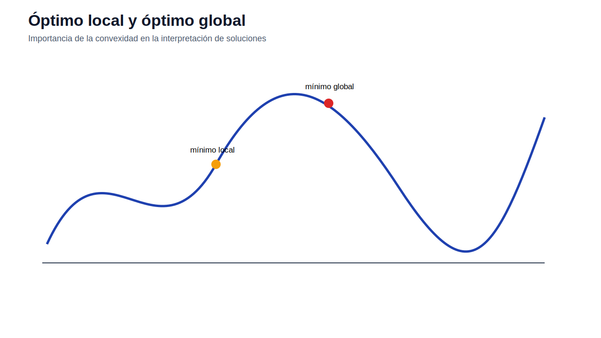
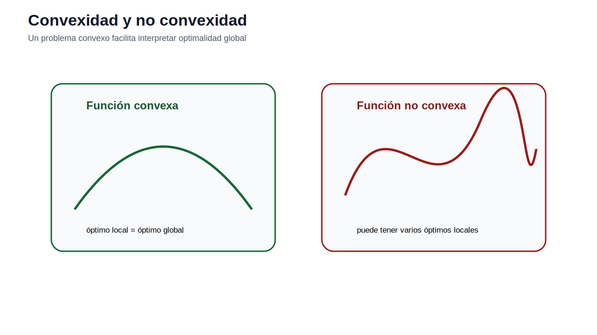
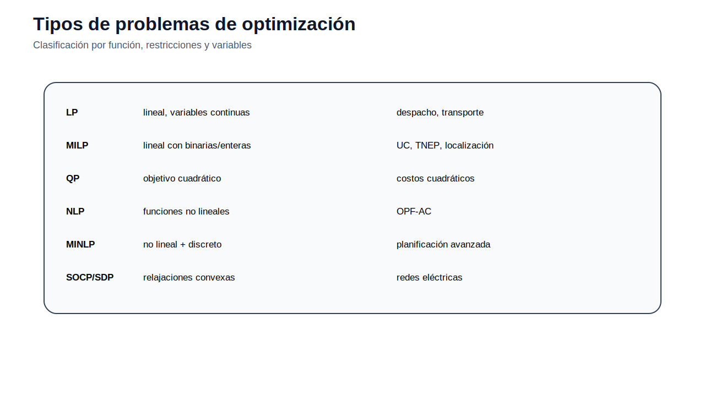
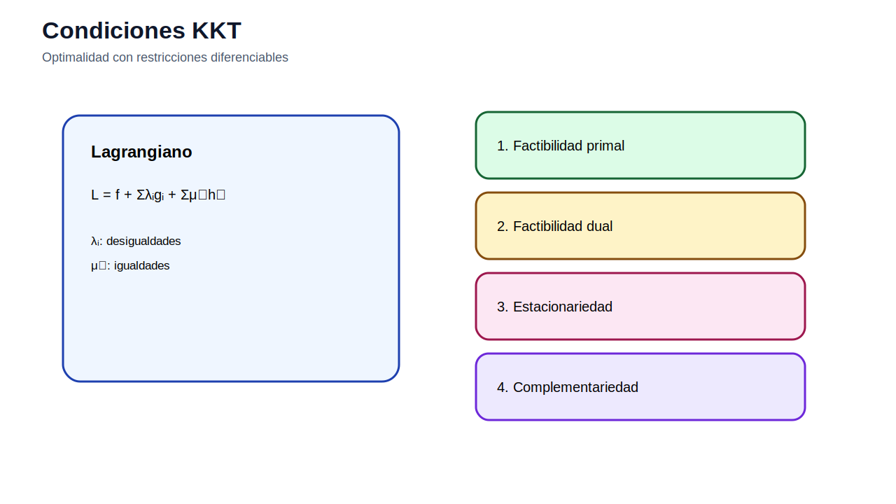

# 01 — Fundamentos de optimización

[Menú principal](../../README.md) · [Actividades](actividades/README.md) · [Datos](datos/)

## Introducción conceptual

La optimización sirve para seleccionar la mejor alternativa entre varias decisiones posibles cuando existen objetivos y restricciones. En sistemas eléctricos, esta lógica aparece al decidir cuánto generar, qué unidad encender, qué línea construir, qué tecnología instalar o cómo usar recursos limitados.

## Fundamentos del tema

Un modelo de optimización se construye identificando variables de decisión, parámetros conocidos, función objetivo, restricciones y dominio de las variables. El estudiante debe reconocer si el problema es lineal, entero mixto, no lineal o convexo; también debe interpretar región factible, restricciones activas, multiplicadores duales y sensibilidad.

## Figuras técnicas principales

Resume el paso desde el problema real hasta la interpretación de resultados.

Explica factibilidad, vértices, holguras y restricciones activas.

Diferencia optimalidad local y global.

Introduce pendiente y curvatura.

Distingue problemas convexos y no convexos.

Clasifica LP, MILP, QP, NLP, MINLP y relajaciones.

Resume factibilidad, estacionariedad y complementariedad.

Conecta restricciones activas con precios sombra.

## Ecuaciones base

### Problema general

$$
\min_x f(x)
$$

Representa el criterio de decisión.

### Restricciones generales

$$
g_i(x)\leq 0,\quad h_j(x)=0,\quad x\in\mathcal{X}
$$

Definen factibilidad y dominio.

### Lagrangiano

$$
\mathcal{L}(x,\lambda,\mu)=f(x)+\sum_i\lambda_i g_i(x)+\sum_j\mu_jh_j(x)
$$

Permite formular condiciones KKT.

### Complementariedad

$$
\lambda_i g_i(x^*)=0
$$

Si una restricción no está activa, su multiplicador es cero.

## Ejemplos o modelos del módulo

| Recurso | Qué aporta | Acceso |
|---|---|---|
| Fábrica de pintura | programación lineal y región factible | [Abrir](ejemplos/01_fabrica_pintura.md) |
| Producción de acero | programación lineal con datos industriales | [Abrir](ejemplos/02_produccion_acero.md) |
| Transporte de energía | flujos, oferta y demanda | [Abrir](ejemplos/03_transporte_energia.md) |
| Localización de antenas | programación entera mixta | [Abrir](ejemplos/04_localizacion_antenas.md) |
| Forma matricial | estructura algebraica de un solver | [Abrir](ejemplos/05_forma_matricial.md) |

## Capa de datos de la v14

Las páginas de ejemplos/modelos del módulo incluyen datos suficientes para construir archivos de datos de trabajo. En los modelos AMPL se incluye una plantilla `.dat` sugerida en el propio README del modelo; en el módulo de demanda se especifican plantillas CSV para Python y archivos de salida hacia TNEP/GEP.

## Actividad del módulo

Revise [actividades/README.md](actividades/README.md) y desarrolle la actividad principal: **Actividad 01 — Fundamentos de optimización**.

---

[Menú principal](../../README.md) · [Actividades](actividades/README.md) · [Datos](datos/)
