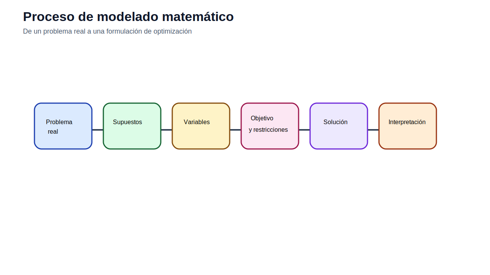
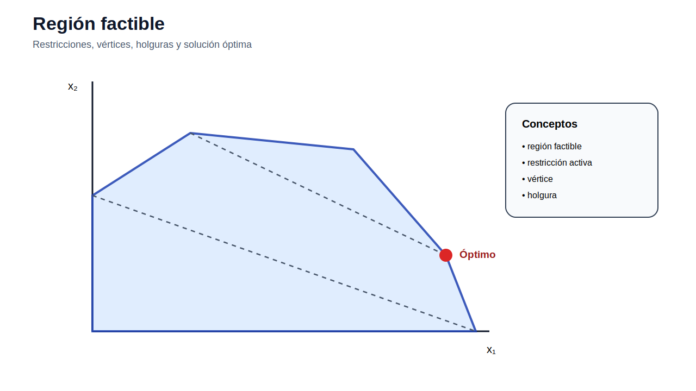

[← Inicio](../../README.md) | [Siguiente módulo →](../02_ampl/README.md)

# Módulo 01 — Fundamentos de optimización

## Objetivo del módulo

El objetivo del módulo es construir la base matemática necesaria para formular problemas de operación y planificación de sistemas eléctricos. Antes de usar AMPL, Python o un solver, el estudiante debe poder identificar variables de decisión, función objetivo, restricciones, parámetros, unidades, dominio de las variables y criterio de optimalidad.

Este módulo no trata todavía economía de la energía ni planificación eléctrica. Su propósito es entender la optimización como lenguaje técnico para representar decisiones sujetas a restricciones.

## Contenidos

1. [De una decisión técnica a un modelo matemático](#de-una-decisión-técnica-a-un-modelo-matemático)
2. [Programación lineal](#programación-lineal)
3. [Forma matricial](#forma-matricial)
4. [Dualidad y sensibilidad](#dualidad-y-sensibilidad)
5. [Programación entera mixta](#programación-entera-mixta)
6. [QP, NLP y condiciones KKT](#qp-nlp-y-condiciones-kkt)
7. [Solvers y validación](#solvers-y-validación)
8. [Archivos incluidos](#archivos-incluidos)
9. [Actividad propuesta](#actividad-propuesta)

## De una decisión técnica a un modelo matemático

Un problema de optimización aparece cuando existe una decisión que puede tomar varios valores posibles y se requiere elegir la mejor alternativa bajo un criterio explícito. En ingeniería eléctrica, la decisión puede ser cuánto generar, qué línea construir, qué tecnología instalar, qué demanda asignar a cada fuente o qué combinación de recursos utilizar.

La forma general de un modelo es:

$$
\min_x f(x)
$$

sujeto a:

$$
g_i(x) \leq 0, \qquad h_j(x)=0, \qquad x \in X
$$

donde $x$ representa las variables de decisión, $f(x)$ es la función objetivo, $g_i(x)$ son restricciones de desigualdad, $h_j(x)$ son restricciones de igualdad y $X$ define el dominio: variables continuas, enteras, binarias, no negativas o acotadas.

La parte más importante de la formulación no es escribir ecuaciones largas, sino reconocer qué representa cada ecuación. Una restricción de balance impone conservación. Una restricción de capacidad impone límite físico. Una restricción lógica activa o desactiva una decisión. Una restricción de presupuesto limita recursos disponibles. Si una ecuación no tiene interpretación técnica clara, probablemente el modelo está mal formulado.



## Programación lineal

Un problema lineal tiene función objetivo lineal y restricciones lineales. Su forma compacta es:

$$
\min c^T x
$$

sujeto a:

$$
Ax \leq b, \qquad x \geq 0
$$

La linealidad implica proporcionalidad y aditividad. Si producir una unidad consume dos horas de un recurso, producir diez unidades consume veinte horas. Esta hipótesis permite representar muchos problemas de asignación, mezcla, transporte, balance de energía y despacho simplificado.

La región factible es el conjunto de soluciones que cumplen todas las restricciones. En un problema lineal convexo, si existe una solución óptima finita, al menos una solución óptima se encuentra en un vértice de la región factible. Esta propiedad explica por qué los métodos simplex y de punto interior pueden resolver problemas lineales de gran tamaño.



Una restricción activa es una restricción que se cumple con igualdad en la solución óptima. Técnicamente indica que el recurso asociado está agotado o que el límite físico se alcanzó. En modelos eléctricos, esto se observará más adelante en límites de generación, límites térmicos de líneas, restricciones de reserva o límites de inversión.

## Forma matricial

La forma matricial permite entender que un modelo escrito con índices se transforma en una matriz para el solver. Por ejemplo:

$$
\min c^T x
$$

$$
Ax=b
$$

$$
l \leq x \leq u
$$

Aquí $A$ contiene los coeficientes técnicos, $b$ los valores del lado derecho, $c$ los coeficientes de la función objetivo y $l,u$ las cotas inferiores y superiores. AMPL, GAMS, Pyomo o JuMP permiten escribir el modelo con conjuntos e índices; internamente, el solver recibe una representación matricial.

Esta idea es esencial para evitar errores de dimensión. Si una restricción está indexada por periodos, debe existir un balance por cada periodo. Si una variable está indexada por generadores y horas, el número de variables crece como $|G|\times|T|$. En planificación, agregar años, escenarios y bloques de carga aumenta rápidamente el tamaño del modelo.

## Dualidad y sensibilidad

La dualidad asocia a cada restricción del problema primal una variable dual. En términos prácticos, una variable dual mide cuánto cambiaría el valor objetivo si se relaja marginalmente una restricción. Por eso se interpreta como precio sombra o valor marginal de un recurso.

En un problema de minimización con una restricción de demanda, el dual puede interpretarse como el costo marginal de atender una unidad adicional. En una restricción de capacidad, puede indicar cuánto se reduciría el costo si se incrementa la capacidad disponible. Esta lectura será clave en despacho económico, OPF y expansión.

La sensibilidad analiza la estabilidad de la solución ante cambios en datos: costos, demanda, capacidad, disponibilidad o presupuesto. Un modelo con solución muy sensible debe revisarse con escenarios, rangos de parámetros o análisis de robustez.


## Programación entera mixta

La programación entera mixta incorpora variables continuas y variables discretas. Una variable binaria se define como:

$$
y \in \{0,1\}
$$

Esta variable representa decisiones sí/no: construir una línea, encender una unidad, instalar una tecnología, seleccionar una ubicación o activar una alternativa. El modelo se vuelve más difícil porque la región factible deja de ser puramente continua.

Una relación común es:

$$
x \leq M y
$$

Si $y=0$, entonces $x=0$. Si $y=1$, entonces $x$ puede tomar valores hasta $M$. Esta formulación se conoce como activación mediante Big-M. El valor de $M$ debe ser suficientemente grande para no cortar soluciones factibles, pero no excesivo, porque puede debilitar la relajación lineal y dificultar la solución del MILP.

La programación entera mixta se resolverá mediante métodos como branch-and-bound o branch-and-cut. El solver explora decisiones discretas y resuelve relajaciones lineales para probar optimalidad.

## QP, NLP y condiciones KKT

No todos los problemas eléctricos son lineales. Los costos térmicos pueden representarse con funciones cuadráticas:

$$
C(P)=a+bP+cP^2
$$

El costo marginal asociado es:

$$
MC(P)=\frac{dC}{dP}=b+2cP
$$

Si la función objetivo es cuadrática y las restricciones son lineales, se tiene un QP. Si existen ecuaciones no lineales, como las de flujo AC, pérdidas o restricciones trigonométricas, se tiene un NLP.

Las condiciones KKT combinan factibilidad primal, factibilidad dual, estacionariedad y complementariedad. En problemas convexos, estas condiciones caracterizan el óptimo global. En problemas no convexos, pueden describir óptimos locales, por lo que la inicialización y la estructura del modelo importan.

## Solvers y validación

El modelador escribe el problema; el solver lo resuelve. AMPL no es el solver, sino el lenguaje algebraico que comunica el modelo al solver. Por eso se debe distinguir entre errores de formulación, errores de datos, errores de sintaxis y límites del método de solución.

Estados frecuentes:

| Estado | Lectura técnica |
|---|---|
| `optimal` | Se encontró una solución óptima bajo los supuestos del modelo. |
| `infeasible` | No existe solución que cumpla todas las restricciones. |
| `unbounded` | El objetivo puede mejorar indefinidamente. |
| `locally optimal` | En NLP se encontró un óptimo local. |

Validar una solución implica revisar unidades, balances, límites activos, valores extremos, variables binarias, costos resultantes y coherencia física. Un solver puede entregar una solución óptima para un modelo mal planteado; por eso la interpretación técnica es parte del proceso.


## Ejemplos y datos de trabajo

La intención didáctica de este módulo es que el estudiante parta de tablas de datos y reconstruya la formulación. Los archivos CSV describen productos, recursos, costos, disponibilidades, nodos o matrices. Con esos datos debe identificar conjuntos, parámetros, variables, función objetivo y restricciones antes de escribir cualquier archivo `.mod`.

Los modelos AMPL incluidos en `ampl/` son referencias mínimas para comprobación. No reemplazan el ejercicio principal: construir el `.dat` a partir de los CSV y escribir el `.mod` desde las ecuaciones del README.

| Archivo | Contenido/encabezado |
|---|---|
| `acero.csv` | producto,utilidad_usd_t,tasa_t_h,maximo_t |
| `acero_parametros.csv` | parametro,valor,unidad |
| `acero_productos.csv` | producto,profit_usd_t,rate_t_h,max_prod_t |
| `antenas_candidatas.csv` | antena,cost_usd,barrio |
| `antenas_cobertura.csv` | medidor,A1,A2,A3,A4,A5,A6,A7,A8 |
| `localizacion_antenas.csv` | antena,costo_usd,barrio |
| `matriz_A_b.csv` | restriccion,x1,x2,x3,b |
| `pintura.csv` | producto,precio_usd_l,produccion_l_h,maximo_l |
| `pintura_parametros.csv` | parametro,valor,unidad |
| `pintura_productos.csv` | producto,price_usd_l,rate_l_h,market_l |
| `transporte_cargas.csv` | carga,demand_mwh |
| `transporte_costos.csv` | fuente,carga,cost_usd_mwh |
| `transporte_energia.csv` | fuente,carga,costo_usd_mwh |
| `transporte_fuentes.csv` | fuente,supply_mwh |
| `vector_c.csv` | variable,c |

### Archivos AMPL de referencia

| Archivo | Contenido/encabezado |
|---|---|
| `localizacion_antenas.dat` | archivo de apoyo |
| `localizacion_antenas.mod` | archivo de apoyo |
| `localizacion_antenas.run` | archivo de apoyo |
| `pintura.dat` | archivo de apoyo |
| `pintura.mod` | archivo de apoyo |
| `pintura.run` | archivo de apoyo |
| `transporte.dat` | archivo de apoyo |
| `transporte.mod` | archivo de apoyo |
| `transporte.run` | archivo de apoyo |

## Archivos incluidos

| Archivo | Uso |
|---|---|
| [ampl/pintura.mod](ampl/pintura.mod) | Ejemplo LP de mezcla de productos. |
| [ampl/transporte.mod](ampl/transporte.mod) | Ejemplo LP de transporte y asignación. |
| [ampl/localizacion_antenas.mod](ampl/localizacion_antenas.mod) | Ejemplo MILP de selección de ubicaciones. |
| [datos/](datos/) | Datos CSV de apoyo para los ejemplos. |
| [figuras/](figuras/) | Figuras conceptuales del módulo. |

## Cómo ejecutar

Desde la carpeta `ampl/`:

```bash
ampl pintura.run
ampl transporte.run
ampl localizacion_antenas.run
```

## Actividad propuesta

Formule un problema de asignación de recursos con al menos dos productos, tres recursos limitados y una función objetivo económica o técnica. Identifique variables, parámetros, función objetivo, restricciones y unidades. Luego impleméntelo como LP en AMPL y evalúe qué restricciones quedan activas en la solución óptima.
