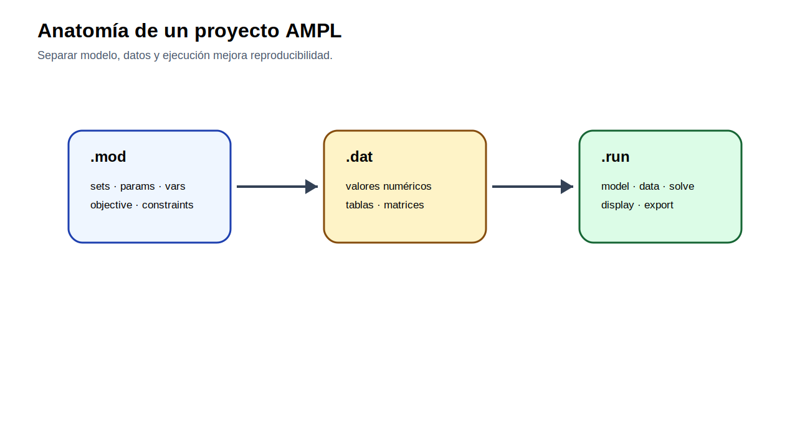

[← Inicio](../../README.md) | [← Módulo anterior](../01_optimizacion/README.md) | [Siguiente módulo →](../03_despacho_economico/README.md)

# Módulo 02 — AMPL para modelos eléctricos

## Propósito

Este módulo conecta la formulación matemática con la implementación en AMPL. La práctica no consiste en copiar un modelo terminado, sino en traducir cada elemento algebraico a una instrucción verificable: conjunto, parámetro, variable, función objetivo, restricción y comando de ejecución.

## Competencia

Implementar modelos algebraicos en AMPL separando correctamente el archivo de modelo, el archivo de datos y el archivo de ejecución.



## Sintaxis mínima de trabajo

| Elemento matemático | Instrucción AMPL |
|---|---|
| Conjunto | `set G;` |
| Parámetro indexado | `param Pmax {G};` |
| Variable no negativa | `var Pg {G} >= 0;` |
| Función objetivo | `minimize TotalCost: ...;` |
| Restricción indexada | `subject to Balance {t in T}: ...;` |
| Sumatoria | `sum {g in G} ...` |
| Cambio de dato | `let demanda := 150;` |
| Impresión de resultados | `display Pg;` o `printf ...;` |

## Caso 1. Traducción del problema de pinturas

### Enunciado

Construya en AMPL el caso de producción de pinturas del módulo 01. El propósito es que el estudiante pueda explicar la correspondencia entre cada símbolo matemático y cada línea de AMPL.

### Datos del caso

**Productos**

| producto   |   precio [USD/L] |   tasa [L/h] |   demanda máxima [L] |
|:-----------|-----------------:|-------------:|---------------------:|
| azul       |               10 |           40 |                 1000 |
| negra      |               15 |           30 |                  860 |

**Parámetro general**

| parametro         |   valor | unidad   |
|:------------------|--------:|:---------|
| horas_disponibles |      40 | h/semana |

### Formulación a implementar

**Conjuntos e índices**

$p\in P$: pinturas disponibles.

**Parámetros**

$r_p$, $a_p$, $D_p^{max}$ y $H$.

**Variable**

$x_p\geq 0$.

**Función objetivo**

$$
\max Z=\sum_{p\in P}r_px_p
$$

**Restricciones**

$$
\sum_{p\in P}\frac{x_p}{a_p}\leq H
$$

$$
0\leq x_p\leq D_p^{max}\qquad \forall p\in P
$$

### Actividad

1. Escriba `pintura.mod` desde la formulación anterior.
2. Construya `pintura.dat` desde las tablas del caso.
3. Prepare `pintura.run` con `reset`, `model`, `data`, `option solver`, `solve` y `display`.
4. Ejecute el caso, corrija errores de índices si aparecen y documente el resultado final.
5. Señale en el informe qué línea del `.mod` corresponde a cada ecuación.

## Caso 2. Escenarios de demanda

### Enunciado

Un despacho uninodal se resolverá para tres escenarios de demanda. El estudiante debe usar una misma formulación y cambiar solo los datos activos del escenario. Este caso introduce el uso de `for`, `let`, `repeat while` y `printf`.

### Datos del caso

**Generadores**

| gen   |   Pmin [MW] |   Pmax [MW] |   costo [USD/MWh] |
|:------|------------:|------------:|------------------:|
| G1    |           0 |         120 |                18 |
| G2    |           0 |         100 |                26 |
| G3    |           0 |          80 |                40 |

**Escenarios de demanda**

| escenario   |   demanda [MW] |
|:------------|---------------:|
| bajo        |            120 |
| base        |            150 |
| alto        |            180 |

### Formulación matemática

**Conjuntos e índices**

$g\in G$: generadores.

$s\in S$: escenarios.

**Parámetros**

$P_g^{min}$, $P_g^{max}$, $c_g$ y $D_s$.

**Variable**

$P_g\geq 0$.

**Función objetivo**

$$
\min Z_s=\sum_{g\in G}c_gP_g
$$

**Restricciones**

$$
\sum_{g\in G}P_g=D_s
$$

$$
P_g^{min}\leq P_g\leq P_g^{max}\qquad \forall g\in G
$$

### Fragmentos de control que debe usar el estudiante

```ampl
for {s in S} {
    let demanda_activa := demanda[s];
    solve;
    printf "%s,%g\n", s, TotalCost >> "resultados_escenarios.csv";
}
```

```ampl
repeat while k < 5 {
    let demanda_activa := demanda_activa + 10;
    solve;
    let k := k + 1;
}
```

Los fragmentos anteriores no reemplazan al modelo. Deben integrarse en un archivo `.run` construido por el estudiante.

### Actividad

Resuelva los tres escenarios, exporte una tabla con costo total y generación por unidad, y explique qué unidad queda marginal en cada caso. Luego realice una sensibilidad de demanda con cinco valores adicionales usando `repeat while`.

## Evaluación

| Criterio | Ponderación |
|---|---:|
| Traducción correcta de símbolos a AMPL | 25 % |
| Separación entre `.mod`, `.dat` y `.run` | 25 % |
| Uso correcto de índices y sumatorias | 20 % |
| Automatización de escenarios | 20 % |
| Registro y corrección de errores | 10 % |


## Archivos de datos

| Archivo | Uso |
|---|---|
| `escenarios_demanda.csv` | Tabla editable del caso |
| `generadores_despacho.csv` | Tabla editable del caso |
| `pintura_parametros.csv` | Tabla editable del caso |
| `pintura_productos.csv` | Tabla editable del caso |
