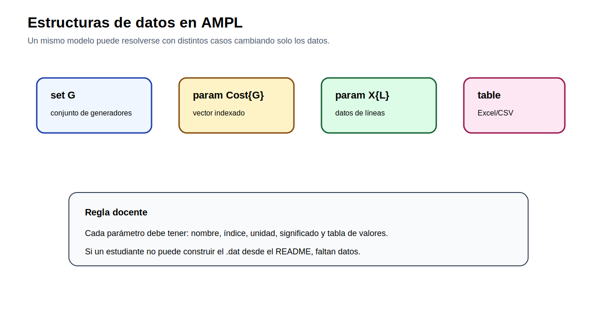

# 02 — Fundamentos de AMPL

[Menú principal](../../README.md) · [Guías](guias/README.md) · [Plantillas](plantillas/) · [Excel](excel/) · [Actividades](actividades/README.md)

## Pregunta guía

¿Cómo se transforma una formulación matemática en un proyecto AMPL reproducible, separando modelo, datos, ejecución y resultados?

## Por qué este módulo va después de optimización

El módulo 01 puede estudiarse incluso con Excel, porque el objetivo inicial es comprender decisiones, restricciones y región factible. Después de eso, AMPL permite escribir modelos de forma algebraica, separar estructura y datos, cambiar casos de estudio sin reescribir ecuaciones y resolver problemas de mayor escala.

## Anatomía de un proyecto AMPL

| Archivo | Función |
|---|---|
| `.mod` | declara conjuntos, parámetros, variables, función objetivo y restricciones |
| `.dat` | contiene los datos numéricos del caso |
| `.run` | ejecuta el flujo: cargar modelo, leer datos, seleccionar solver, resolver y mostrar/exportar resultados |

## Estructura de datos

## Guías del módulo

| Guía | Propósito | Enlace |
|---|---|---|
| 01 | estructura de archivos AMPL | [Abrir](guias/01_estructura_archivos_ampl.md) |
| 02 | conjuntos, parámetros y variables | [Abrir](guias/02_sets_parametros_variables.md) |
| 03 | archivo `.mod`, `.dat` y `.run` | [Abrir](guias/03_modelo_datos_run.md) |
| 04 | importación desde Excel/CSV | [Abrir](guias/04_importacion_excel_csv.md) |
| 05 | exportación de resultados a Excel | [Abrir](guias/05_exportacion_resultados.md) |
| 06 | errores frecuentes y depuración | [Abrir](guias/06_errores_frecuentes.md) |

## Material de práctica

| Recurso | Ubicación |
|---|---|
| Ejemplo AMPL de pintura | `plantillas/pintura/` |
| Lectura desde Excel | `plantillas/excel_read/` |
| Exportación a Excel | `plantillas/excel_export/` |
| Libro Excel didáctico | `excel/pintura_ampl.xlsx` |
| Notebook AMPL-Python | `notebooks/01_amplpy_pandas_excel.ipynb` |

## Validación del aprendizaje

Al terminar este módulo, el estudiante debe poder reconocer qué va en `.mod`, `.dat` y `.run`; declarar conjuntos, parámetros y variables; leer datos desde tablas; exportar resultados; y diagnosticar errores de índice, dimensión o datos faltantes.
