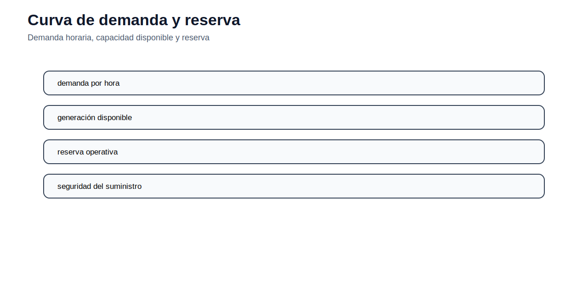
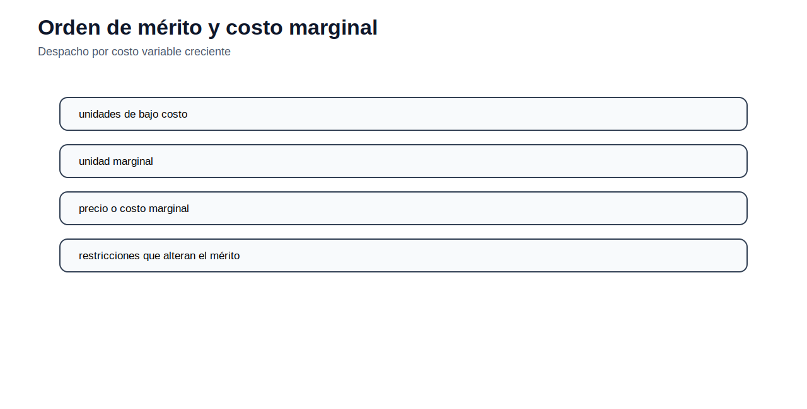
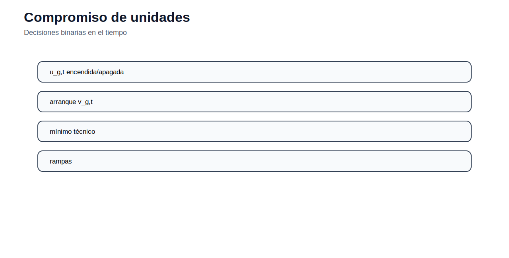

# 02 — Operación de corto plazo

[Menú principal](../../README.md) · [Actividades](actividades/README.md) · [Datos](datos/) · [Guía AMPL](../../docs/guia_ampl.md)

## Propósito del módulo

La operación de corto plazo determina cómo atender la demanda con los recursos disponibles en horizontes de una hora, un día o una semana. En este nivel la red puede simplificarse o incorporarse parcialmente, pero la decisión principal es operativa: cuánto genera cada unidad, qué unidades se mantienen encendidas, cuánto margen de reserva se conserva y cómo se usa el agua disponible.

El despacho económico es la primera formulación porque muestra la relación entre costo variable, demanda y unidad marginal. A partir de ese modelo se agregan tramos de costo, pérdidas, mínimos técnicos, arranques, rampas, reserva y acoplamiento temporal. El estudiante debe distinguir entre un despacho puramente continuo y un problema con decisiones binarias de encendido.

## Costos y despacho económico

Para una unidad térmica, el costo variable puede construirse desde la tasa de calor y el precio del combustible:

$$
c_g^{fuel}=HR_g\,p_g^{fuel}.
$$

Si se incluyen operación y mantenimiento variable, y eventualmente emisiones, el costo marginal aproximado de una unidad puede escribirse como:

$$
c_g^{var}=c_g^{fuel}+c_g^{VOM}+EF_g p^{CO_2}.
$$

El despacho económico lineal minimiza el costo de producción:

$$
\min \sum_{g,t} c_g P_{g,t}
$$

sujeto al balance de potencia:

$$
\sum_g P_{g,t}+ENS_t=D_t,
$$

y a límites de generación:

$$
\underline{P}_g\leq P_{g,t}\leq \overline{P}_g.
$$

El término $ENS_t$ representa energía no servida. Se permite solo cuando se penaliza con un costo suficientemente alto, como el VOLL, para evitar infactibilidad artificial y medir el costo de no atender demanda.

## Compromiso de unidades y acoplamiento temporal

Cuando se modelan unidades térmicas con mínimos técnicos, arranques y apagados, se requiere una variable binaria $u_{g,t}$:

$$
\underline{P}_g u_{g,t}\leq P_{g,t}\leq \overline{P}_g u_{g,t}.
$$

Esta restricción vincula el estado de la unidad con su generación. Si $u_{g,t}=0$, la unidad no genera; si $u_{g,t}=1$, debe respetar su mínimo técnico y su máximo. Las rampas agregan acoplamiento entre periodos y limitan cambios bruscos de generación.

En sistemas hidroeléctricos, la operación no se decide solo por el costo térmico inmediato. Usar agua hoy reduce disponibilidad futura. El balance de embalse puede escribirse como:

$$
V_{h,t}=V_{h,t-1}+A_{h,t}-Q_{h,t}-S_{h,t},
$$

donde $V$ es volumen almacenado, $A$ afluencia, $Q$ caudal turbinado y $S$ vertimiento. Esta ecuación convierte el despacho hidrotérmico en un problema intertemporal.

## Lectura técnica de las figuras

La reserva se evalúa comparando demanda y capacidad disponible. En operación, no basta con cubrir la demanda esperada; debe existir margen para contingencias, errores de pronóstico y variaciones rápidas.

El orden de mérito permite interpretar la solución de un despacho lineal. Las unidades de menor costo variable entran primero y la última unidad necesaria define el costo marginal si no existen restricciones adicionales.

El compromiso de unidades transforma el problema en MILP. La figura muestra que la decisión no es solo cuánto generar, sino también cuándo encender y mantener disponible una unidad.

El embalse introduce memoria temporal. La decisión de turbinar en un periodo afecta la factibilidad y el costo de los periodos siguientes.

## Modelos del módulo

| Recurso | Concepto principal | Acceso |
|---|---|---|
| Despacho económico uninodal | costo marginal y orden de mérito | [Abrir](modelos/01_despacho_economico_uninodal.md) |
| Despacho económico por tramos | costos lineales por segmentos | [Abrir](modelos/02_despacho_economico_por_tramos.md) |
| Despacho con pérdidas | pérdidas como puente hacia OPF | [Abrir](modelos/03_despacho_con_perdidas.md) |
| Compromiso de unidades | mínimos técnicos, arranques y binarios | [Abrir](modelos/04_compromiso_unidades_termicas.md) |
| Despacho hidrotérmico simple | balance de embalse y térmicas | [Abrir](modelos/05_despacho_hidrotermico_simple.md) |
| Operación de cascada hidroeléctrica | embalses conectados aguas arriba y abajo | [Abrir](modelos/06_operacion_cascada_hidroelectrica.md) |

## Actividad del módulo

La actividad principal se desarrolla desde [actividades/README.md](actividades/README.md). El estudiante debe construir su formulación, preparar datos, resolver al menos un caso base y comparar un escenario de sensibilidad: demanda alta, combustible caro, reserva mayor o menor disponibilidad hídrica.

---

[Menú principal](../../README.md) · [Actividades](actividades/README.md) · [Datos](datos/)
