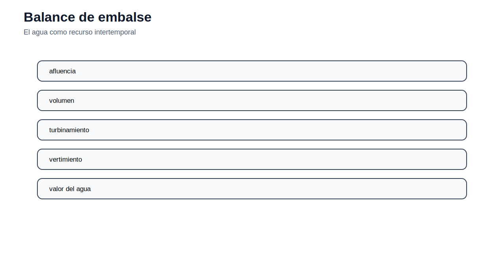

[← Inicio](../../README.md) | [← Módulo anterior](../02_ampl/README.md) | [Siguiente módulo →](../04_opf/README.md)

# Módulo 03 — Despacho económico y operación de corto plazo

## Objetivo del módulo

El módulo estudia cómo operar un conjunto de unidades de generación para atender una demanda dada al menor costo posible, respetando límites técnicos. Aquí se incorporan los conceptos económicos que sí pertenecen a la operación: costo variable, costo de combustible, costo marginal, orden de mérito, reserva, unit commitment, energía no servida y valor operativo del agua.

## Contenidos

1. [Costos operativos de generación](#costos-operativos-de-generación)
2. [Despacho económico uninodal](#despacho-económico-uninodal)
3. [Costo marginal y orden de mérito](#costo-marginal-y-orden-de-mérito)
4. [Costos cuadráticos y despacho por tramos](#costos-cuadráticos-y-despacho-por-tramos)
5. [Unit commitment](#unit-commitment)
6. [Despacho hidrotérmico](#despacho-hidrotérmico)
7. [Energía no servida y VOLL](#energía-no-servida-y-voll)
8. [Archivos incluidos](#archivos-incluidos)
9. [Actividad propuesta](#actividad-propuesta)

## Costos operativos de generación

En operación de corto plazo, la infraestructura ya existe. La decisión principal es cuánto genera cada unidad en cada periodo. Por tanto, el costo relevante para el despacho es el costo variable de producir energía.

Para una unidad térmica, el costo de combustible por MWh puede calcularse con:

$$
c^{fuel}_g = HR_g \cdot p^{fuel}_g
$$

siendo $HR_g$ la tasa de calor en MMBtu/MWh y $p^{fuel}_g$ el precio del combustible en USD/MMBtu.

El costo variable completo puede incluir operación y mantenimiento variable y emisiones:

$$
c^{var}_g = HR_g p^{fuel}_g + c^{VOM}_g + EF_g p^{CO_2}
$$

Estos costos definen el orden económico de operación. Los costos fijos no determinan el despacho horario, aunque sí importan en decisiones de inversión y expansión.

## Despacho económico uninodal

El despacho económico básico se formula como:

$$
\min \sum_{g \in G}\sum_{t \in T} c_g P_{g,t}
$$

sujeto a:

$$
\sum_{g \in G} P_{g,t} = D_t \qquad \forall t
$$

$$
P_g^{min} \leq P_{g,t} \leq P_g^{max} \qquad \forall g,t
$$

La restricción de balance representa conservación de potencia en un sistema agregado. Los límites de generación representan capacidades físicas o restricciones de operación.

## Costo marginal y orden de mérito

Cuando los costos variables son constantes, las unidades se ordenan de menor a mayor costo. La unidad que cubre el último MW de demanda es la unidad marginal y su costo variable define el costo marginal del sistema, en ausencia de pérdidas, congestión o restricciones adicionales.


Si la demanda aumenta y obliga a encender una unidad más cara, el costo marginal sube. Por eso el costo marginal no es el costo promedio del sistema, sino el costo de atender una unidad adicional en el margen.

## Costos cuadráticos y despacho por tramos

Algunas unidades térmicas se representan mediante funciones cuadráticas:

$$
C_g(P_g)=a_g+b_gP_g+c_gP_g^2
$$

El costo marginal es:

$$
MC_g(P_g)=b_g+2c_gP_g
$$

En modelos lineales, esta curva puede aproximarse por tramos. Para ello se divide la capacidad de la unidad en bloques, cada uno con un costo incremental. El modelo decide cuánta potencia usar de cada bloque, respetando el ancho máximo de cada tramo.

Esta técnica es útil porque mantiene el problema como LP o MILP, evitando un NLP cuando la aproximación por tramos es suficiente para el análisis.

## Unit commitment

El despacho económico supone que las unidades están disponibles y pueden operar entre sus límites. El unit commitment agrega la decisión de encender o apagar unidades:

$$
u_{g,t} \in \{0,1\}
$$

$$
P_g^{min}u_{g,t} \leq P_{g,t} \leq P_g^{max}u_{g,t}
$$

La variable $u_{g,t}$ activa la unidad. Si $u_{g,t}=0$, la generación debe ser cero. Si $u_{g,t}=1$, la unidad puede operar dentro de sus límites. El modelo también puede incluir costos de arranque, rampas, reserva y condiciones iniciales.


El UC es un MILP porque combina variables continuas de generación con variables binarias de compromiso. Su solución es más compleja que un despacho económico lineal, pero representa mejor la operación real de centrales térmicas.

## Despacho hidrotérmico

En sistemas con hidroelectricidad, usar agua hoy reduce la disponibilidad futura. Por eso el agua tiene un costo de oportunidad. Un balance simple de embalse es:

$$
S_{t+1}=S_t+I_t-R_t-Sp_t
$$

Donde $S_t$ es el almacenamiento, $I_t$ la afluencia, $R_t$ el caudal turbinado o liberado y $Sp_t$ el vertimiento. La generación hidroeléctrica puede aproximarse como:

$$
P^{hydro}_t = \rho R_t
$$

con $\rho$ como coeficiente de producción.



La decisión ya no es solo despachar la unidad barata. El modelo debe decidir si conviene usar agua en el periodo actual o conservarla para periodos más críticos.

## Energía no servida y VOLL

La energía no servida permite mantener factible el modelo cuando no existe suficiente generación o capacidad de red. Se representa con una variable $LS_t \geq 0$:

$$
\sum_g P_{g,t}+LS_t=D_t
$$

Para evitar que el modelo use energía no servida como solución normal, se penaliza con un valor alto:

$$
\min C + \sum_t VOLL \cdot LS_t
$$

El VOLL aproxima el costo social o económico de no atender demanda. Si aparece energía no servida en la solución, debe interpretarse como señal de déficit operativo o insuficiencia de capacidad.


## Datos de trabajo para construir el caso

El caso no debe entenderse como un modelo cerrado. Los CSV permiten reconstruir el despacho económico, el despacho por tramos, el unit commitment y el hidrotérmico simple. La actividad esperada es generar el archivo `.dat` desde estas tablas y escribir el `.mod` desde la formulación matemática anterior.

| Archivo | Contenido/encabezado |
|---|---|
| `cascada_afluencias.csv` | embalse,t1,t2,t3,t4 |
| `cascada_embalses.csv` | embalse,v0_hm3,vmin_hm3,vmax_hm3,qmax_hm3,prod_mwh_hm3 |
| `cascada_upstream.csv` | embalse,upstream |
| `ed_demanda.csv` | parametro,valor,unidad |
| `ed_generadores.csv` | gen,pmin_mw,pmax_mw,cost_usd_mwh |
| `ed_perdidas_B.csv` | g,h,B_1_mw |
| `ed_perdidas_demanda.csv` | parametro,valor,unidad |
| `ed_perdidas_generadores.csv` | gen,pmin_mw,pmax_mw,cost_usd_mwh |
| `ed_tramos.csv` | gen,tramo,segmax_mw,segcost_usd_mwh |
| `ed_tramos_demanda.csv` | parametro,valor,unidad |
| `hidrotermico_demanda_afluencia.csv` | periodo,demand_mw,inflow_hm3 |
| `hidrotermico_didactico.csv` | periodo,demanda,afluencia |
| `hidrotermico_hidro.csv` | hidro,v0_hm3,vmin_hm3,vmax_hm3,qmax_hm3,prod_mw_hm3 |
| `hidrotermico_termicas.csv` | gen,pmax_mw,cost_usd_mwh |
| `hidrotermico_voll.csv` | parametro,valor,unidad |
| `operacion_3_generadores.csv` | gen,pmin,pmax,costo |
| `uc_demanda_reserva.csv` | hora,demand_mw,reserve_mw |
| `uc_unidades.csv` | gen,pmin_mw,pmax_mw,cost_usd_mwh,startup_usd,ru_mw_h,rd_mw_h,initial_status |

### Archivos AMPL de referencia

| Archivo | Contenido/encabezado |
|---|---|
| `dispatch.dat` | archivo de apoyo |
| `dispatch.mod` | archivo de apoyo |
| `dispatch.run` | archivo de apoyo |
| `dispatch_blocks.dat` | archivo de apoyo |
| `dispatch_blocks.mod` | archivo de apoyo |
| `dispatch_blocks.run` | archivo de apoyo |
| `hydrothermal.dat` | archivo de apoyo |
| `hydrothermal.mod` | archivo de apoyo |
| `hydrothermal.run` | archivo de apoyo |
| `uc.dat` | archivo de apoyo |
| `uc.mod` | archivo de apoyo |
| `uc.run` | archivo de apoyo |

### Scripts Python de apoyo

| Archivo | Contenido/encabezado |
|---|---|
| `graficar_orden_merito.py` | archivo de apoyo |

## Archivos incluidos

| Archivo | Uso |
|---|---|
| [ampl/dispatch.mod](ampl/dispatch.mod) | Despacho económico con energía no servida. |
| [ampl/dispatch_blocks.mod](ampl/dispatch_blocks.mod) | Despacho por bloques de costo. |
| [ampl/uc.mod](ampl/uc.mod) | Unit commitment térmico simplificado. |
| [ampl/hydrothermal.mod](ampl/hydrothermal.mod) | Despacho hidrotérmico con embalse. |
| [datos/](datos/) | Datos de generadores, demanda, bloques, UC e hidrotérmico. |
| [python/graficar_orden_merito.py](python/graficar_orden_merito.py) | Script para construir una curva de mérito. |

## Cómo ejecutar

Desde `modulos/03_despacho_economico/ampl/`:

```bash
ampl dispatch.run
ampl dispatch_blocks.run
ampl uc.run
ampl hydrothermal.run
```

## Actividad propuesta

Modifique el caso de despacho económico aumentando la demanda en 20 %. Compare generación por unidad, costo total, costo marginal aproximado y energía no servida. Luego repita el análisis reduciendo el VOLL y explique por qué un valor bajo puede distorsionar la operación.
