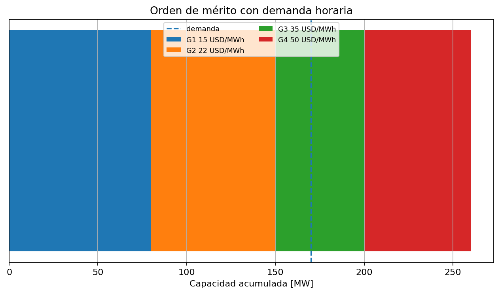

# 03 — Operación de corto plazo

[Menú principal](../../README.md) · [Actividades](actividades/README.md) · [Datos](datos/)

## Pregunta guía

¿Cómo decide un operador qué unidades generan en cada hora para cubrir la demanda al menor costo, respetando límites técnicos y seguridad operativa?

## Contexto técnico

En operación de corto plazo, la demanda se toma como dato de entrada. La decisión central es asignar generación disponible en el tiempo. El problema empieza con el despacho económico y evoluciona hacia modelos con restricciones operativas, encendido de unidades, reserva, rampas y coordinación hidrotérmica.

## Desarrollo conceptual

```text
demanda horaria → balance generación-demanda → costo variable → orden de mérito → costo marginal → límites técnicos → unit commitment → despacho hidrotérmico
```

## Figura central



## Formulación base

$$
\min \sum_{g,t} c_g P_{g,t} + \sum_{g,t} SU_g v_{g,t}
$$

sujeto a balance, límites técnicos, rampas y reserva.

## Modelos incluidos

| Modelo | Enlace |
| --- | --- |
| Modelo 01 — Despacho económico uninodal | [Abrir](modelos/01_despacho_economico_uninodal.md) |
| Modelo 02 — Despacho económico por tramos | [Abrir](modelos/02_despacho_economico_por_tramos.md) |
| Modelo 03 — Despacho económico con pérdidas | [Abrir](modelos/03_despacho_con_perdidas.md) |
| Modelo 04 — Compromiso de unidades térmicas | [Abrir](modelos/04_compromiso_unidades_termicas.md) |
| Modelo 05 — Despacho hidrotérmico simple | [Abrir](modelos/05_despacho_hidrotermico_simple.md) |
| Modelo 06 — Operación de cascada hidroeléctrica | [Abrir](modelos/06_operacion_cascada_hidroelectrica.md) |

## Validación de resultados

La demanda debe estar cubierta en cada periodo; ningún generador debe violar Pmin/Pmax; una unidad apagada no puede generar; las rampas no deben superar los límites; y en hidrotérmico el balance de embalse debe cerrar.
