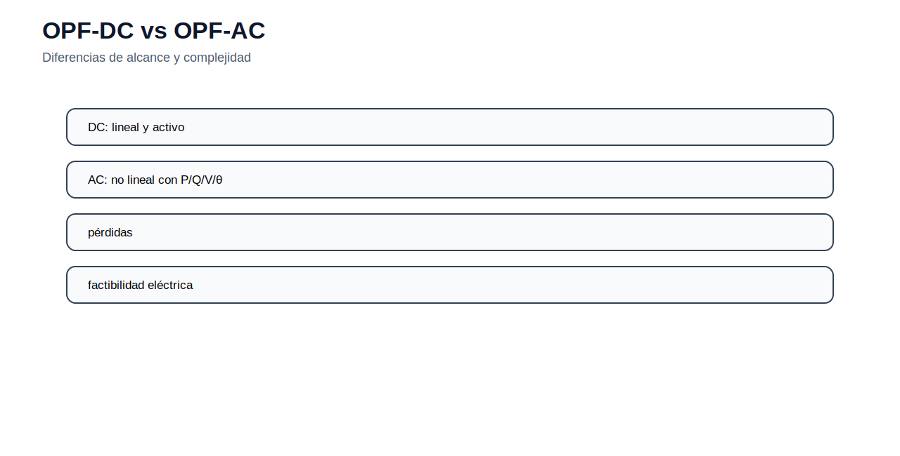

# 03 — Flujo óptimo de potencia

[Menú principal](../../README.md) · [Actividades](actividades/README.md) · [Datos](datos/) · [Guía AMPL](../../docs/guia_ampl.md)

## Propósito del módulo

El flujo óptimo de potencia incorpora la red eléctrica dentro del problema de despacho. La ubicación de generadores y cargas importa porque la energía fluye de acuerdo con las impedancias de la red, no por una asignación contractual directa. Por eso dos despachos con el mismo costo de generación pueden tener distinta factibilidad cuando se consideran límites de líneas, ángulos, tensiones, reactivos o pérdidas.

El OPF-DC se usa como primera aproximación porque permite representar balance nodal, ángulos de tensión y límites térmicos con una formulación lineal. El OPF-AC conserva las relaciones no lineales entre tensiones, ángulos, potencia activa y potencia reactiva; por ello permite evaluar factibilidad eléctrica con mayor detalle, aunque el problema se vuelve no lineal y más exigente.

## Balance nodal y flujo DC

En cada barra debe cumplirse el balance de potencia activa. Para una barra $n$, una formulación DC puede escribirse como:

$$
\sum_{g\in G_n}P_g-P_n^D+ENS_n=\sum_\ell A_{n,\ell}F_\ell.
$$

El lado izquierdo representa inyección neta en la barra; el lado derecho representa el flujo neto que sale o entra a través de las líneas conectadas. La matriz de incidencia $A_{n,\ell}$ define la orientación de cada línea.

El flujo activo DC se aproxima con la diferencia angular:

$$
F_\ell=\frac{\theta_i-\theta_j}{x_\ell},
$$

donde $x_\ell$ es la reactancia de la línea. Además debe fijarse una barra de referencia para evitar indeterminación angular:

$$
\theta_{ref}=0.
$$

Los límites de línea representan capacidad térmica o criterios de seguridad:

$$
-\overline{F}_\ell\leq F_\ell\leq \overline{F}_\ell.
$$

## OPF-AC y factibilidad eléctrica

En OPF-AC, los balances de potencia se expresan con magnitudes de tensión, ángulos y elementos de la matriz de admitancia:

$$
P_i=V_i\sum_jV_j(G_{ij}\cos\theta_{ij}+B_{ij}\sin\theta_{ij}),
$$

$$
Q_i=V_i\sum_jV_j(G_{ij}\sin\theta_{ij}-B_{ij}\cos\theta_{ij}).
$$

Estas ecuaciones permiten representar tensión y potencia reactiva, pero introducen no linealidad. El estudiante debe interpretar el OPF-DC como una herramienta para estudiar congestión y costos, y el OPF-AC como una herramienta para verificar condiciones eléctricas más completas.

## Lectura técnica de las figuras

La red se representa mediante barras, generadores, cargas y líneas. Esta representación define los conjuntos e índices del modelo: barras, líneas, generadores y la relación de conexión entre ellos.

El balance nodal es la restricción central del OPF. Toda inyección, retiro y flujo debe quedar contabilizado para que la solución sea físicamente consistente.

La diferencia angular explica el sentido del flujo activo. Cuando una línea alcanza su límite, el despacho puede cambiar aunque exista generación más barata en otra parte de la red.

La comparación muestra qué se gana y qué se pierde con cada aproximación. El modelo DC es más simple y útil para planificación; el AC es más completo para análisis eléctrico.

## Modelos del módulo

| Recurso | Concepto principal | Acceso |
|---|---|---|
| OPF-DC | balance nodal, ángulos, flujos y congestión | [Abrir](modelos/01_flujo_optimo_potencia_dc.md) |
| OPF-AC | tensión, potencia reactiva y no linealidad | [Abrir](modelos/02_flujo_optimo_potencia_ac.md) |

## Actividad del módulo

La actividad se desarrolla desde [actividades/README.md](actividades/README.md). El estudiante debe construir un OPF-DC con datos de barras, líneas y generadores, resolver el caso base, identificar líneas congestionadas y comparar el despacho con y sin límite de transmisión.

---

[Menú principal](../../README.md) · [Actividades](actividades/README.md) · [Datos](datos/)
