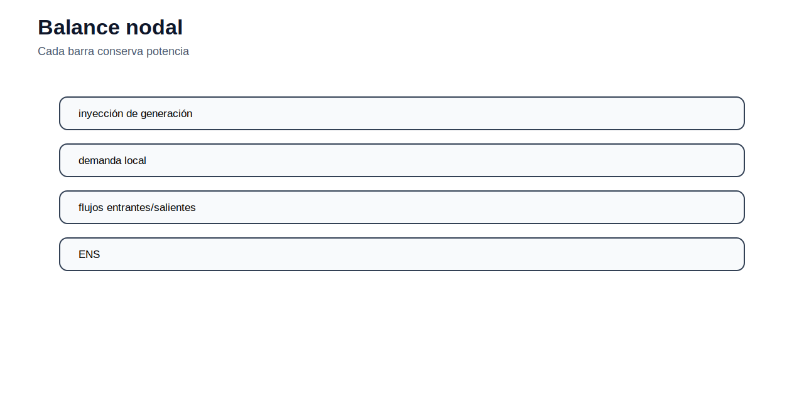

[← Inicio](../../README.md) | [← Módulo anterior](../03_despacho_economico/README.md) | [Siguiente módulo →](../05_demanda/README.md)

# Módulo 04 — Flujo óptimo de potencia

## Objetivo del módulo

El módulo introduce la operación económica con restricciones de red. A diferencia del despacho uninodal, el OPF reconoce que la generación y la demanda están ubicadas en barras, que los flujos se distribuyen por la red y que las líneas tienen límites térmicos. El caso base se formula como OPF DC para concentrarse en balance nodal, ángulos, susceptancias y congestión.

## Contenidos

1. [Del despacho uninodal al despacho con red](#del-despacho-uninodal-al-despacho-con-red)
2. [Balance nodal](#balance-nodal)
3. [Modelo DC](#modelo-dc)
4. [Límites térmicos y congestión](#límites-térmicos-y-congestión)
5. [Referencia angular](#referencia-angular)
6. [Lectura económica de los duales](#lectura-económica-de-los-duales)
7. [Archivos incluidos](#archivos-incluidos)
8. [Actividad propuesta](#actividad-propuesta)

## Del despacho uninodal al despacho con red

El despacho económico uninodal supone que toda generación puede atender toda demanda sin restricciones de transporte. Esa hipótesis es útil para introducir costos marginales, pero no representa sistemas reales. En una red eléctrica, la ubicación importa: una central barata puede no abastecer una carga si las líneas cercanas están congestionadas.


El OPF minimiza costos de operación, pero incorpora ecuaciones de flujo y límites de red. Por eso conecta operación económica con restricciones físicas.

## Balance nodal

Para cada barra $n$ y periodo $t$, el balance nodal se expresa como:

$$
\sum_{g\in G_n} P_{g,t} - D_{n,t}
= \sum_{(n,j)\in L} f_{n,j,t} - \sum_{(i,n)\in L} f_{i,n,t}
$$

El lado izquierdo representa la inyección neta de la barra: generación menos demanda. El lado derecho representa el flujo neto que sale por las líneas. Esta ecuación es una forma de conservación de potencia activa.



## Modelo DC

El flujo DC aproxima el flujo activo entre dos barras como:

$$
f_{i,j,t}=B_{i,j}(\theta_{i,t}-\theta_{j,t})
$$

Donde $B_{i,j}$ es la susceptancia de la línea y $\theta$ son los ángulos de tensión. El modelo DC usa supuestos simplificadores: magnitudes de tensión cercanas a 1 p.u., diferencias angulares pequeñas, resistencia despreciable y ausencia de potencia reactiva.

No reemplaza al OPF AC para estudios detallados de tensión o reactivos, pero es ampliamente usado en planificación y análisis económico porque conserva la relación principal entre inyecciones, ángulos y flujos activos.

## Límites térmicos y congestión

Cada línea tiene un límite:

$$
-F_{i,j}^{max} \leq f_{i,j,t} \leq F_{i,j}^{max}
$$

Cuando una línea alcanza su límite, se dice que está congestionada. La congestión puede obligar a reducir generación barata en una zona y aumentar generación más cara en otra. Por ello, el costo marginal puede diferir entre barras.


## Referencia angular

Los ángulos solo tienen significado relativo. Si se suma una constante a todos los ángulos, los flujos no cambian. Para evitar infinitas soluciones equivalentes, se fija una barra de referencia:

$$
\theta_{ref,t}=0
$$

Esta restricción no representa una limitación física adicional; solo define el sistema de referencia matemática.

## Lectura económica de los duales

El dual del balance nodal puede interpretarse como costo marginal local de atender demanda en esa barra, bajo el modelo y los supuestos usados. Si no hay congestión ni pérdidas, los costos marginales nodales tienden a ser iguales. Si existe congestión, los precios sombra de las líneas modifican el valor marginal por ubicación.

Esta lectura permite entender por qué el OPF es el puente entre operación técnica, costos marginales y señales locacionales.

## Archivos incluidos

| Archivo | Uso |
|---|---|
| [ampl/opf_dc.mod](ampl/opf_dc.mod) | Formulación OPF DC. |
| [ampl/opf_dc.dat](ampl/opf_dc.dat) | Caso de prueba con barras, líneas y generadores. |
| [ampl/opf_dc.run](ampl/opf_dc.run) | Ejecución del OPF DC. |
| [datos/](datos/) | Datos CSV de barras, líneas y generadores. |
| [python/graficar_red_dc.py](python/graficar_red_dc.py) | Revisión básica de datos de red. |

## Cómo ejecutar

Desde `modulos/04_opf/ampl/`:

```bash
ampl opf_dc.run
```

## Actividad propuesta

Reduzca el límite térmico de una línea crítica y resuelva nuevamente el OPF DC. Compare costo total, generación por barra y flujos. Identifique qué línea queda activa y explique cómo la congestión modifica la operación respecto al despacho uninodal.
