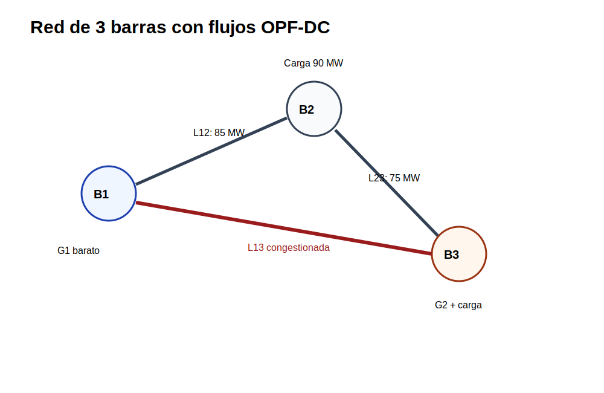

[← Inicio](../../README.md) | [← Módulo anterior](../03_despacho_economico/README.md) | [Siguiente módulo →](../05_demanda/README.md)

# Módulo 04 — Flujo óptimo de potencia

## Propósito

El módulo incorpora la red eléctrica dentro del problema de operación. La demanda ya no se atiende solo con un balance global: cada barra debe cumplir su propio balance y cada línea debe respetar su capacidad.

## Competencia

Formular un OPF DC, interpretar flujos y congestión, y reconocer las diferencias principales frente a la formulación AC.

## Caso 1. OPF DC de tres barras

### Enunciado

Se tiene una red de tres barras con dos generadores y tres líneas. Se debe minimizar el costo de generación cumpliendo balance nodal, flujo DC, límites térmicos y referencia angular.

### Datos del caso

**Barras**

| bus   |   demanda [MW] |
|:------|---------------:|
| B1    |              0 |
| B2    |             90 |
| B3    |             80 |

**Generadores**

| gen   | bus   |   Pmin [MW] |   Pmax [MW] |   costo [USD/MWh] |
|:------|:------|------------:|------------:|------------------:|
| G1    | B1    |           0 |         160 |                18 |
| G2    | B3    |           0 |         100 |                32 |

**Líneas**

| linea   | desde   | hasta   |   x [p.u.] |   Fmax [MW] |
|:--------|:--------|:--------|-----------:|------------:|
| L12     | B1      | B2      |       0.1  |         100 |
| L23     | B2      | B3      |       0.08 |          80 |
| L13     | B1      | B3      |       0.12 |          60 |

**Parámetros generales**

| parametro   | valor   | unidad   |
|:------------|:--------|:---------|
| slack       | B1      | -        |
| VOLL        | 1000    | USD/MWh  |

### Formulación matemática

**Conjuntos e índices:** $n\in N$, $g\in G$, $l\in L$.

**Parámetros:** $D_n$, $P_g^{min}$, $P_g^{max}$, $c_g$, $x_l$, $F_l^{max}$, barra de origen $o(l)$ y destino $d(l)$.

**Variables:** $P_g\geq0$, $\theta_n$ y $f_l$.

**Función objetivo**

$$
\min Z=\sum_{g\in G}c_gP_g
$$

**Restricciones**

Balance nodal:

$$
\sum_{g\in G_n}P_g-D_n=\sum_{l:o(l)=n}f_l-\sum_{l:d(l)=n}f_l\qquad \forall n\in N
$$

Flujo DC:

$$
f_l=\frac{\theta_{o(l)}-\theta_{d(l)}}{x_l}\qquad \forall l\in L
$$

Límites de línea:

$$
-F_l^{max}\leq f_l\leq F_l^{max}\qquad \forall l\in L
$$

Límites de generación:

$$
P_g^{min}\leq P_g\leq P_g^{max}\qquad \forall g\in G
$$

Referencia angular:

$$
\theta_{slack}=0
$$

### Actividad

Construya el OPF DC en AMPL. Entregue generación, ángulos, flujos, porcentaje de carga de cada línea y costo total. Verifique que la suma de todos los balances nodales cierra en cero.

## Caso 2. Congestión de transmisión

### Enunciado

Repita el OPF DC reduciendo el límite de una línea. El objetivo es observar cómo una restricción de red puede cambiar el despacho económico.

### Formulación matemática

Use la misma formulación del caso 1. En el `.dat`, modifique el límite térmico de una línea seleccionada por el docente o reduzca $F_{L13}^{max}$ en $5d$ MW, donde $d$ es el último dígito de su código.

### Actividad

Compare el caso base y el caso congestionado. Presente una tabla con flujo, límite y porcentaje de carga. Explique qué generador cambia su despacho y por qué el costo total puede aumentar.

## Caso 3. Estructura de OPF AC

### Enunciado

El OPF AC representa tensiones, potencia activa y potencia reactiva. No se exige una implementación completa en esta práctica; se solicita formular y comparar sus restricciones con el OPF DC.

### Datos del caso

**Barras AC**

| bus   |   pdem_mw |   qdem_mvar |   vmin_pu |   vmax_pu |
|:------|----------:|------------:|----------:|----------:|
| B1    |         0 |           0 |      0.95 |      1.05 |
| B2    |        80 |          30 |      0.95 |      1.05 |
| B3    |        60 |          25 |      0.95 |      1.05 |

**Generadores AC**

| gen   | bus   |   pmin_mw |   pmax_mw |   qmin_mvar |   qmax_mvar |   costo_usd_mwh |
|:------|:------|----------:|----------:|------------:|------------:|----------------:|
| G1    | B1    |         0 |       180 |         -80 |         120 |              20 |
| G2    | B3    |         0 |       100 |         -50 |          80 |              35 |

**Líneas AC**

| linea   | desde   | hasta   |   r_pu |   x_pu |   bsh_pu |   smax_mva |
|:--------|:--------|:--------|-------:|-------:|---------:|-----------:|
| L12     | B1      | B2      |  0.02  |   0.1  |    0.02  |        120 |
| L23     | B2      | B3      |  0.015 |   0.08 |    0.015 |        100 |
| L13     | B1      | B3      |  0.025 |   0.12 |    0.025 |         90 |

**Parámetros generales**

| parametro   | valor   | unidad   |
|:------------|:--------|:---------|
| slack       | B1      | -        |
| BaseMVA     | 100     | MVA      |

### Formulación matemática

**Conjuntos e índices:** $n,m\in N$, $g\in G$, $l\in L$.

**Variables:** $V_n$, $\theta_n$, $P_g$, $Q_g$, $P_{nm}$, $Q_{nm}$.

**Balance activo**

$$
\sum_{g\in G_n}P_g-P_n^D=\sum_{m\in N}P_{nm}\qquad \forall n\in N
$$

**Balance reactivo**

$$
\sum_{g\in G_n}Q_g-Q_n^D=\sum_{m\in N}Q_{nm}\qquad \forall n\in N
$$

**Límites de tensión**

$$
V_n^{min}\leq V_n\leq V_n^{max}\qquad \forall n\in N
$$

**Límites de generación**

$$
P_g^{min}\leq P_g\leq P_g^{max},\qquad Q_g^{min}\leq Q_g\leq Q_g^{max}
$$

**Límite aparente**

$$
P_l^2+Q_l^2\leq (S_l^{max})^2\qquad \forall l\in L
$$

### Actividad

Elabore una tabla comparando OPF DC y OPF AC: variables, datos necesarios, restricciones, linealidad y tipo de solver. Explique por qué el OPF AC puede tener óptimos locales.

## Evaluación

| Criterio | Ponderación |
|---|---:|
| Balance nodal y referencia angular | 25 % |
| Flujo DC y límites térmicos | 25 % |
| Comparación de escenarios de congestión | 20 % |
| Interpretación DC/AC | 20 % |
| Presentación de tablas de resultados | 10 % |

## Archivos de datos

| Archivo | Uso |
|---|---|
| `opf_ac_barras.csv` | Tabla editable del caso |
| `opf_ac_generadores.csv` | Tabla editable del caso |
| `opf_ac_lineas.csv` | Tabla editable del caso |
| `opf_ac_parametros.csv` | Tabla editable del caso |
| `opf_dc_barras.csv` | Tabla editable del caso |
| `opf_dc_generadores.csv` | Tabla editable del caso |
| `opf_dc_lineas.csv` | Tabla editable del caso |
| `opf_dc_parametros.csv` | Tabla editable del caso |
